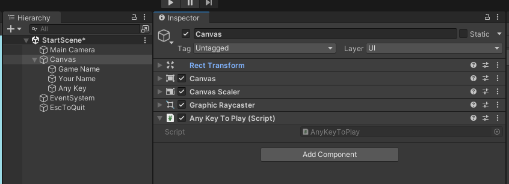
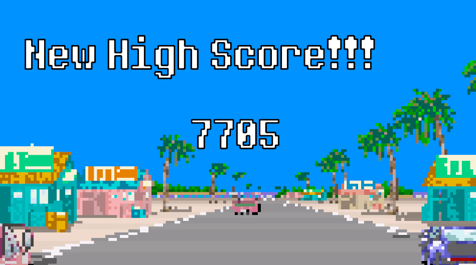

# Addendum on animation scripting

If you're finding the state machine a bit overwhelming (I do!), you can bypass all the parameters and transitions by telling the animator play a state.

```csharp
animator.Play("walk");
```

As long as the animation clip is attached to the animator controller (it shows up as a box in the Animator window) you can change to that animation clip.

> While this is a convenient way to switch animations, you won't reap the benefits of the transition system and you'll have to script the logic for determining when an animation should be triggered.

# Persistent Data
*Note: Persistent data is ***Optional*** for this project, but good to know about!*

Unity’s [PlayerPrefs](https://docs.unity3d.com/ScriptReference/PlayerPrefs.html) allows you to save data (string, int, or float) to a named key. Retrieving a value can be done by passing in the correct key. This allows you to keep track of values from one session to the next even after the game has been shut down.

```csharp
string playerName = "Zip Zap";
// save the string
PlayerPrefs.SetString("name", playerName);
// get back the string
string name = PlayerPrefs.GetString("name", “anonymous”);
```

Saving a high score is just as easy, especially if you only need to keep track of a single score. 

This script references a UI Text element that displays the current high score. Another script could call the *SetHighScore* function to save the score and update the UI.

```csharp
using UnityEngine;
using TMPro;
public class SimpleHighScore : MonoBehaviour
public class SimpleHighScore : MonoBehaviour
{
	public TMP_Text highScore;
	
	void Start()
	{
		// get most recent high score
		int score = PlayerPrefs.GetInt("HighScore");
		// display the value
		highScore.text = score.ToString();
	}
	
	public void SetHighScore(int newScore)
	{
		// save the new score
		PlayerPrefs.SetInt("HighScore", newScore);
		// update the text
		highScore.text = newScore.ToString();
	}
}
```

At first, you may not have any saved preferences, so you can also have a default value by adding an additional argument to the Get method:

```csharp
PlayerPrefs.GetInt("HighScore", 0);
```
## High scores and initials

This section is *extra optional* since the complexity ramps up quite a bit. If you plan to work with data and Unity (parsing JSON responses from a server request for instance), this technique will prove useful.

Keeping track of a list of scores and associated names becomes a bit trickier. One option is to create a separate PlayerPref key-value pair for each entry on the list, but this can be hard to keep track of. 

One method is to create a small class that contains a name and a score. 

```csharp
[System.Serializable]
public class HighScore
{
	public string name;
	public int score;
}
```

Making the class serializable allows it to be converted to JSON. So rather than having ten different PlayerPref entries, it’s possible to create a list of HighScore objects and convert the entire list into a single [JSON](https://www.json.org/json-en.html) string. 

JSON is a text-based format for representing structured data. More info [here](https://developer.mozilla.org/en-US/docs/Learn/JavaScript/Objects/JSON). Data is stored as javascript-style objects and can also be written as an array of objects:

```json
[
{
	"name": "Molecule Man",
	"age": 29,
	"secretIdentity": "Dan Jukes",
	"powers": ["Radiation resistance", "Turning tiny", "Radiation blast"]
},
{
	"name": "Madame Uppercut",
	"age": 39,
	"secretIdentity": "Jane Wilson",
	"powers": ["Million tonne punch", "Damage resistance","Superhuman reflexes"]
}
]
```

Having a list of HighScore objects also involves another class:

```csharp
public class HighScores
{
	public List<HighScore> highScoreList;
}
```

The benefit of this is that all the scores can be managed, sorted, etc. as a list and saving/loading is easy by converting to and from a JSON string. Ultimately, the JSON string is still being saved and loaded using PlayerPrefs.

Saving list of high scores:

```csharp
void SaveHighScores(List<HighScore> scores)
{
	// create list object
	HighScores highScores = new HighScores { highScoreList = scores };
	// convert to JSON
	string json = JsonUtility.ToJson(highScores);
	// save prefs
	PlayerPrefs.SetString("HighScoreTable", json);
}
```

Loading list of high scores

```csharp
public static List<HighScore> LoadHighScores()
{
	// grab scores as json
	string json = PlayerPrefs.GetString("HighScoreTable");
	// if empty, make a new list
	if (json == "") return new List<HighScore>();
	// convert back to list
	HighScores loadedScores = JsonUtility.FromJson<HighScores>(json);
	// return the list of scores
	return loadedScores.highScoreList;
}
```


# Scenes, Loading, Changing, Managing

This demo heavily references [this demo game](https://drive.google.com/file/d/1hBL7aww-pa3cSKZHSHBiVD8_bAXoOkC_/view?usp=share_link). But most concepts will work with the [Flat Game Template](https://drive.google.com/file/d/1wl8eYa-01PaycjSLsaZzSBzm7S1s59S3/view?usp=sharing) from a few classes ago. 

If you want another Unity project to pick apart, feel free to download the other demo package and import it into your existing 2D unity project or a new project (2D URP template, add input system package)


Here is an overview of the different scenes and how they are connected.
## Start Screen or Title screen


People have made [web-based versions](https://sm64.gitlab.io/) of just the SM64 title screen.

This can be any sort of text and image combination. You really can include whatever you would like in this scene (a player controller, video, animation, a mini-game).

In the example game, I’ve set it to check the current high score and blink some text. In the Flat Game Template, there's just some text and a script which makes other text fade in and out. 

Both demos have a way to detect a key input and change scenes. Let's take a look at how it works.


Flat Game Template start screen - The AnyKeyToPlay Script is attached to the Canvas game object. It only detects the space bar, so we can change it to work with any key using the new input system.

The AnyKeyToPlay script directly loads the next scene in the build settings:

```csharp
using UnityEngine;
using UnityEngine.SceneManagement;

namespace DesmaDemos
{
    public class AnyKeyToPlay : MonoBehaviour
    {
        void Update()
        {
	        // note that this is for space bar only
            if (Input.GetKeyDown(KeyCode.Space))
            {
                SceneManager.LoadScene(1);
            }
        }
    }
}
```

Changing scenes involves the [Unity Scene Manager](https://docs.unity3d.com/ScriptReference/SceneManagement.SceneManager.html) which requires

```csharp
Using UnityEngine.SceneManagement;
```

Scenes can be loaded by name `SceneManager.LoadScene("StartScene");` or by their build index (as above). Scenes need to be added to the build before they can be loaded by the scene manager

Open the Build Settings (File > Build Settings) and drag the scenes you would like to include with the game into the Scenes In Build section


The build index for each scene is listed on the right side.

How is the demo game using this?


The demo game has the StartGame script which begins the game using a GameManager (more on this in a second) script. It detects keyboard input using the new input system:

```csharp
using UnityEngine;
using UnityEngine.InputSystem;
public class StartGame : MonoBehaviour
{
	void Update()
	{
		if (Keyboard.current.anyKey.wasPressedThisFrame)
		{
			GameManager.Instance.StartGame();
		}
	}
}
```

### A Game Manager and DontDestroyOnLoad

The demo game title screen scene also includes a basic GameManager script that will be used across all the scenes in the game. This script uses [DontDestroyOnLoad](https://docs.unity3d.com/ScriptReference/Object.DontDestroyOnLoad.html) to prevent being erased when a new scene is loaded

The GameManager is also written using a [Singleton](https://levelup.gitconnected.com/tip-of-the-day-manager-classes-singleton-pattern-in-unity-1bf3aafe9430) pattern, storing a single static instance of the manager. This instance makes it easy for other scripts to access global game information or to call specific game related functions

The Singleton involves creating a public and static instance of the game manager, but making sure there is only ever one copy of the game manager. You’ll find lots of arguments about the pros and cons of this pattern. The problem is more about developers overusing the pattern when other patterns or techniques would be more appropriate.

The simplest version of a Singleton Game Manager (without any other functionality) would look something like this:

```csharp
using UnityEngine;
using System.Collections;
public class GameManager : MonoBehaviour
{
	// singleton business
	public static GameManager Instance { get; private set; }
	void Awake()
	{
		// check if a GameManager already exists
		if (Instance != null && Instance != this)
		{
			// if one does, destroy this gameobject
			Destroy(gameObject);
		}
		else
		{
			// if it doesn't, save this manager to the Instance var
			Instance = this;
			// keep object around between scene changes
			DontDestroyOnLoad(gameObject);
		}
	}
	// end singleton business
}
```

The **Awake** method is similar to **Start**, but it will run earlier to make sure certain things happen first. Don't worry if this doesn't make too much sense, as long as you know the results of this bit of code, you can make use of it.

Because the GameManager uses DontDestroyOnLoad, you can attach things as children to the manager that you want to stay on every scene. For example. background music.

This is the full GameManager script from the demo. There are a few methods for keeping track of score and loading scenes. The main takeaway is to understand that the methods in this script can easily be called from any other game object in any scene. This is why methods for StartGame and EndGame are in the same manager.

```csharp
using UnityEngine;
using UnityEngine.SceneManagement;
using System.Collections;
public class GameManager : MonoBehaviour
{
	// keeping track of scores
	public int score { get; private set; }
	public int highScore { get; private set; }
	// singleton business
	public static GameManager Instance { get; private set; }
	void Awake()
	{
		if (Instance != null && Instance != this)
		{
			Destroy(gameObject);
		}
		else
		{
			Instance = this;
			// keep object around between scene changes
			DontDestroyOnLoad(gameObject);
		}
	
		// get the current high score
		highScore = PlayerPrefs.GetInt("hi-score", 0);
	}
	
	public void AddToScore(int amount)
	{
		score += amount;
	}
	
	public void StartGame()
	{
		StartCoroutine(DelaySceneLoad(1, 1));
	}
	
	public void EndGame()
	{
		// check if there's a high score
		if (score > highScore)
		{
			// store the new high score
			highScore = score;
			PlayerPrefs.SetInt("hi-score", score);
			// New high score screen
			StartCoroutine(DelaySceneLoad(2, 2));
		}
		else
		{
			ReturnToTitle();
		}
	}
	
	public void ReturnToTitle()
	{
		// clear score
		score = 0;
		// return to title
		StartCoroutine(DelaySceneLoad(0, 2));
	}
	
	IEnumerator DelaySceneLoad(int index, float delay)
	{
		yield return new WaitForSeconds(delay);
		SceneManager.LoadScene(index);
	}
}
```

Aside from the Singleton code in the Awake section, the manager doesn’t do very much. There is a score variable that can be updated with the AddToScore method and methods for changing to different scenes depending on whether the player achieved a high score.

The version in the demo has a few extra things related to background music.
## Level 1 or Main game scene

In the flat game template, this scene is completely empty aside from a main camera and a canvas. We'll need to add in a script that will tell the game to load the next scene (either the ending scene or another level). You'll need to decide what the condition is for entering the next level: a button click, a trigger entered, number of objects collected, a timer finished, etc.

When your condition is met, you'll use the same technique from starting the game.

Import the scene management namespace:

```csharp
using UnityEngine.SceneManagement;
```

Tell the scene manager to load a new scene:

```csharp
SceneManager.LoadScene(Name-Or-Index-Of-The-Scene-You-Want-To-Load);
// i.e.
SceneManager.LoadScene("Level-2");
// or
SceneManager.LoadScene(2);
```


The demo has a very simple game that just requires the player to place sunglasses on another character’s face:

1. A score decreases over time
2. When the sunglasses are in the right position, the score is recorded.
3. If there’s a new high score, the manager loads a high score scene, otherwise it’s back to the title screen.

The collision detection is on the InputTestForce.cs script and very similar to the Roll-a-ball project (using 2D physics) :

```csharp
private void OnTriggerEnter2D(Collider2D collision)
{
	if (collision.CompareTag("face"))
	{
		freeze = true;
		rb.velocity = Vector2.zero;
		// let everyone know
		FoundFace.Invoke();
		// signal end of game
		GameManager.Instance.EndGame();
	}
}
```

There is an additional UnityEvent that lets the timer know that it should stop and record the score and to add a small visual effect.

## End Scene or High score scene

The flat game template has an EndScene scene, which is just text and an AnyKeyToRetry script that returns to the StartScene (using the build index)

```csharp
using UnityEngine;
using UnityEngine.SceneManagement;

namespace DesmaDemos
{
    public class AnyKeyToRetry : MonoBehaviour
    {
        void Update()
        {
            if (Input.anyKeyDown)
            {
                SceneManager.LoadScene(0);
            }
        }
    }
}
```

Again, you can decide if you want to use something like this for returning to the beginning. Or you can also call `Application.Quit()` to fully close the program.



The demo game has a high score entry which is slightly more complicated. The important thing is that it uses [PlayerPrefs](https://docs.unity3d.com/ScriptReference/PlayerPrefs.html) to load and save high score information. The GameManager keeps track of the high score, so the script to assign the new high score to the text element isn't calling PlayerPrefs but rather getting the score from the game manager:

```csharp
using UnityEngine;
using TMPro;

public class SetScoreValue : MonoBehaviour
{
    public TMP_Text highScoreValue;

    void Start()
    {
        highScoreValue.text = GameManager.Instance.highScore.ToString();
    }
}
```

The manager stores the high score in the EndGame method:

```csharp
public void EndGame()
{

    // check if there's a high score
    if (score > highScore)
    {
        // store the new high score
        highScore = score;
        PlayerPrefs.SetInt("hi-score", score);

        // New high score screen
        StartCoroutine(DelaySceneLoad(2, 2));
    }
    else
    {
        ReturnToTitle();
    }
}
```

And gets the current high score as soon as the game loads in the awake section:

```csharp
public int highScore { get; private set; }
void Awake()
{
	 // singleton things 
     if (Instance != null && Instance != this)
     {
         Destroy(gameObject);
     }
     else
     {
         Instance = this;

         // keep object around between scene changes
         DontDestroyOnLoad(gameObject);
     }
     // end singleton things

     // get the current high score
     highScore = PlayerPrefs.GetInt("hi-score", 2);   
}
```


The call to reset the game is also inside of a keypress script and uses the game manager to return to the first scene

```csharp
using UnityEngine;
using UnityEngine.InputSystem;

public class InputRestart : MonoBehaviour
{
    void Update()
    {
        if (Keyboard.current.anyKey.wasPressedThisFrame)
        {
            GameManager.Instance.ReturnToTitle();
        }
    }
}
```
  

