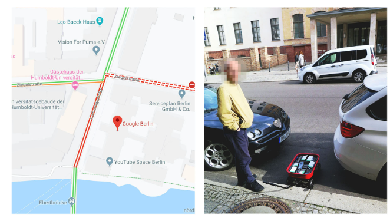
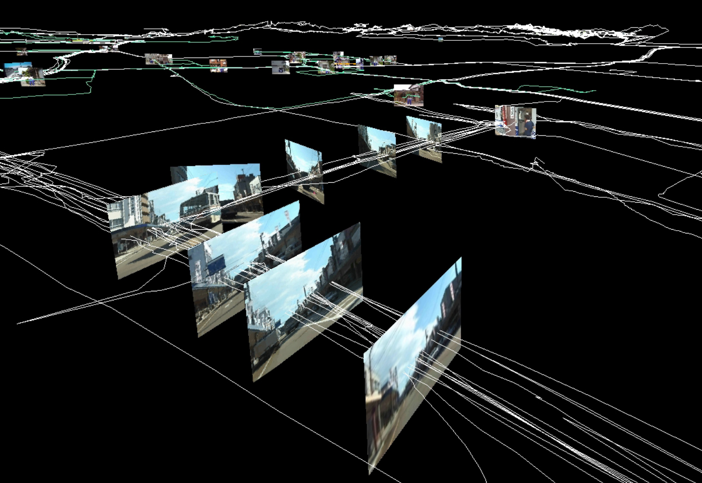

# Intro to Project 3

[*Super Mario Clouds*](https://coryarcangel.com/things-i-made/2002-001-super-mario-clouds) Cory Arcangel (2002)

> I have since grown used to programming only because it is the mechanism that seems to make most of the world move. Believe me, if I could order Pizzas by painting, I definitely would paint.
> 
> Cory Arcangel

[**Project 3: Game as Engine (Due: Week 10)**  ](project-3.md)

Metagames, remix, sampling, streaming, custom input, mods, machinima

Use Unity and/or other tools (emulators, recording software, existing games) to create a real-time, interactive work where games become the platform for expression.

*Recycled Records* Christian Marclay (1983) - Physically remixing a "fixed" medium ([live perf](https://www.youtube.com/watch?v=IIFH4XHU228)).

>And even though metagames have always existed alongside games, the concept has taken on renewed importance and political urgency in a media landscape in which videogames not only colonize and enclose the very concept of games, play, and leisure but ideologically conflate the creativity, criticality, and craft of play with the act of consumption. When did the term game become synonymous with hardware warranties, packaged products, intellectual property, copyrighted code, end user licenses, and digital rights management? When did rules become conflated with the physical, mechanical, electrical, and computational operations of technical media? When did player become a code word for customer? When did we stop making metagames?
>
>[*Metagaming: Playing, Competing, Spectating, Cheating, Trading, Making, and Breaking Videogames*. ](https://manifold.umn.edu/read/metagaming)Stephanie Boluk and Patrick LeMieux. 2017

Fourth wall breaking in Metal Gear Solid (1998)

>After all, metagames are not just games about games. They are not simply the games we play in, on, around, and through games or before, during, and after games. From the most complex house rules, arcade cultures, competitive tournaments, and virtual economies to the simple decision to press start, pass the controller, use a player’s guide, or even purchase a game in the first place, for all intents and purposes metagames are the only kind of games that we play. 
>
>[*Metagaming*. ](https://manifold.umn.edu/read/metagaming)Boluk and LeMieux. 2017

[*Hidden In Plain Sight*](https://gottfriedhaider.com/Hidden-In-Plain-Sight). Gottfried Haider (2008) - DMA alum! 

> What's really valuable about hacking and modifying games is the realization that there are ways of interacting with games other than just playing them: roles beyond consumer. Inventing rules is, after all, inventing games.
> 
> *Rise of the Videogame Zinesters* Anna Anthropy (2012)

## Extra Credit

Read Ch 4, "Changing the Game" of *Rise of the Videogame Zinesters* ([pdf](https://drive.google.com/file/d/1_Xy_K0T7GHnaOLjsjEUpHlG7ShGXlp0F/view?usp=drive_link)) and respond to the questions in this [form](https://forms.gle/8TeLm7JJH42XU82V7) 

# Mapping Metagames

Let's consider Google Maps as a Game Engine and take a look at ways that it has been approached: 

*Pokemon GO*. Niantic/Google (2016) -- see also *Ingress* from the same company

> Importantly, though, it \[Pokemon GO\] is less about monitoring where individuals go and more about developing the capacity to direct people where it wants them to move.
> 
> *The Playstation Dreamworld* Alfie Bown (2017)

[Geoguessr](https://www.geoguessr.com/) , making a more literal game out of google maps

*[Postcards from Google Earth](http://www.postcards-from-google-earth.com/)*. Clement Valla (2010-ongoing)

> ... these images are not glitches. They are the absolute logical result of the system
> 

*[GEO GOO](https://geogoo.net/)*. JODI (2008) - approaching google maps as a drawing platform 

[*Google Maps Hacks*](https://www.simonweckert.com/googlemapshacks.html) Simon Weckert (2020) -- using a wagon full of phones to divert traffic 

[*Prison Map*](http://prisonmap.com/about) Josh Begley (2012) - Leveraging the availability of data through a platform (google maps) to reflect on aspects of another platform (USA)

# Navigating the Stack

Google maps is just a one node within a larger network of other tools, software, interfaces, devices, infrastructures, etc. 

Shifting your focus can bring into light another potential game engine.

[*Field Works*](https://field-works.net/) Masaki Fujuhata (1992 - 2012) -- GPS Based work. 

One layer below. GPS is an underlying technology which Google Maps relies on. Wayfinding using location data sensors becomes itself a tool for exploration.

*iPhone Oil Paintings* JK Keller (2012) 

One layer above. The device used to view google maps (screen, phone, etc.) and our physical incompatibility with with these objects can be a different path.

If you are interested in an object -- platforms, software, hardware, relationships -- but are unsure about how to approach it as an engine, consider the layers surrounding that object (above, below, and adjacent).

Some Questions to ask:
- What are the inputs? Can I intervene?
- What are the outputs? Can I intervene?
- Can it be combined with something else?

>... \[metagaming\] has become a popularly used and particularly useful label for a diverse form of play, a game design paradigm, and a way of life occurring not only around videogames but around all forms of digital technology.

[*Metagaming*. ](https://manifold.umn.edu/read/metagaming)Boluk and LeMieux. 2017

[https://www.mokafolio.de/works/YuccaRidicula](https://www.mokafolio.de/works/YuccaRidicula) 

[http://okfoc.us/seapunknames/](http://okfoc.us/seapunknames/) 

# Randomness and things

Any time for this?

# Cameras Workshop

1. talk about cameras in unity, how to use multiple cameras. Things like layer masks, clear flags, render textures. -- Maybe I can show the 
2. Introduce cinemachine, show how to download and create a virtual camera (talk about relationship of main cam to vcam)
3. Rapid proto a scene for cam playing
4. Have groups investigate different types of vcam setups, aim properties, body properties, multicam things?-- 
	1. https://docs.unity3d.com/Packages/com.unity.cinemachine@2.9/manual/CinemachineManagerCameras.html
	2. maybe this is too much, but should be having students do their own research -- know how to navigate docs
5. 