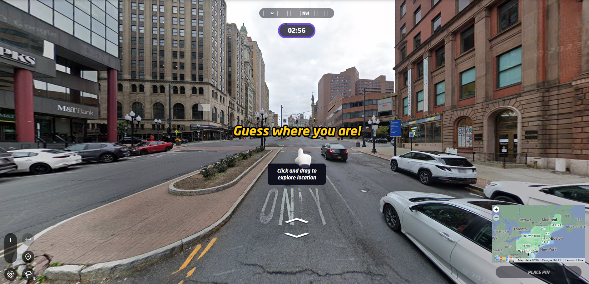

# Intro to Project 3

[*Super Mario Clouds*](https://coryarcangel.com/things-i-made/2002-001-super-mario-clouds) Cory Arcangel (2002)

> I have since grown used to programming only because it is the mechanism that seems to make most of the world move. Believe me, if I could order Pizzas by painting, I definitely would paint.
> 
> Corey Arcangel

[**Project 3: Game as Engine (Due: Week 10)**  ](project-3.md)

Metagames, remix, sampling, streaming, custom input, mods, machinima

Use Unity and/or other tools (emulators, recording software, existing games) to create a real-time, interactive work where games become the platform for expression.

*Recycled Records* Christian Marclay (1983) - Physically remixing a "fixed" medium ([live perf](https://www.youtube.com/watch?v=IIFH4XHU228)).

>And even though metagames have always existed alongside games, the concept has taken on renewed importance and political urgency in a media landscape in which videogames not only colonize and enclose the very concept of games, play, and leisure but ideologically conflate the creativity, criticality, and craft of play with the act of consumption. When did the term game become synonymous with hardware warranties, packaged products, intellectual property, copyrighted code, end user licenses, and digital rights management? When did rules become conflated with the physical, mechanical, electrical, and computational operations of technical media? When did player become a code word for customer? When did we stop making metagames?

[*Metagaming: Playing, Competing, Spectating, Cheating, Trading, Making, and Breaking Videogames*. ](https://manifold.umn.edu/read/metagaming)Stephanie Boluk and Patrick LeMieux. 2017

Fourth wall breaking in Metal Gear Solid (1998)

>After all, metagames are not just games about games. They are not simply the games we play in, on, around, and through games or before, during, and after games. From the most complex house rules, arcade cultures, competitive tournaments, and virtual economies to the simple decision to press start, pass the controller, use a player’s guide, or even purchase a game in the first place, for all intents and purposes metagames are the only kind of games that we play. 

[*Metagaming*. ](https://manifold.umn.edu/read/metagaming)Boluk and LeMieux. 2017

[*Hidden In Plain Sight*](https://gottfriedhaider.com/Hidden-In-Plain-Sight). Gottfried Haider (2008) - DMA alum! 

> What's really valuable about hacking and modifying games is the realization that there are ways of interacting with games other than just playing them: roles beyond consumer. Inventing rules is, after all, inventing games.

*Rise of the Videogame Zinesters* Anna Anthropy (2012)

# Mapping Metagames

*Pokemon Go*. Niantic/Google (2016) -- see also *Ingress* from the same company

[Geoguessr](https://www.geoguessr.com/) , making a more literal game out of google maps

*[GEO GOO](https://geogoo.net/)*. JODI (2008) - approaching google maps as a drawing platform 

[*Google Maps Hacks*](https://www.simonweckert.com/googlemapshacks.html) Simon Weckert (2020) -- using a wagon full of phones to divert traffic 

*iPhone Oil Paintings* JK Keller (2012)

[https://www.mokafolio.de/works/YuccaRidicula](https://www.mokafolio.de/works/YuccaRidicula) 

[http://okfoc.us/seapunknames/](http://okfoc.us/seapunknames/) 

>a diverse form of play, a game design paradigm, and a way of life occurring not only around videogames but around all forms of digital technology.

>Prepositions are to parts of speech as _metagames_ are to games. A signifier for everything occurring before, after, between, and during games as well as everything located in, on, around, and beyond games, the metagame anchors the game in time and space.