# Thinking about visual expression, elements of design in games

[](https://youtu.be/CHm2d3wf8EU)
*Cruelty Squad*

Take each of these into consideration when designing the visual features of your project. How are you approaching a particular element? What does it communicate? How does one element relate to other visual, mechanical, textual, sonic, etc. elements of the work?

It can be useful to look online (or use a virtual assistant) on how to achieve the "look" from an existing game in Unity. Try including the term "shader" or "material", e.g.  "zelda shader in Unity"
# Line
Horizontal, vertical, diagonal, straight, curved, dotted, broken, thick, thin. 

[](https://nikitadiakur.com/)
*[Nikita Diakur](https://vimeo.com/257761642)*

Nice talk about achieving outline effects in the game Roller Drome - [https://youtu.be/G1NY0LKDqJo](https://youtu.be/G1NY0LKDqJo) 
# Color
The wavelength of light. Hue, value, intensity, and temperature.  

[](https://www.youtube.com/watch?v=1b9kVuavlqA)
*[Schim](https://schimgame.com/)*
# Shape – 2D, flat, geometric, organic

  

[](https://www.facebook.com/GazelliArtHouse/videos/peter-burr-dirtscraper-live/566167464450625/)
[*Peter Burr*](https://www.peterburr.org/)
# Form
3D, Geometric, organic

[](http://iancheng.com/)
[*Ian Cheng*](http://iancheng.com/emissaries)

[](https://www.instagram.com/soft_baroque/?hl=en)
[*Soft Baroque*](https://softbaroque.com/)

[](https://www.yonk.online/)
[*Yonk*](https://www.yonk.online/)
# Value
The lightness or darkness of an image

[](https://www.youtube.com/watch?v=Y4HSyVXKYz8)
[*Limbo*](https://playdead.com/games/limbo/)

# Space
The area around, within, or between images. +/- space. Composition.

[](https://www.youtube.com/watch?v=sBmBFN4A_mM)
[*Kentucky Route Zero*](https://youtu.be/l5zwtIExdIM?si=cAqfNB5l-JhDvw3Q&t=936) 15:36

[](https://www.youtube.com/watch?v=NAhrOoNR4ng)
[*Oxenfree*](https://nightschoolstudio.com/oxenfree/)

# Texture
The feel, appearance, thickness, or stickiness of a surface (smooth, rough, silky, furry)  

[](https://www.youtube.com/watch?v=dVlyy0Wnx1Y)
*Hatoful Boyfriend*

For a ton of insightful opinions and examples – references within and beyond games – definitely check out this blog post on [Real Time 3D Imagery](https://startingoverinraccooncity.blogspot.com/2021/02/preferences-and-proposals-for-real-time.html)  

## Toon Shaders


Lots of the effects mentioned at the start of the day can be achieved using a technique called "toon shading" that mixes elements of both lit and unlit shading. The example image above is from a free URP toon shading pack called [OToon](https://assetstore.unity.com/packages/vfx/shaders/otoon-urp-toon-shading-216102) (sadly no longer available via asset store -- backup)

*Note: When looking for custom assets on the Unity Asset Store (or elsewhere), check to make sure they are compatible with your render pipeline.*

## Custom Shaders and Shader Graph

URP (and HDRP) include a node-based editor for creating custom shaders, called “Shader Graph”


I won’t be getting into the details of custom shaders for this class. But in some cases there are simple shaders that you can build which aren’t included with URP. 
### Vertex Color Shader

It is possible to include color data with the vertices of a model, known as vertex painting. For example, the models in the [Everything Library](https://www.davidoreilly.com/library) do not come with textures.


To display the colors of the models, you need to use a material that uses a shader to convert the vertex colors of the model to the colors. This is pretty easy to make using a shader graph.


You can then create a material that uses this shader graph, and apply it to the material of an object that has vertex colors:  


# Universal Render Pipeline, Lights, Materials, Shaders

So you may have an idea of how you would like things to look, but how do you design visual elements within Unity?

# Post-processing

URP uses **Volumes** for adding post-processing effects to the scene. When a camera is within a volume, all overrides will be applied to the scene. 

1. Enable “Post Processing” in the Camera
2. Create a Volume Game Object and then create a Profile
3. Add in any overrides that you’d like to include in your scene


## Global illumination


Global illumination is a group of techniques that model both direct and indirect lighting to provide realistic lighting results. Unity has systems for both baked and real time global illumination. In URP, real-time global illumination is not turned on by default ([more info](https://docs.unity3d.com/Manual/realtime-gi-using-enlighten.html))

## Exercise


*Object*. Méret Oppenheim (1936)

Search online for a 3D model of a piece of furniture (the [Everything Library](https://davidoreilly.itch.io/everything-library-furnishings) is a good starting place). Change the material of this object into something impossible or unexpected. Create a composition around the object by using only Unity's default primitives. Frame the scene with the Main Camera object. Use the skybox, lights, and post-processing to enhance the scene.

If you aren't sure how to recreate an effect, ask us and we can help.


# Intro to Project 3


[*Super Mario Clouds*](https://coryarcangel.com/things-i-made/2002-001-super-mario-clouds) Cory Arcangel (2002)

> I have since grown used to programming only because it is the mechanism that seems to make most of the world move. Believe me, if I could order Pizzas by painting, I definitely would paint.
> 
> Cory Arcangel

[**Project 3: Game as Engine (Due: Week 10)**  ](project-3.md)

Metagames, remix, sampling, streaming, custom input, mods, machinima

Use Unity and/or other tools (emulators, recording software, existing games) to create a real-time, interactive work where games become the platform for expression.


*Recycled Records* Christian Marclay (1983) - Physically remixing a "fixed" medium ([live perf](https://www.youtube.com/watch?v=IIFH4XHU228)).

>And even though metagames have always existed alongside games, the concept has taken on renewed importance and political urgency in a media landscape in which videogames not only colonize and enclose the very concept of games, play, and leisure but ideologically conflate the creativity, criticality, and craft of play with the act of consumption. When did the term game become synonymous with hardware warranties, packaged products, intellectual property, copyrighted code, end user licenses, and digital rights management? When did rules become conflated with the physical, mechanical, electrical, and computational operations of technical media? When did player become a code word for customer? When did we stop making metagames?
>
>[*Metagaming: Playing, Competing, Spectating, Cheating, Trading, Making, and Breaking Videogames*. ](https://manifold.umn.edu/read/metagaming)Stephanie Boluk and Patrick LeMieux. 2017

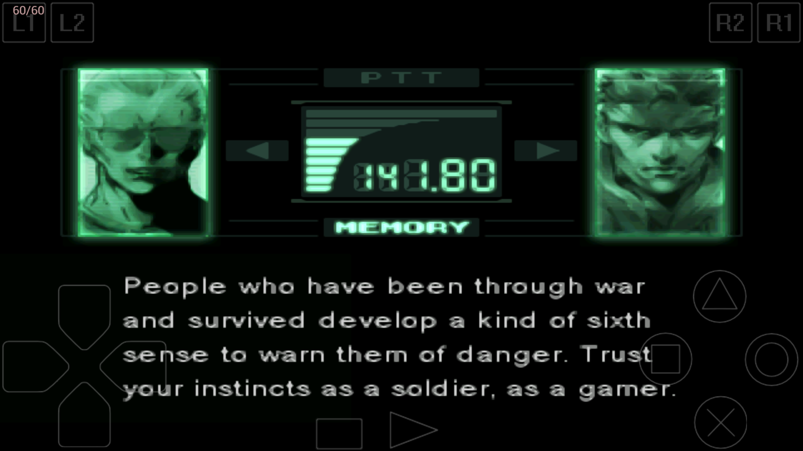
Fourth wall breaking in Metal Gear Solid (1998)

>After all, metagames are not just games about games. They are not simply the games we play in, on, around, and through games or before, during, and after games. From the most complex house rules, arcade cultures, competitive tournaments, and virtual economies to the simple decision to press start, pass the controller, use a player’s guide, or even purchase a game in the first place, for all intents and purposes metagames are the only kind of games that we play. 
>
>[*Metagaming*. ](https://manifold.umn.edu/read/metagaming)Boluk and LeMieux. 2017


[*Hidden In Plain Sight*](https://gottfriedhaider.com/Hidden-In-Plain-Sight). Gottfried Haider (2008) - DMA alum! 

> What's really valuable about hacking and modifying games is the realization that there are ways of interacting with games other than just playing them: roles beyond consumer. Inventing rules is, after all, inventing games.
> 
> *Rise of the Videogame Zinesters* Anna Anthropy (2012)

## Extra Credit

Read Ch 4, "Changing the Game" of *Rise of the Videogame Zinesters* ([pdf](https://drive.google.com/file/d/1_Xy_K0T7GHnaOLjsjEUpHlG7ShGXlp0F/view?usp=drive_link)) and respond to the questions in this [form](https://forms.gle/8TeLm7JJH42XU82V7) 

<iframe src="https://player.vimeo.com/video/17789896?h=a2a3fb7480" width="640" height="360" frameborder="0" allow="autoplay; fullscreen; picture-in-picture" allowfullscreen></iframe>
[Modern Warfare](https://vimeo.com/17789896). Claire L. Evans (2010)

# Mapping Metagames

Let's consider Google Maps as a Game Engine and take a look at ways that it has been approached: 


*Pokemon GO*. Niantic/Google (2016) -- see also *Ingress* from the same company

> Importantly, though, it \[Pokemon GO\] is less about monitoring where individuals go and more about developing the capacity to direct people where it wants them to move.
> 
> *The Playstation Dreamworld* Alfie Bown (2017)

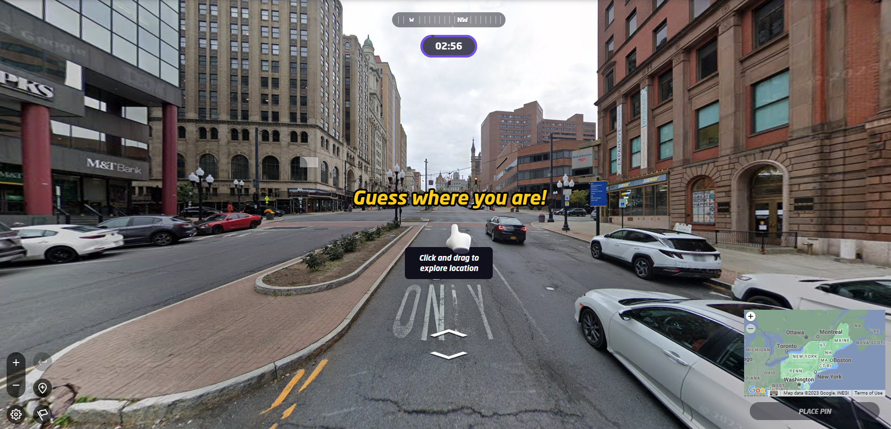
[Geoguessr](https://www.geoguessr.com/) , making a more literal game out of google maps

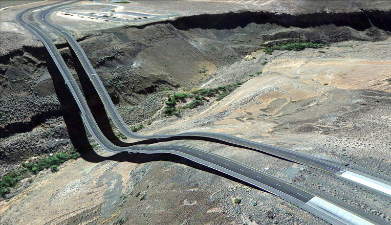

*[Postcards from Google Earth](http://www.postcards-from-google-earth.com/)*. Clement Valla (2010-ongoing)

> ... these images are not glitches. They are the absolute logical result of the system 
> - Clement Valla 


*[GEO GOO](https://geogoo.net/)*. JODI (2008) - approaching google maps as a drawing platform 

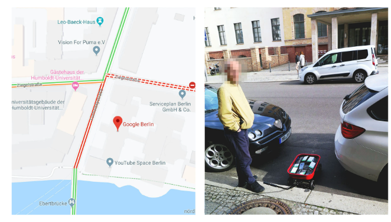

[*Google Maps Hacks*](https://www.simonweckert.com/googlemapshacks.html) Simon Weckert (2020) -- using a wagon full of phones to divert traffic 

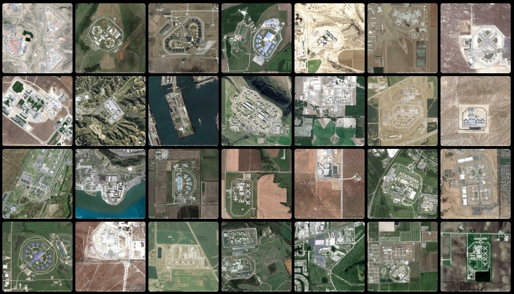
[*Prison Map*](http://prisonmap.com/about) Josh Begley (2012) - Leveraging the availability of data through a platform (google maps) to reflect on aspects of another platform (USA)

# Navigating the Stack

Google maps is just a one node within a larger network of other tools, software, interfaces, devices, infrastructures, etc. 

Shifting your focus can bring into light another potential game engine.

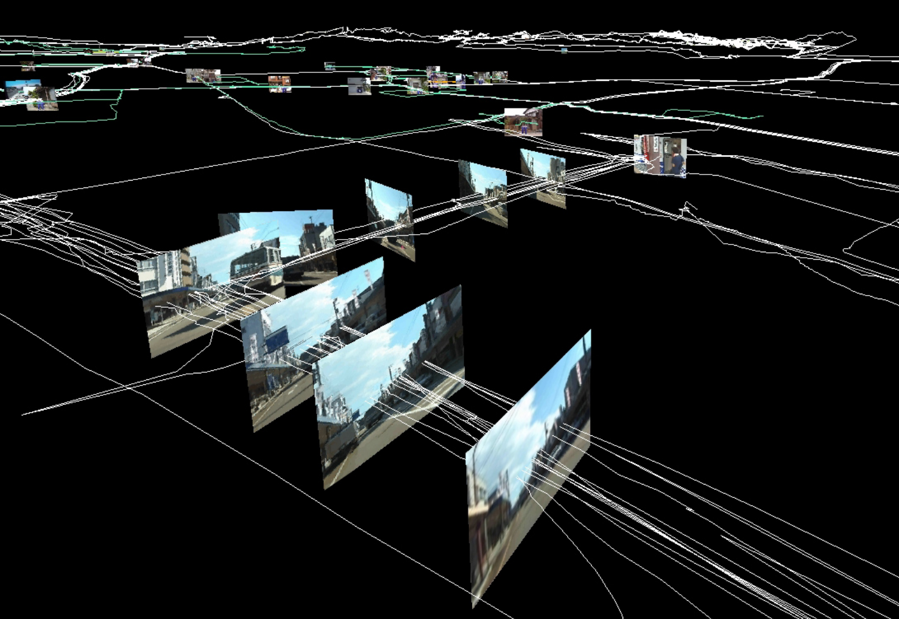
[*Field Works*](https://field-works.net/) Masaki Fujuhata (1992 - 2012) -- GPS Based work. 

One layer below. GPS is an underlying technology which Google Maps relies on. Wayfinding using location data sensors becomes itself a tool for exploration.


*iPhone Oil Paintings* JK Keller (2012) 

One layer above. The device used to view google maps (screen, phone, etc.) and our physical incompatibility with with these objects can be a different path.

If you are interested in an object -- platforms, software, hardware, relationships -- but are unsure about how to approach it as an engine, consider the layers surrounding that object (above, below, and adjacent).

Some Questions to ask:
- What are the inputs? Can I intervene?
- What are the outputs? Can I intervene?
- Can it be combined with something else?

>... \[metagaming\] has become a popularly used and particularly useful label for a diverse form of play, a game design paradigm, and a way of life occurring not only around videogames but around all forms of digital technology.

[*Metagaming*. ](https://manifold.umn.edu/read/metagaming)Boluk and LeMieux. 2017

<iframe width="560" height="315" src="https://www.youtube.com/embed/14wqBA5Q1yc?si=wTSl82oPB4f_EOox" title="YouTube video player" frameborder="0" allow="accelerometer; autoplay; clipboard-write; encrypted-media; gyroscope; picture-in-picture; web-share" allowfullscreen></iframe>

When playing a game, we don't really think of ourselves as manipulating and executing code as much as attempting to "play" within the constraints or rules dictated by the designer/programmer and enforced by the computer. 

Moving from playing games to designing games, the computation aspect becomes more apparent even while a Game Engine abstracts the low level puttering involved in the staging and display of the game. But as a designer, there is no expectation the that the player could themselves become a programmer and rewrite your own game.

Speedrunning is another form of hacking, but only with in-universe tools.

> You can go anywhere you want in gamespace, but you can never leave it.
> 
> *[Gamer Theory](https://futureofthebook.org/gamertheory2.0/)*. Mackenzie Wark (2007)


# Camera Tools


[Assemble with Care](https://www.assemblegame.com/)

Knowing a bit more about working with cameras in Unity can be especially useful when it comes to building projects that sample, recombine, or display live, external imagery.

I'll cover some important tools to know about and a few tricks:

# Camera component

The Camera ([Standard](https://docs.unity3d.com/Manual/class-Camera.html)) ([URP](https://docs.unity3d.com/Packages/com.unity.render-pipelines.universal@17.0/manual/camera-component-reference.html)) 


A Standard Render Pipeline camera component

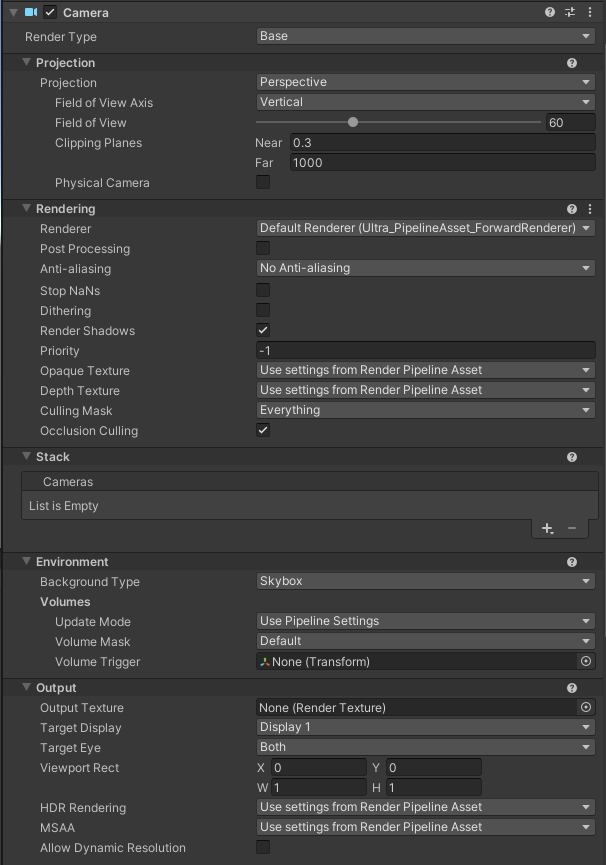
URP Camera component

The URP camera adds a significant number of options compared to the default camera component. It can be good to glance at the [documentation](https://docs.unity3d.com/Packages/com.unity.render-pipelines.universal@17.0/manual/camera-component-reference.html) to see what everything does, but some settings are much more commonly used than others:

- **Projection**: Change camera between Perspective and Orthographic
- **Field of view (FOV)**: How wide (or tall) of an area is visible to the camera. Larger FOV means you can see more.


[Hyper Demon](https://hyprd.mn/) is a game that encourages high FOV to keep track of everything around you.

- **Clipping planes**: What are the closest and farthest distances that a camera can "see"
- **Post Processing**: Check the box if you want to use post processing effects (global volume)
- **Anti-aliasing**: Smooths out any "jaggy" lines. Can be heavy on processing
- **Culling Mask**: Control which layers that the camera can see
- **Occlusion Culling**: hide objects that the camera can't see
- **Background Type**: What is drawn behind everything (like background in p5)
- **Output Texture**: Important if you want to use the camera with a [Render Texture](https://docs.unity3d.com/Manual/class-RenderTexture.html)
- **Target Display**: Control where the camera displays, can use for multi-screen output
- **Viewport Rect**: Control how much of the camera view is rendered to the screen (useful for split screen)


Some intense aliasing
# Render Texture

Camera output isn't limited to a display. You can add the output to other objects in the scene using a [Render Texture](https://docs.unity3d.com/Manual/class-RenderTexture.html)

Here's a short setup step-by-step for connecting a camera output to a material using a render texture:

1. In the Project Panel: **Create > Render Texture** 
2. By default these are 256x256. It's a good idea to only increase the texture size based on where it's being used. If the texture is looking too low-res, try increasing the dimensions.
3. In the Hierarchy of your scene, add a new camera: **Create > Camera**
4. Drag the Render Texture to the new Camera's **Output Texture** property.
5. Create a new Material and drag the Render Texture into the "BaseMap" property (you could also experiment with using the render texture elsewhere).
6. Attach the material to an object, plane, UI element (Raw Image)
7. Press play and the output of the camera should appear on the object.

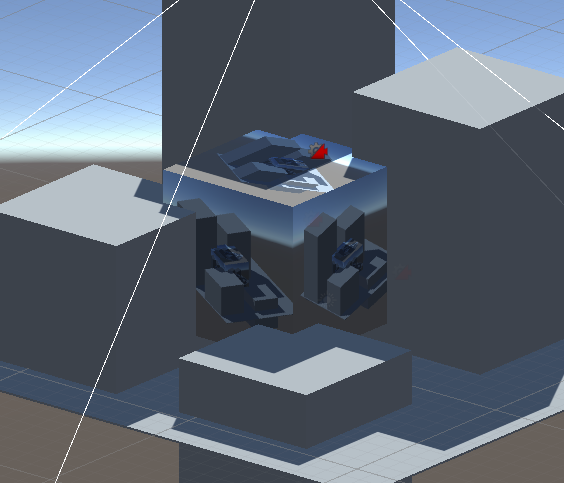

Output of camera attached to a cube using a Render Texture

# Webcam input

Getting the input from a webcam uses a slightly different type of texture called a [WebCamTexture](https://docs.unity3d.com/ScriptReference/WebCamTexture.html)  

The demo script from [this page](https://docs.unity3d.com/ScriptReference/WebCamTexture.Play.html) is a fast way to get webcam input into Unity:

```csharp
// Starts the default camera and assigns the texture to the current renderer
using UnityEngine;
using System.Collections;  
  
public class GetWebCam : MonoBehaviour
{
    void Start()
    {
       WebCamTexture webcamTexture = new WebCamTexture();
       Renderer renderer = GetComponent<Renderer>();
       renderer.material.mainTexture = webcamTexture;
       webcamTexture.Play();
    }
}
```

Attach this script to an object in your scene and it will replace the BaseMap color of the material with the WebCamTexture

# Virtual Webcam Input

If I want to route video from another program on my computer, I can create a "Virtual Webcam" to pass the input into Unity using the WebCamTexture.

I like to use [OBS](https://obsproject.com/) to capture a screen or window and then start up a Virtual Webcam. In Unity, you'll need to tell the WebCamTexture to use that device. There are other ways of routing video within a computer ([syphon](https://syphon.github.io/) for mac, [spout](https://spout.zeal.co/) for windows)

In the controls section of OBS you can start/stop the virtual camera:

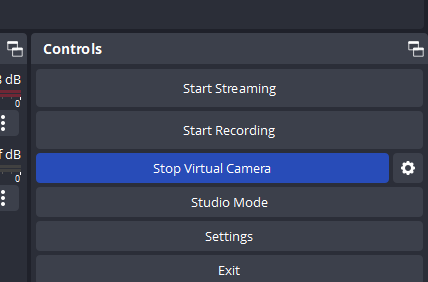

Because the script above will always pick the first camera, you'll need to modify it a bit to figure out which camera is the OBS virtual camera:

```csharp
// Starts the default camera and assigns the texture to the current renderer
using UnityEngine;
using System.Collections;

public class GetWebCam : MonoBehaviour
{
    void Start()
    {
        WebCamDevice[] devices = WebCamTexture.devices;
        WebCamTexture webcamTexture = new WebCamTexture();

        if (devices.Length > 0)
        {
            // print names of all connected devices
            foreach (var d in devices) print(d.name);
            // set the device
            webcamTexture.deviceName = devices[0].name;

            Renderer renderer = GetComponent<Renderer>();
            renderer.material.mainTexture = webcamTexture;

            webcamTexture.Play();
        }
    }
}
```

If you run the game with the updated script, you'll see the names of the devices in the console. I can see that OBS is the second device:

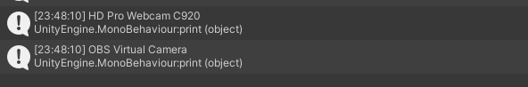

You can directly set the device name in the script, 

```csharp
webcamTexture.deviceName = "OBS Virtual Camera";
```

or I can change the index of the webcam device from 0 to 1

```csharp
webcamTexture.deviceName = devices[1].name;
```

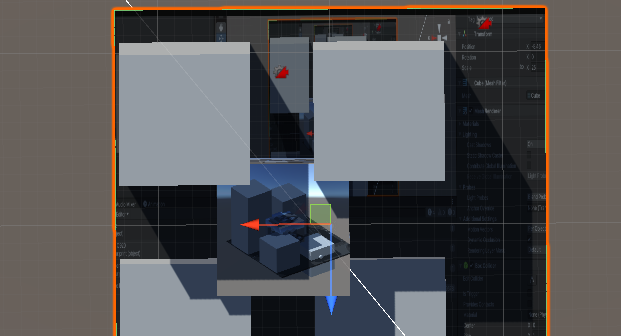

Applying the virtual camera input as a texture on an object

# Reading Pixels

For grabbing pixels off a Camera or Render Texture see [ReadPixels](https://docs.unity3d.com/ScriptReference/Texture2D.ReadPixels.html)

WebCamTexture has it's own version of reading pixels called [GetPixels](https://docs.unity3d.com/ScriptReference/WebCamTexture.GetPixels.html)

In both cases, you'll be writing the output to a new texture or material rather than editing the pixels of the texture before it is passed to a display.

Here's an example of reading the pixel array from a webcam input (extending the previous webcam code from above):

```csharp
using UnityEngine;
using System.Collections;

public class GetWebCam : MonoBehaviour
{
    WebCamTexture webcamTexture;
    Color[] data; // use Color32[] if you need better performance
    Material averageMaterial;
    
    void Start()
    {
        WebCamDevice[] devices = WebCamTexture.devices;
        webcamTexture = new WebCamTexture();

        if (devices.Length > 0)
        {
            // print names of all connected devices
            foreach (var d in devices) print(d.name);

            webcamTexture.deviceName = devices[0].name;

            // store the material to change later
            Renderer renderer = GetComponent<Renderer>();
            averageMaterial = renderer.material;

            webcamTexture.Play();
        }
    }

    void Update()
    {
        data = webcamTexture.GetPixels();
        
        // e.g. find the average color
        float r = 0f;
        float g = 0f;
        float b = 0f;
        foreach(var col in data)
        {
            r += col.r;
            b += col.b;
            g += col.g;
        }

        int len = data.Length;
        Color avgColor = new Color(r/len, g/len, b/len);

        // set the color of the material
        averageMaterial.SetColor("_BaseColor", avgColor);
    }
}
```

This begins to encroach into the territory of shaders (or shader graphs) -- URP has a built-in [Fullscreen Shader Graph](https://docs.unity3d.com/Packages/com.unity.render-pipelines.universal@16.0/manual/post-processing/post-processing-custom-effect-low-code.html) that can be used to design custom post processing effects.

# Decal Projectors

It is not uncommon to add complexity, shadows, markings, logos, etc. to surfaces without wanting to create a custom texture. This can be achieved using a [decal projector](https://docs.unity3d.com/Packages/com.unity.render-pipelines.universal@17.0/manual/renderer-feature-decal.html)


For URP, you can add a decal projector to your scene by right-clicking in the hierarchy and selecting **Rendering > URP Decal Projector**.

In order to use the decal projector, you'll need to add the decal projector [render feature](https://docs.unity3d.com/Packages/com.unity.render-pipelines.universal@17.0/manual/urp-renderer-feature-how-to-add.html) to your URP settings. Conveniently, Unity tells you that you need to add it and gives you a link:

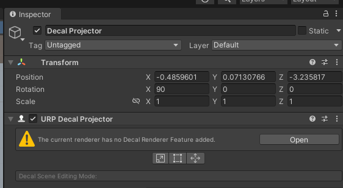

Click "open" to change the view of the inspector and then find "Add Renderer Feature > Decal"

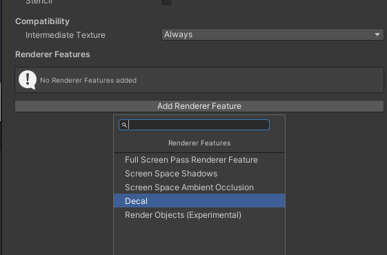

This should reload the scene and the decal projector will be available to use. URP decal projectors use a custom shader found in Shader Graphs/ Decal:

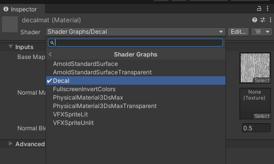

The decal projector, depending on the width, height, and projection depth settings in the component will apply a texture (and/or normal map) onto a surface based on it's forward z-direction:

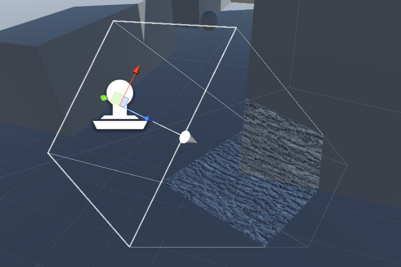
# Boring Challenge

Set up a live mini map using an overhead camera, render texture, and a UI Raw Image. For an extra challenge, use culling layers on the cameras to have the character look different on the mini map.

> Hint: You need to use an unlit UI material on the RawImage

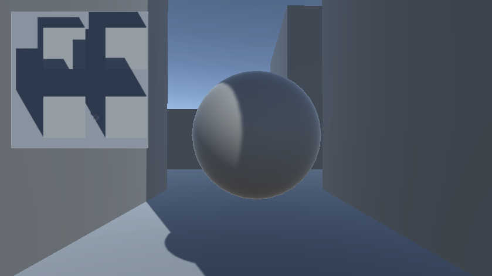

# Better Challenge

Using camera techniques from above, mix together video from inside and outside Unity. Create video feedback loops. Mash up multiple video sources and project them onto 3D objects. Add yourself to the mix with a webcam. Add remote performers from zoom using virtual cameras. Anything can become a source from inside and outside of Unity.


[Let’s Paint, Exercise & Blend Drinks](https://youtu.be/PvbL_5rH1QQ) - public access television


[Sam Rolfes](https://www.instagram.com/sam.rolfes/)


*TV Buddha*. Nam June Paik (1974)

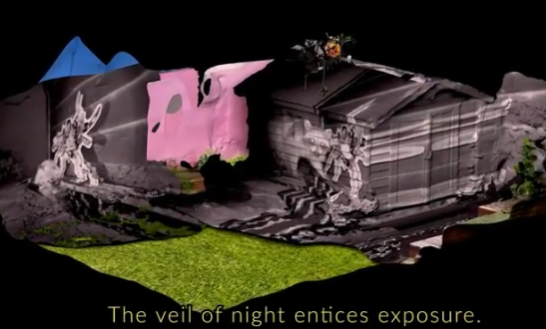
[Graham Akins](https://www.instagram.com/p/BxYggXolojv/?hl=en&img_index=1)


[Shana Moulton](https://www.whisperingpines10.com/)


[Ryan Trecartin & Lizzie Fitch](https://www.instagram.com/ryantrecartin/?hl=en)


*Corridor Installation (Nick Wilder Installation)* Bruce Nauman (1970)