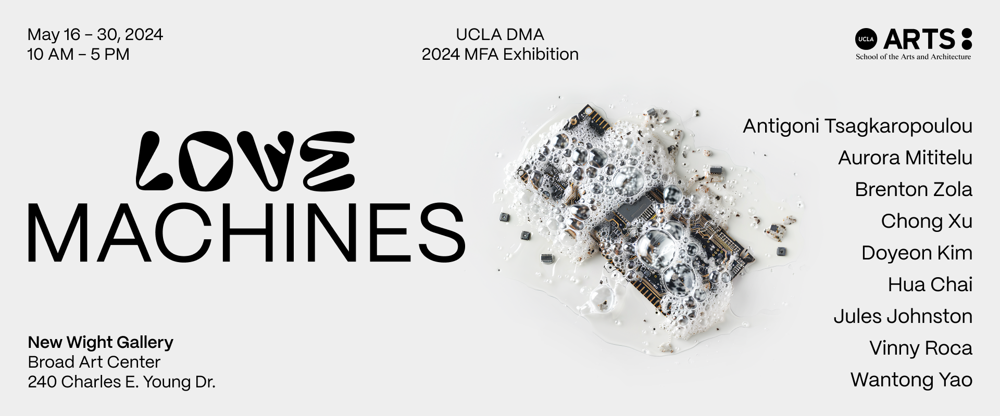

Check out the DESMA MFA 2024 exhibition tonight!
# Project 2 info

Take a quick look at the [Project 2 page](project-2.md) to make sure that you aren't forgetting anything.

We can also revisit any concepts from the last few weeks that might feel a bit shaky:
- [Input System](day-8.md#cocktail-cabinet-input-system)
- [Triggers, Dialogue](day-8.md#scripting-triggers-and-collisions-in-2d)
- [Inventory](day-9.md#picking-up-an-item-and-holding-on)
- [Animation](day-10.md#importing-sprites-animation-frame-animation) / [Scripting animation](day-13.md#animation-scripting)
- [Changing scenes](day-10.md#scenes-loading-changing)
- [Game Manager](day-12.md#a-game-manager-and-dontdestroyonload)
- [Instantiation and Destruction](day-11.md#instantiate-and-destroy)

Or go over some ways to integrate other elements with the above concepts:
- Sounds
- UI and Layout
- Physics and collisions
- Or anything else!

Some bonus things:
https://downpour.games/ -- mobile app game engine
https://alienmelon.itch.io/electric-zine-maker -- digital tool for making zines

# Testing on the cabinet

If you want to test your project on a cocktail cabinet. We can help you set it up. 

## Joytokey config

For those that might want to test the cocktail cabinet inputs by plugging one of the controllers directly into your computer. You can download the [JoyToKey](https://joytokey.net/en/) config file (you'll also need to download JoyToKey): 

[https://drive.google.com/file/d/1eRSZgUk_XG248zJ_lDLOb1Vf2FHsWwJD/view?usp=share_link](https://drive.google.com/file/d/1eRSZgUk_XG248zJ_lDLOb1Vf2FHsWwJD/view?usp=share_link)

# Game Feel, Polish, Juice 

This is something to consider for your project, but be judicious and considerate about what things really need these types of things. 

Can the game just feel good to play, even without any points, score, graphics, etc. – would you have fun just moving the character around the screen? Do actions have weight? Is it satisfying to do an action?

Some common techniques:

- Screen Shake (careful on going overboard)
- Dust particles on landing/jumping
- Character model warping (stretching on jump, squashing on landing)
- Deeper/louder SFX
- Stronger feedback on enemy hits (freeze frames, slow time, flashes, particles, sfx)
- Make things bigger (explosions, bullets, sfx) 

Some Game feel references:

The classic talk on “Juicing” your game –[Juice it or lose it - a talk by Martin Jonasson & Petri Purho](https://www.youtube.com/watch?v=Fy0aCDmgnxg)
Also see follow up [Don’t Juice it or Lose It](https://www.gdcvault.com/play/1020861/Don-t-Juice-It-or
[GMTK also has many videos dedicated to “Feel”](https://youtu.be/216_5nu4aVQ)
[Game Feel Book](http://www.game-feel.com/) (2008)

One of the most popular assets on the Unity Asset store is Feel: [https://feel.moremountains.com/](https://feel.moremountains.com/)

Careful though, it can be easy to “over-juice” a game and make players a bit disoriented

....though sometimes that can be the point:

[Problem Attic](https://lizryerson.itch.io/problem-attic) -  Liz Ryerson

[Textreme](https://ash-k.itch.io/textreme) 

# Studio Time

