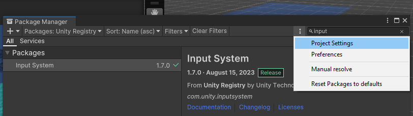
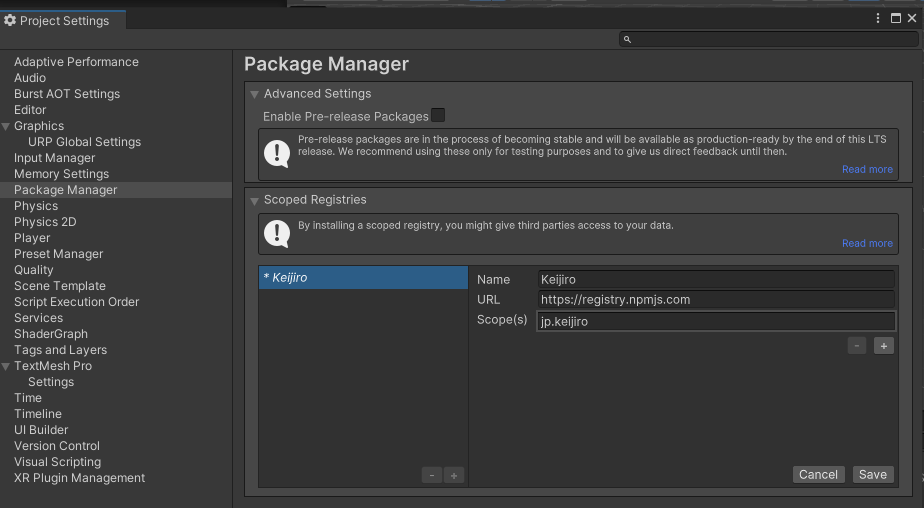
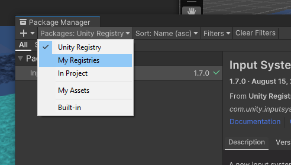
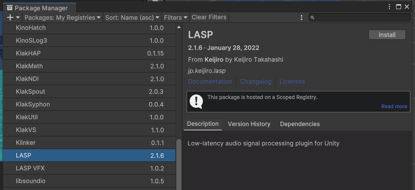
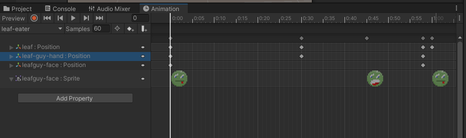
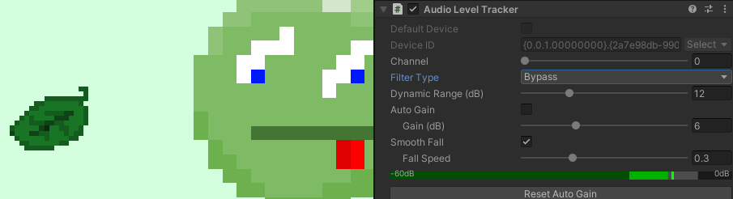

# Homeplay 3

Sign up here:
https://docs.google.com/spreadsheets/d/16Q30e3dV3oBYqcNBkZU3OUfUtbhKppxvfDuS4Yjc6zo/edit?usp=sharing

For this homeplay, a lot of the projects are old and unavailable in their original form, broken, or not meant to be played. Some of the artists may also have works that address videogames very loosely or not at all. 

What we’d like you to do is to pick a Game/Artist/Group and research how the work (or examples within a body of work) reveals the potential “engine” or metagame of an object, medium, or existing game.

Check the “notes” column for starting points if you aren’t sure where to begin.

# Inputs and Interfaces for Sound


[Buchla Easel](https://buchla.com/easel-k/) - reconsider the orientation of inputs and buttons for alternative performance approaches


[Clara Rockmore](https://www.youtube.com/watch?v=pSzTPGlNa5U) - Virtuosa Thereminist - the theremin (Leon Theremin (1920)) uses a proximity-based approach to controlling the frequency and amplitude of a monophonic synthesizer.


David Rokeby's [Very Nervous System](http://www.davidrokeby.com/vns.html) (1986-1990) uses processed video as input to control sound


Laurie Spiegel's Music Mouse (1985) - used software to reconsider the computer mouse as a musical instrument ([playable online version](https://teropa.info/musicmouse/))


[COBRA](https://youtu.be/yp-oZbmsQVw?si=RpTeHjF0mfxq6uQ1) and other "game" works in the 1970s and 80s by composer John Zorn called for improvisation within a framework of rules. Other works included Lacrosse (1976), Hockey (1978), Pool (1979), and Archery (1979)

> Playing John Zorn’s Cobra is akin to playing Monopoly with an ogre: the rules apply until your opponent, gristly hands snapping the board in two, decides they don’t. There is no sheet music, no conductor, no requisite number of players, no instrumentation. A cherished staple of experimental music, Cobra is a game piece—a genre that Zorn in part originated—in which players improvise according to rules that can change at anyone's whim.
> 
> [Jennifer Gersten](https://www.wqxr.org/story/watch-rare-video-john-zorn-recording-his-experimental-piece-cobra-1992/)

Zorn's game pieces might be akin to a TTRPG for improvised music. 

Ultimately, the combination of inputs, sensors/transducers, hardware and software interface design, and computer-mediated rule systems is more or less what we build and consider when developing a game using an engine like Unity.

# LASP


LASP is a plugin for routing audio directly into Unity. It also comes with some useful tools for controlling Unity properties with the incoming audio. 

LASP can be found here:
https://github.com/keijiro/Lasp

> Secret Tip: [Keijiro](https://github.com/keijiro) is a prolific developer of Unity plugins. Check out their github for all sorts of things
> 

Installing can be a bit more involved than adding a package from the Unity Registry. 

First, add the keijiro's scoped registry in the project settings:



Then add this info in the "scoped registries section"

```
name: Keijiro
url: https://registry.npmjs.com
scopes: jp.keijiro
```

It should look like the image below. Click "Save".


Back in the package manager, select the "My Registries" dropdown



You'll see all of Keijiro's packages. Find LASP and click install.



You'll have to click RESTART in the next section to make sure you're using the new input system


# Notes on using LASP

Sound comes in from the AudioLevelTracker component (**Add Component > LASP > Audio Level Tracker**)

> Note: For me, the "Default Device" property almost never works and I need to uncheck the box and manually select the input device from the dropdown


After adding the component and selecting the input device, you should try pressing play to see that the green level meter is reacting to incoming audio.

You can optionally filter high, low, or mid frequencies of the incoming audio if you want to track a slightly more specific band of frequencies. Check out the spectrum analyzer component if you want to listen for more specific frequencies.

## Adding a property

You can bind the incoming audio to any property within Unity:

1. Click the Add Property Binder
2. Select the type of property to bind (float, Vector3, Rotation, Color)
3. Drag a Game Object into the Target
4. Select the component
5. Select the property
6. Set the range of values for when the audio is completely muted (0) and full volume (1)

You can hook the property binder to variables in your scripts as well. Because it is a "property" binder, it means that you'll need to define your variable as a [property](https://learn.microsoft.com/en-us/dotnet/csharp/programming-guide/classes-and-structs/properties). 

The easiest way to do this is like this:

```csharp
public float MyFloatProperty {get; set;}
```

You'll declare the property in the same place that you'd normally declare public variables. When declared this way, you can use the property just like any other public variable.

```csharp
using UnityEngine;

public class testprop : MonoBehaviour
{
    public float MyFloatProp { get; set; }
    
    void Start()
    {
        MyFloatProp = 5f;
        MyFloatProp += 1f;
        print(MyFloatProp);
    }
}
```

# Quick Game

To show a bit more about controlling objects with sound. Let's progressively move something by having to sustain a sound over time. 

First, I'll start with a script that directly links the current amplitude / volume level of the sound to a position along an animation:

```csharp
using UnityEngine;

public class SoundToAnimation : MonoBehaviour
{
    public Animator animator;
    public float SoundInput { get; set; } = 0f;
    void Start()
    {
        // "pause" animation
        animator.speed = 0f;
    }

    void Update()
    {
        // move the playhead to the position of the sound
        animator.Play(0, -1, SoundInput);
    }
}
```

Notice that the `SoundInput` variable is a property. The first two parameters of `animator.Play` are to target the very first animation clip associated with the controller. Drag an animator component into the script, then set up the [property binding](#adding-a-property) with the Audio Level Tracker. Try it out to make sure things are working.

Now, rather than directly link the volume level to the animation. We'll check to see if the volume is louder than a threshold, and we'll increment the animation playhead on frames when the volume is above the threshold:

```csharp
using UnityEngine;

public class ScrubAnimation : MonoBehaviour
{
    public float playhead = 0f;
    public float threshold = 0.7f;
    public float sensitivity = 1f;
    public float SoundInput { get; set; } = 0f;

    public Animator animator;
    void Start()
    {
        // pause animation
        animator.speed = 0f;
    }

    void Update()
    {

        if (SoundInput > threshold) 
            playhead += sensitivity * Time.deltaTime;

        animator.Play(0, -1, playhead);
    }
}
```

Try making something animate using sound. Play with how loud the sound needs to be. What sorts of things might be fun to animate when connected to different types of sound? 





# More Demos

The [LASP github](https://github.com/keijiro/Lasp) is itself a Unity project. You can download the whole repo as a zip and open it with Unity Hub if you want to try it out.

Keijiro describes all the scenes in the github along with some nice gifs:


## Music Engine Examples 

Last year the UCLA Laboratory of Game put on a small [workshop](https://docs.google.com/presentation/d/1Ao0IEBOSMtFcjHfaE6MB1gL6tPvWausfL0rmZfB68tM/edit?usp=sharing) about the possibility of a game engine becoming a musical engine.

There's a whole unitypackage of scenes developed for the workshop. Lots of examples use Unity's physics and input systems for generating alternative musical instruments.


Construct a force-based sequencer that uses physics to push the step trigger around 


Control a pendulum with the analog sticks of a game controller to try and reach samples.


Click on hinged keys that play a sample when crossing the center line.

# Extra Useful Tools

## Loopback recording

If you need to route audio between two programs you can create a virtual audio cable. This is great for quickly grabbing samples!

Soundflower (mac)  :: https://github.com/mattingalls/Soundflower
VB Audio Cable (win) :: https://vb-audio.com/Cable/ 

## Other things
[BBC](https://sound-effects.bbcrewind.co.uk/) [FreeSound](https://freesound.org/) [GDCAudioLib](https://sonniss.com/gameaudiogdc) 

Browser based SFX Generator
https://sfbgames.itch.io/chiptone https://sfxr.me/ (others / all a bit similar)

Browser based audio tracker
https://jummbus.bitbucket.io/ 

More thing (EP’s Tools List) – https://github.com/everestpipkin/tools-list#Sound-music