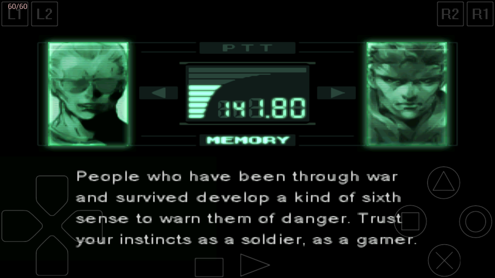
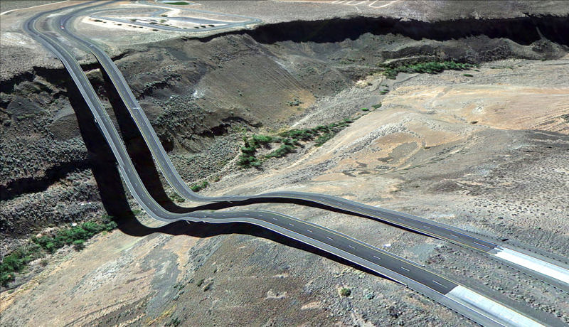
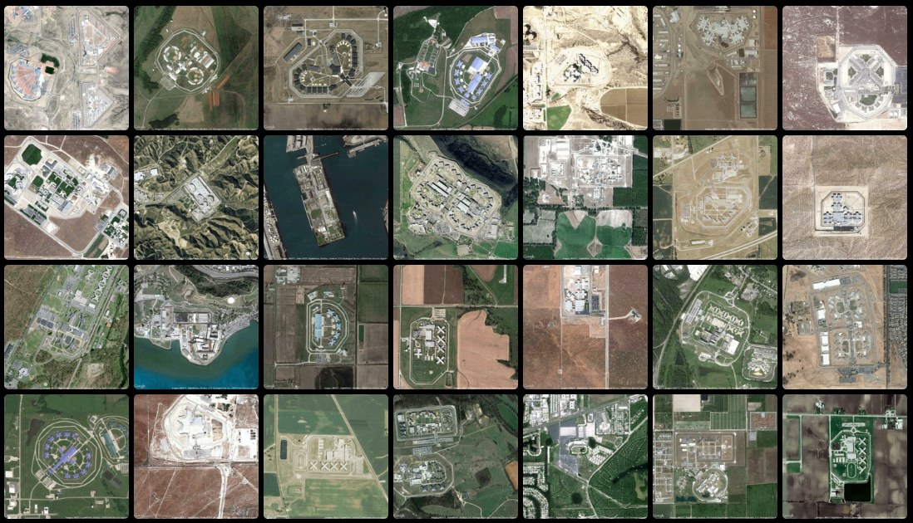
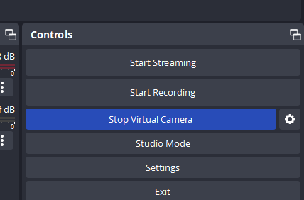
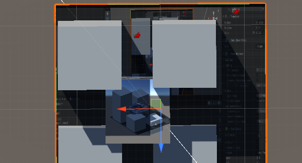
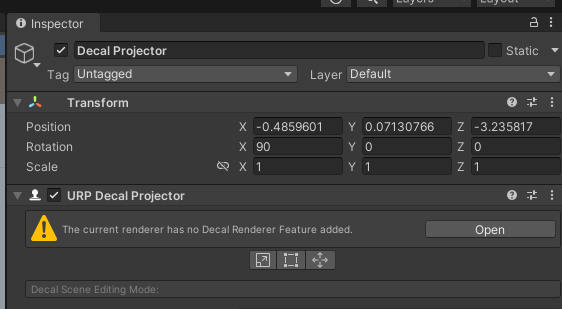
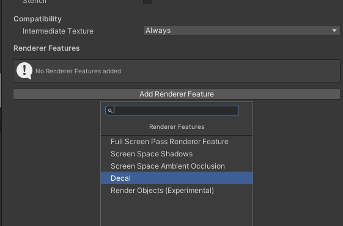

[Prometheus - Theo Trian](https://vimeo.com/559599702)

# Tiny Simulations Package

You can download this [unity package here](https://drive.google.com/file/d/1xOWhh4aRWCeEesZZglBNhmk6KkrNkx0d/view?usp=sharing), it contains some demos of commonly used techniques for building simulations.


# Randomization, Simulation, Generators

Why? Computers are great at receiving some input and returning a result. The deterministic qualities of a computer are what make it useful. 

You want to know that when you create a text file or save a png that the text or the pixels won’t change every time you open the file.

Compare this with how our own brains recall memories, each recall is slightly distorted and affected by time, environment and mood.

Apps can play with our expectations of permanence ([most dangerous writing app](https://www.squibler.io/dangerous-writing-prompt-app)) and it isn’t uncommon to encounter an image or video that is a rip of a photo or a screenshot of a backup of a video recorded from a tv screen ([In defense of the poor image](https://www.e-flux.com/journal/10/61362/in-defense-of-the-poor-image/)).

  


So it takes a bit of human intervention to introduce randomness to deterministic machines. Maybe this is why randomness is so alluring, it adds a touch of humanity. 
# Process

1. What do you want to generate?
2. What are the properties and constraints of your thing? 
3. What are the methods for generating these things?
4. Generate things  
5. Evaluate, modify, repeat

([alt approach](https://www.youtube.com/watch?v=s_eyo_m_hnc&t=958s) – start with method first or reverse engineer some objects)

Consider perceptual differentiation vs perceptual uniqueness. Is it enough to tell that each new output is different from the previous one, or should the output also be totally unique? All discussed in [So you want to build a generator](https://galaxykate0.tumblr.com/post/139774965871/so-you-want-to-build-a-generator)

## Generating things


*A hundred thousand billion poems* - Raymond Queneau ([coded](https://codepen.io/olliepalmer/pen/YOzbYb))

You don’t need to build every single house in a city as long as you have a set of blocks and components that would ultimately comprise enough variety to give the impression of a complex city. 


[video](https://youtu.be/FaswJcEWTfE)

A big part of generation involves understanding a particular typology, recognizing the core components of what might define a character/story/object/sound and defining the variations that you can explore within that theme


Hans Eijkelboom – [People of the Twenty-first Century](https://www.phaidon.com/agenda/photography/articles/2014/october/09/hans-eijkelboom-laureate-of-normcore/) 
## Creating images, simulations and movements


[Mirror Lake](https://everestpipkin.itch.io/mirrorlake) - Everest Pipkin  


[Lichenia](https://molleindustria.org/lichenia/) - Molleindustria 

## Emergent behavior 


Braitenberg Vehicle - [more info here](http://users.sussex.ac.uk/~christ/crs/kr-ist/lecx1a.html)
[](https://youtu.be/yYgjx3vpvN0)


Steering algorithms / boids / agent behaviors ([nature of code](https://natureofcode.com/book/chapter-6-autonomous-agents/))

Emergent behavior refers to the phenomenon where complex systems exhibit properties, patterns, or behaviors that arise from the interactions of simpler components within the system.

These emergent properties are not explicitly programmed or designed but arise spontaneously as a result of the interactions and relationships between the system's components.  

See also Autopoiesis –  the self-maintaining and self-reproducing nature of living systems. Autopoietic systems give rise to emergent properties. ([book](https://monoskop.org/images/3/35/Maturana_Humberto_Varela_Francisco_Autopoiesis_and_Congition_The_Realization_of_the_Living.pdf))

 


[Reaction diffusion](https://www.karlsims.com/rd.html) – simulation of two virtual chemicals 


[https://ncase.me/sim/](https://ncase.me/sim/) – Cellular Automata


[Emissary Forks For You (2016)](https://www.artspace.com/magazine/interviews_features/art-bytes/ian-cheng-interview-54128) – Ian Cheng 

Boid simulation, steering, autonomous agents, and “Sim” games. Stories and narratives can come into being even when based on simple sets of rules.


[The Sims](https://www.ea.com/games/the-sims)


[Dwarf Fortress](http://www.bay12games.com/dwarves/) 

See [patch notes](https://www.pcgamer.com/the-most-ridiculous-patch-notes-from-10-years-of-dwarf-fortress/) for unexpected outcomes of the dwarf fortress systems: 


## Modular Architecture

Create a program that designs buildings out of modular parts, with a variety of terraces, flags, windows, roofing, materials, telephone wires, banners, and more.

Are you emulating an existing architectural style? Or are you designing Escher-like impossible architectures?


Vietnam Romance - Eddo Stern Features cityscapes made out of randomly generated modular buildings. Each building is constructed from a variety of roofs, floors, window decorations, awnings, and signs.

See also: Wave Function Collapse

[https://selfsame.itch.io/unitywfc](https://selfsame.itch.io/unitywfc) or [https://marian42.de/article/wfc/](https://marian42.de/article/wfc/) – based on : [https://github.com/mxgmn/WaveFunctionCollapse](https://github.com/mxgmn/WaveFunctionCollapse) 


While the final result may seem effortless. There is quite a bit of preparatory work in designing modular sections as well as defining the rules for how each section fits together. 

Most often used in generating landscape / maps. However [this is not the only algorithm](https://christianjmills.com/posts/procedural-map-generation-techniques-notes/) 


[https://www.badnorth.com/](https://www.badnorth.com/) – see Oskar Stalberg give a [talk on WFC usage in Bad North](https://youtu.be/0bcZb-SsnrA) 

## Generative Landscape

Write a program that presents an ever-changing, imaginative landscape. Populate your landscape with features that are suitable for your concept: trees, buildings, vehicles, animals, people, food, body parts, hairs, seaweed, space junk, zombies, etc.

While there are many techniques for generating “realistic” landscapes (see Sebastian Lague’s [series of videos](https://youtu.be/wbpMiKiSKm8)), your landscape does not need to follow those conventions. Consider Mirror Lake above. While the scale isn’t completely clear, there is a consistent substrate (the lake / bowl / pot), and the random variation happens in the growth and surrounding areas.

Really consider the scale that you are trying to generate. Is it a planet, a garden, or a leaf? How does the viewer navigate or experience your landscape? Are things constantly being generated or does the interaction take place post-generation? Does the camera fly through it? Does the camera orbit?


Proteus - David Kanaga Players explore a large, generative island in 3D. The island is populated by low-res trees, flowers, and more. The soundscape changes based on the weather, time of day, and other factors.
## Genetic Algorithm

Write a program that presents the user with several randomly generated options. The user picks a few, and a new set is produced based on the user's selections.

A genetic algorithm needs three things:
- A thing you can modify (a 'genotype’)
- A thing you can judge (a 'phenotype’)
- A way to turn the first into the second


Kate Compton - Flower Generator

## Automata

Write a program that creates a dynamic visual system using cellular automata or other dynamic agents that change state based on their neighbors.

See the [Emoji Simulator](https://ncase.me/sim/) by Nicky Case for a great interactive example of cellular automata in action.

This blog post does a decent job explaining cellular automata: [https://tatasz.github.io/compound_ca/](https://tatasz.github.io/compound_ca/)


# Tiny Simulations Package

You can download this [unity package here](https://drive.google.com/file/d/1xOWhh4aRWCeEesZZglBNhmk6KkrNkx0d/view?usp=sharing), it contains some demos of common 


  

## Scene 1: Generating objects

After downloading the unitypackage. Open the package in a new or existing URP project and open the “generate-objects” scene under Scenes > generate-objects.

This scene is pretty simple: a platform and a few spawners that we can use to test out different methods for instantiating objects.

Let’s start with the basic spawning script:

```csharp
using System.Collections;  
using UnityEngine;  

public class SpawnGameObject : MonoBehaviour  
{  
	// prefab to spawn  
	public GameObject prefab;  
	
	[Range(0.1f,8f)]  
	public float ratePerSecond = 1f;  
	
	void Start()  
	{  
		// use a coroutine to control the spawn rate  
		StartCoroutine(Spawn());  
	}  
	
	IEnumerator Spawn(){  
		// infinite loop  
		while(true){  
			// spawn the prefab  
			Instantiate(prefab, transform.position, transform.rotation);  
			// wait a moment before next loop  
			yield return new WaitForSeconds(1f/ratePerSecond);  
		}  
	}  
}
```

  

This combines [Instantiate](https://docs.unity3d.com/ScriptReference/Object.Instantiate.html) with a [Coroutine](https://docs.unity3d.com/Manual/Coroutines.html) to continuously spawn a new prefab at a specific interval. 

Attach the script to an empty game object. Create a [prefab](https://docs.unity3d.com/Manual/Prefabs.html) and drag it into the script's prefab slot in the inspector. Press play and see if the prefab spawns.


What are ways to complicate things?  
  
Spawn prefabs over a range of positions…

- Using [Random.InsideUnitSphere](https://docs.unity3d.com/ScriptReference/Random-insideUnitSphere.html) or [Random.OnUnitSphere](https://docs.unity3d.com/ScriptReference/Random-onUnitSphere.html) or [Random.Range](https://docs.unity3d.com/ScriptReference/Random.Range.html) 
  
Spawn multiple prefabs each time…

- For loop wrapped around Instantiate


Animate the spawner to create a pattern of prefabs…

- Using the Animation system
- Animating the position and rotation with script … in Update loop
- … or give the spawner a RigidBody and add forces to it

Adding a force to the spawned prefabs (could also be done on the prefab itself)

- [GetComponent](https://docs.unity3d.com/ScriptReference/Component.GetComponent.html) -> [AddForce](https://docs.unity3d.com/ScriptReference/Rigidbody.AddForce.html) (don't forget `ForceMode.Impulse`) 

Adding collision detection to the prefabs

- Spawn more objects/images/sounds/particles on collision
- Change colors on collision

Randomly spawning from an array of prefabs…

```csharp
// array to fill with prefabs in the inspector  
public GameObject[] prefabs;  

//...  
// inside the coroutine  

// pick random prefab from the array  
GameObject randomPrefab = prefabs[Random.Range(0, prefabs.Length)];  
// spawn it  
Instantiate(randomPrefab, transform.position, transform.rotation);
 ```

Add to the array of prefabs in the inspector:


## Face Shuffler

We could use this technique to spawn prefabs at specific locations. Here’s an example script that uses preset GameObjects, but randomly switches the textures on the objects:


```csharp
using UnityEngine;  

public class FaceShuffler : MonoBehaviour  
{  
	public GameObject eyes;  
	public GameObject nose;  
	public GameObject mouth;  
	
	public Texture[] eyeTextures;  
	public Texture[] noseTextures;  
	public Texture[] mouthTextures;  
	
	void Start()  
	{  
		Shuffle();  
	}  
	
	public void Shuffle()  
	{  
		// pick random textures  
		var randEye = GetRandomTexture(eyeTextures);  
		var randNose = GetRandomTexture(noseTextures);  
		var randMouth = GetRandomTexture(mouthTextures);  
		
		// update the texture on each object  
		SetTexture(eyes, randEye);  
		SetTexture(nose, randNose);  
		SetTexture(mouth, randMouth);  
	}  
		
	public void SetTexture(GameObject obj, Texture tex)  
	{  
		obj.GetComponent<Renderer>().material.SetTexture("_BaseMap", tex);  
	}  
		
	public Texture GetRandomTexture(Texture[] textures)  
	{  
		return textures[Random.Range(0, textures.Length)];  
	}  
}
```


You can download [this unitypackage](https://drive.google.com/file/d/1ehZKqJ_Dq3EurMjSftbrkZN2w0K1bpXl/view?usp=share_link) with the scene to test it out.


## Spawning prefabs from spawned prefabs: Chain Link

You can spawn prefabs that also contain an object spawner. It’s important to be careful to avoid runaway spawners that could cause crashing or freezing. In this example, there is a maximum number of layers that are allowed to spawn and the spawner will only spawn when the linkPrefab variable is not null. It’s possible to prevent further generation by setting the linkPrefab value to null in the newly instantiated game object.

[Unity package](https://drive.google.com/file/d/1KOeK9PLpm2CglfuJA63ZcXkmKQSBk1PD/view?usp=share_link)


```csharp
using UnityEngine;  

public class SpawnLink : MonoBehaviour  
{  
	public GameObject linkPrefab;  
	public float length = 5f;  
	public float angleVariation = 10f;  
	public float delay = 1f;  
	public int branchesPerSpawn = 2;  
	public int maxLinks = 5;  
	
	static int linkCount = 0;  
	
	void Start()  
	{  
		// add more to the link count  
		linkCount++;  
		// spawn after delay  
		Invoke("Spawn", delay);  
	}  
	
	void Spawn()  
	{  
		if(linkPrefab != null)  
		{  
			for(int i = 0;  i < branchesPerSpawn; i++)  
			{  
				// move to end of this prefab  
				Vector3 spawnPos = transform.position + transform.up * length;  
				
				// adjust the direction  
				Vector3 spawnRot = transform.rotation.eulerAngles + new Vector3(  
				Random.Range(-angleVariation, angleVariation),  
				Random.Range(-angleVariation, angleVariation),  
				Random.Range(-angleVariation, angleVariation));  
				
				// spawn the link  
				GameObject link = Instantiate(linkPrefab, spawnPos, Quaternion.Euler(spawnRot));  
				
				if (linkCount > maxLinks)  
				{  
					link.GetComponent<SpawnLink>().linkPrefab = null;  
				}  
			}  
		}  
	}  
}
```


  


  

# Particle Systems


The Unity Particle System is a tool for creating and controlling dynamic visual effects such as fire, smoke, explosions, and more. It simulates the behavior of individual particles, which can be emitted, move, change color, size, and fade over time, creating effects in real-time.

Adding a new particle system involves adding the Particle System component to a game object. In addition to the built-in particle system, the [Visual Effect Graph](https://docs.unity3d.com/Packages/com.unity.visualeffectgraph@16.0/manual/GettingStarted.html) is a newer, node-based system that is GPU optimized and only runs in URP and HDRP 


Built-in particle system component


Empty VFX Graph

## Firework Effect

We will be taking a short tour of the built-in particle system by building a firework effect.

What are the parts of a firework? How to break down the effect?


## Launching

1. In a new scene, create an empty game object named “firework” and add a particle system component.
2. Clicking on the object in the hierarchy should show a preview of the effect in the scene view. If it looks like a bunch of pink squares, you’ll need to assign a material to your effect.
   

3. In your project’s assets, create a new material and select it. In the inspector for the material, set the shader to Universal Render Pipeline > Particles > Unlit
4. Select the firework game object in the hierarchy and expand the Renderer section of the particle system component in the inspector. Set the Material field to the material you just created. URP should also come with a default ParticlesUnlit material that you can use.
   
5. The particles aren’t going in the right direction, so rotate the system to make the particles move upward. You can either rotate the x-value of the transform by -90 degrees. Or you can expand the Shape section of the particle system and rotate its x-value by -90 degrees.
   


6. Reduce the number of fireworks being launched. In the Emission section of the particle system, lower the Rate over time value to around one or less. 
7. Increase the launch speed. Change the Start Speed of the particle system to something a bit faster. Also, increase the Gravity Modifier to one. Play with the values until the behavior looks right.
8. Now reduce the Start lifetime of the particle so it disappears at about the apex of its trajectory. 
9. Scale the size of the launcher using the Start Size value. It might be useful to create a default cube somewhere in your scene to get a sense of scale.

## Exploding

10. Create another particle system named “explosion”. In addition to adding the particle system to an empty game object. You can also use Game Object > Effects > Particle System
    

11. Open the Shape section of this particle system and change the shape to Sphere. Now the particles will emit outward in all directions.
12. Make it so the particles all emit together. Under the Emission section, change the Rate over Time value to zero and add a new Burst to the burst list. Adjust the Count (even set the count to be randomized).
    

13. Adjust the Start Speed, Start Size, Start Lifetime, Gravity Modifier until you are happy with the effect. 

## Connecting the two. Sub Emitters

14. Select the firework launcher game object and expand the Sub Emitters section of the particle system component. If it’s grayed out, you’ll need to select the check-box next to the name.
    
15. Change Birth to Death and then drag the explosion particle system into the empty slot. When a popup appears, select Yes, reparent to make the explosion a child of the launcher game object.
16. Additionally, change the Inherit property to Color so that the explosion will inherit the color of the launched firework.
    

17. Now the preview should be showing the launch and explosion of the firework. 
18. Add random colors to the system. Change the Start Color of the launcher to Random Color. Then click the color swatch and add in a few different colors inside the gradient editor. Selecting the bottom arrow lets you change the color at that position, the top arrow lets you change the alpha value of that position (note: make sure the material you are using in your particle system is set to transparent, otherwise the alpha values will be ignored).
    
    
    
20. Now you should see randomized colors for each firework. Try playing around with other settings on the particle system. Color over Lifetime could be used to fade out the explosion. Trails can add some more effects.

What other things could you build? Snow? Fire? Rain? Confetti?

  

 

# Perlin Noise

Calling successive random values from Random.value results in successive, but disconnected values. When you’d like to sample random values that can smoothly move from one value to another, you can use the Perlin Noise algorithm.


Perlin noise can be useful for adding more organic movement to objects, variation in textures, and heights in a landscape.

[Check this update to the Unitypackage for demos involving Perlin Noise](https://drive.google.com/file/d/1s7B0HBBwFQzAWcH7d3ql7fDOvr1biOJl/view?usp=sharing)

Import the Unitypackage into your project (URP) and open the scene called “Noise”
## Generating a noise texture

In the scene, the active object called “PerlinNoiseTexture” contains a script that will generate a texture and apply it to a cube. Generating a texture is also something new that you could use elsewhere if you need to create custom textures while your game is running.

In Unity the [Mathf](https://docs.unity3d.com/ScriptReference/Mathf.html) class contains [Perlin Noise](https://docs.unity3d.com/ScriptReference/Mathf.PerlinNoise.html) which can be used to sample 2D noise values at different x and y coordinates.

```csharp
float value =  Mathf.PerlinNoise(xCoord, yCoord);
```
  
Each coordinate will return a value between 0.0 and 1.0. The distance between successive coordinates can control the variation of the sampled values. Smoother changes will have shorter distances between two points.

Creating the texture involves defining a new [Texture2D](https://docs.unity3d.com/ScriptReference/Texture2D.html) with a width and a height. This creates a canvas where you can specify the color of each pixel. 

```csharp
Texture2D texture = new Texture2D(width, height);
```

Set the pixel color by giving the coordinates of that pixel and a [Color](https://docs.unity3d.com/ScriptReference/Color.html) (all values are between 0 and 1):

```csharp
Color color = new Color(1, 0.92, 0.016); // set RGB of the color  
texture.SetPixel(x, y, color);
```

When generating a perlin noise texture, we’ll use the pixel X and Y coordinates of the texture as coordinates for the Perlin Noise method.

The script encapsulates all of this into a method:

```csharp
Color CalclulateColor(int x, int y)  
{  
	// convert from pixel coords to perlin coords  
	float xCoord = (float)x / width * scale;  
	float yCoord = (float)y / height * scale;  
	
	float value = Mathf.PerlinNoise(xCoord, yCoord);  
	
	return new Color(value, value, value);  
}
```

While you could directly use the pixel coordinates, the conversion lets us vary how “zoomed” we are in the noise space.

The script loops through every pixel of the texture and sets the color using this CalculateColor method:

```csharp
Texture2D GenerateTexture()  
{  
	Texture2D texture = new Texture2D(width, height);  
	
	for (int x = 0; x < width; x++)  
		{  
		for (int y = 0; y < height; y++)  
		{  
			Color color = CalclulateColor(x, y);  
			texture.SetPixel(x, y, color);  
		}  
	}  
	
	// have to call this or the texture won't update  
	texture.Apply();  
	
	return texture;  
}
```

Take a look at the script in the unity package to see it in its entirety. There is a separate method that demonstrates using multiple layers of noise, also known as multi-octave or fractal noise which are often used to generate more “natural” looking noise. See Catlike-coding for a bunch of in-depth tutorials on [pseudorandom noise](https://catlikecoding.com/unity/tutorials/pseudorandom-noise/)
## Movement with randomness and noise

Comment out the PerlinNoiseTexture game object and uncomment the RandomWalk object.

This object has a script that demonstrates three different types of random movement.

### Using Random.onUnitSphere to pick random directions for a cube to move

```csharp
void MoveRandom()  
{  
	// pick a random direction  
	Vector3 randomDirection = Random.onUnitSphere;  
	
	// move a bit in that direction  
	transform.position += randomDirection * Time.deltaTime;  
}
```

### Using a random value with different thresholds to determine the direction of movement


```csharp
void MoveWeightedRandom()  
{  
	// pick random value  
	float value = Random.value;  
	
	Vector3 movement = Vector3.zero;  
	
	// use these values to control the weights of the agent's movement  
	if (value < 0.4)  
	{  
		movement = Vector3.left;  
	}  
	else if (value < 0.6)  
	{  
		movement = Vector3.right;  
	}  
	else if (value < 0.8)  
	{  
		movement = Vector3.forward;  
	}  
	else  
	{  
		movement = Vector3.forward;  
	}  
	
	
	// move that direction  
	transform.position += movement * Time.deltaTime;  
}
```

### Using perlin noise to control movement

```csharp
void MoveWithPerlinNoise()  
{  
// move through perlin space over time  
float newX = Mathf.PerlinNoise(Time.time, 0) * 10f;  
float newZ = Mathf.PerlinNoise(0, Time.time) * 10f;  

Vector3 movement = new Vector3(newX, 0, newZ);  

// move that direction  
//transform.position += movement * Time.deltaTime;  
transform.position = movement;  
}
```


By using Time.time, it’s possible to walk through the noise space.

## Spawning with noise

Just as we used the coordinate values of noise to pick a color for a texture, the value can also be used to set the height of many objects. 

The next game object, RandomSpawning, has a script that generates a grid of prefabs. The grid coordinates are also used to sample from perlin noise, and that value determines the height at which the prefab will be spawned.

```csharp
for (int i = 0; i < width; i++)  
{  
	for (int j = 0; j < height; j++)  
	{  
		// calculate the height  
		float height = heightScale * Mathf.PerlinNoise(i * noiseScale, j * noiseScale);  
		Instantiate(prefab, new Vector3(i, height, j), Quaternion.identity);  
	}  
}
```

The script in the scene also stores each instantiated object in an array. This allows values to be adjusted during the update loop.

# Thinking about visual expression, elements of design in games

[](https://youtu.be/CHm2d3wf8EU)
*Cruelty Squad*

Take each of these into consideration when designing the visual features of your project. How are you approaching a particular element? What does it communicate? How does one element relate to other visual, mechanical, textual, sonic, etc. elements of the work?

It can be useful to look online (or use a virtual assistant) on how to achieve the "look" from an existing game in Unity. Try including the term "shader" or "material", e.g.  "zelda shader in Unity"
# Line
Horizontal, vertical, diagonal, straight, curved, dotted, broken, thick, thin. 

[](https://nikitadiakur.com/)
*[Nikita Diakur](https://vimeo.com/257761642)*

Nice talk about achieving outline effects in the game Roller Drome - [https://youtu.be/G1NY0LKDqJo](https://youtu.be/G1NY0LKDqJo) 
# Color
The wavelength of light. Hue, value, intensity, and temperature.  

[](https://www.youtube.com/watch?v=1b9kVuavlqA)
*[Schim](https://schimgame.com/)*
# Shape – 2D, flat, geometric, organic

  

[](https://www.facebook.com/GazelliArtHouse/videos/peter-burr-dirtscraper-live/566167464450625/)
[*Peter Burr*](https://www.peterburr.org/)
# Form
3D, Geometric, organic

[](http://iancheng.com/)
[*Ian Cheng*](http://iancheng.com/emissaries)

[](https://www.instagram.com/soft_baroque/?hl=en)
[*Soft Baroque*](https://softbaroque.com/)

[](https://www.yonk.online/)
[*Yonk*](https://www.yonk.online/)
# Value
The lightness or darkness of an image

[](https://www.youtube.com/watch?v=Y4HSyVXKYz8)
[*Limbo*](https://playdead.com/games/limbo/)

# Space
The area around, within, or between images. +/- space. Composition.

[](https://www.youtube.com/watch?v=sBmBFN4A_mM)
[*Kentucky Route Zero*](https://youtu.be/l5zwtIExdIM?si=cAqfNB5l-JhDvw3Q&t=936) 15:36

[](https://www.youtube.com/watch?v=NAhrOoNR4ng)
[*Oxenfree*](https://nightschoolstudio.com/oxenfree/)

# Texture
The feel, appearance, thickness, or stickiness of a surface (smooth, rough, silky, furry)  

[](https://www.youtube.com/watch?v=dVlyy0Wnx1Y)
*Hatoful Boyfriend*

For a ton of insightful opinions and examples – references within and beyond games – definitely check out this blog post on [Real Time 3D Imagery](https://startingoverinraccooncity.blogspot.com/2021/02/preferences-and-proposals-for-real-time.html)  

## Toon Shaders


Lots of the effects mentioned at the start of the day can be achieved using a technique called "toon shading" that mixes elements of both lit and unlit shading. The example image above is from a free URP toon shading pack called [OToon](https://assetstore.unity.com/packages/vfx/shaders/otoon-urp-toon-shading-216102) (sadly no longer available via asset store -- backup)

*Note: When looking for custom assets on the Unity Asset Store (or elsewhere), check to make sure they are compatible with your render pipeline.*

## Custom Shaders and Shader Graph

URP (and HDRP) include a node-based editor for creating custom shaders, called “Shader Graph”


I won’t be getting into the details of custom shaders for this class. But in some cases there are simple shaders that you can build which aren’t included with URP. 
### Vertex Color Shader

It is possible to include color data with the vertices of a model, known as vertex painting. For example, the models in the [Everything Library](https://www.davidoreilly.com/library) do not come with textures.


To display the colors of the models, you need to use a material that uses a shader to convert the vertex colors of the model to the colors. This is pretty easy to make using a shader graph.


You can then create a material that uses this shader graph, and apply it to the material of an object that has vertex colors:  


# Universal Render Pipeline, Lights, Materials, Shaders

So you may have an idea of how you would like things to look, but how do you design visual elements within Unity?

# Post-processing

URP uses **Volumes** for adding post-processing effects to the scene. When a camera is within a volume, all overrides will be applied to the scene. 

1. Enable “Post Processing” in the Camera
2. Create a Volume Game Object and then create a Profile
3. Add in any overrides that you’d like to include in your scene


## Global illumination


Global illumination is a group of techniques that model both direct and indirect lighting to provide realistic lighting results. Unity has systems for both baked and real time global illumination. In URP, real-time global illumination is not turned on by default ([more info](https://docs.unity3d.com/Manual/realtime-gi-using-enlighten.html))

## Exercise


*Object*. Méret Oppenheim (1936)

Search online for a 3D model of a piece of furniture (the [Everything Library](https://davidoreilly.itch.io/everything-library-furnishings) is a good starting place). Change the material of this object into something impossible or unexpected. Create a composition around the object by using only Unity's default primitives. Frame the scene with the Main Camera object. Use the skybox, lights, and post-processing to enhance the scene.

If you aren't sure how to recreate an effect, ask us and we can help.


# Intro to Project 3


[*Super Mario Clouds*](https://coryarcangel.com/things-i-made/2002-001-super-mario-clouds) Cory Arcangel (2002)

> I have since grown used to programming only because it is the mechanism that seems to make most of the world move. Believe me, if I could order Pizzas by painting, I definitely would paint.
> 
> Cory Arcangel

[**Project 3: Game as Engine (Due: Week 10)**  ](project-3.md)

Metagames, remix, sampling, streaming, custom input, mods, machinima

Use Unity and/or other tools (emulators, recording software, existing games) to create a real-time, interactive work where games become the platform for expression.


*Recycled Records* Christian Marclay (1983) - Physically remixing a "fixed" medium ([live perf](https://www.youtube.com/watch?v=IIFH4XHU228)).

>And even though metagames have always existed alongside games, the concept has taken on renewed importance and political urgency in a media landscape in which videogames not only colonize and enclose the very concept of games, play, and leisure but ideologically conflate the creativity, criticality, and craft of play with the act of consumption. When did the term game become synonymous with hardware warranties, packaged products, intellectual property, copyrighted code, end user licenses, and digital rights management? When did rules become conflated with the physical, mechanical, electrical, and computational operations of technical media? When did player become a code word for customer? When did we stop making metagames?
>
>[*Metagaming: Playing, Competing, Spectating, Cheating, Trading, Making, and Breaking Videogames*. ](https://manifold.umn.edu/read/metagaming)Stephanie Boluk and Patrick LeMieux. 2017


Fourth wall breaking in Metal Gear Solid (1998)

>After all, metagames are not just games about games. They are not simply the games we play in, on, around, and through games or before, during, and after games. From the most complex house rules, arcade cultures, competitive tournaments, and virtual economies to the simple decision to press start, pass the controller, use a player’s guide, or even purchase a game in the first place, for all intents and purposes metagames are the only kind of games that we play. 
>
>[*Metagaming*. ](https://manifold.umn.edu/read/metagaming)Boluk and LeMieux. 2017


[*Hidden In Plain Sight*](https://gottfriedhaider.com/Hidden-In-Plain-Sight). Gottfried Haider (2008) - DMA alum! 

> What's really valuable about hacking and modifying games is the realization that there are ways of interacting with games other than just playing them: roles beyond consumer. Inventing rules is, after all, inventing games.
> 
> *Rise of the Videogame Zinesters* Anna Anthropy (2012)

## Extra Credit

Read Ch 4, "Changing the Game" of *Rise of the Videogame Zinesters* ([pdf](https://drive.google.com/file/d/1_Xy_K0T7GHnaOLjsjEUpHlG7ShGXlp0F/view?usp=drive_link)) and respond to the questions in this [form](https://forms.gle/8TeLm7JJH42XU82V7) 

<iframe src="https://player.vimeo.com/video/17789896?h=a2a3fb7480" width="640" height="360" frameborder="0" allow="autoplay; fullscreen; picture-in-picture" allowfullscreen></iframe>
[Modern Warfare](https://vimeo.com/17789896). Claire L. Evans (2010)

# Mapping Metagames

Let's consider Google Maps as a Game Engine and take a look at ways that it has been approached: 


*Pokemon GO*. Niantic/Google (2016) -- see also *Ingress* from the same company

> Importantly, though, it \[Pokemon GO\] is less about monitoring where individuals go and more about developing the capacity to direct people where it wants them to move.
> 
> *The Playstation Dreamworld* Alfie Bown (2017)


[Geoguessr](https://www.geoguessr.com/) , making a more literal game out of google maps



*[Postcards from Google Earth](http://www.postcards-from-google-earth.com/)*. Clement Valla (2010-ongoing)

> ... these images are not glitches. They are the absolute logical result of the system 
> - Clement Valla 


*[GEO GOO](https://geogoo.net/)*. JODI (2008) - approaching google maps as a drawing platform 


[*Google Maps Hacks*](https://www.simonweckert.com/googlemapshacks.html) Simon Weckert (2020) -- using a wagon full of phones to divert traffic 


[*Prison Map*](http://prisonmap.com/about) Josh Begley (2012) - Leveraging the availability of data through a platform (google maps) to reflect on aspects of another platform (USA)

# Navigating the Stack

Google maps is just a one node within a larger network of other tools, software, interfaces, devices, infrastructures, etc. 

Shifting your focus can bring into light another potential game engine.


[*Field Works*](https://field-works.net/) Masaki Fujuhata (1992 - 2012) -- GPS Based work. 

One layer below. GPS is an underlying technology which Google Maps relies on. Wayfinding using location data sensors becomes itself a tool for exploration.


*iPhone Oil Paintings* JK Keller (2012) 

One layer above. The device used to view google maps (screen, phone, etc.) and our physical incompatibility with with these objects can be a different path.

If you are interested in an object -- platforms, software, hardware, relationships -- but are unsure about how to approach it as an engine, consider the layers surrounding that object (above, below, and adjacent).

Some Questions to ask:
- What are the inputs? Can I intervene?
- What are the outputs? Can I intervene?
- Can it be combined with something else?

>... \[metagaming\] has become a popularly used and particularly useful label for a diverse form of play, a game design paradigm, and a way of life occurring not only around videogames but around all forms of digital technology.

[*Metagaming*. ](https://manifold.umn.edu/read/metagaming)Boluk and LeMieux. 2017

<iframe width="560" height="315" src="https://www.youtube.com/embed/14wqBA5Q1yc?si=wTSl82oPB4f_EOox" title="YouTube video player" frameborder="0" allow="accelerometer; autoplay; clipboard-write; encrypted-media; gyroscope; picture-in-picture; web-share" allowfullscreen></iframe>

When playing a game, we don't really think of ourselves as manipulating and executing code as much as attempting to "play" within the constraints or rules dictated by the designer/programmer and enforced by the computer. 

Moving from playing games to designing games, the computation aspect becomes more apparent even while a Game Engine abstracts the low level puttering involved in the staging and display of the game. But as a designer, there is no expectation the that the player could themselves become a programmer and rewrite your own game.

Speedrunning is another form of hacking, but only with in-universe tools.

> You can go anywhere you want in gamespace, but you can never leave it.
> 
> *[Gamer Theory](https://futureofthebook.org/gamertheory2.0/)*. Mackenzie Wark (2007)


# Camera Tools


[Assemble with Care](https://www.assemblegame.com/)

Knowing a bit more about working with cameras in Unity can be especially useful when it comes to building projects that sample, recombine, or display live, external imagery.

I'll cover some important tools to know about and a few tricks:

# Camera component

The Camera ([Standard](https://docs.unity3d.com/Manual/class-Camera.html)) ([URP](https://docs.unity3d.com/Packages/com.unity.render-pipelines.universal@17.0/manual/camera-component-reference.html)) 


A Standard Render Pipeline camera component


URP Camera component

The URP camera adds a significant number of options compared to the default camera component. It can be good to glance at the [documentation](https://docs.unity3d.com/Packages/com.unity.render-pipelines.universal@17.0/manual/camera-component-reference.html) to see what everything does, but some settings are much more commonly used than others:

- **Projection**: Change camera between Perspective and Orthographic
- **Field of view (FOV)**: How wide (or tall) of an area is visible to the camera. Larger FOV means you can see more.


[Hyper Demon](https://hyprd.mn/) is a game that encourages high FOV to keep track of everything around you.

- **Clipping planes**: What are the closest and farthest distances that a camera can "see"
- **Post Processing**: Check the box if you want to use post processing effects (global volume)
- **Anti-aliasing**: Smooths out any "jaggy" lines. Can be heavy on processing
- **Culling Mask**: Control which layers that the camera can see
- **Occlusion Culling**: hide objects that the camera can't see
- **Background Type**: What is drawn behind everything (like background in p5)
- **Output Texture**: Important if you want to use the camera with a [Render Texture](https://docs.unity3d.com/Manual/class-RenderTexture.html)
- **Target Display**: Control where the camera displays, can use for multi-screen output
- **Viewport Rect**: Control how much of the camera view is rendered to the screen (useful for split screen)


Some intense aliasing
# Render Texture

Camera output isn't limited to a display. You can add the output to other objects in the scene using a [Render Texture](https://docs.unity3d.com/Manual/class-RenderTexture.html)

Here's a short setup step-by-step for connecting a camera output to a material using a render texture:

1. In the Project Panel: **Create > Render Texture** 
2. By default these are 256x256. It's a good idea to only increase the texture size based on where it's being used. If the texture is looking too low-res, try increasing the dimensions.
3. In the Hierarchy of your scene, add a new camera: **Create > Camera**
4. Drag the Render Texture to the new Camera's **Output Texture** property.
5. Create a new Material and drag the Render Texture into the "BaseMap" property (you could also experiment with using the render texture elsewhere).
6. Attach the material to an object, plane, UI element (Raw Image)
7. Press play and the output of the camera should appear on the object.


Output of camera attached to a cube using a Render Texture

# Webcam input

Getting the input from a webcam uses a slightly different type of texture called a [WebCamTexture](https://docs.unity3d.com/ScriptReference/WebCamTexture.html)  

The demo script from [this page](https://docs.unity3d.com/ScriptReference/WebCamTexture.Play.html) is a fast way to get webcam input into Unity:

```csharp
// Starts the default camera and assigns the texture to the current renderer
using UnityEngine;
using System.Collections;  
  
public class GetWebCam : MonoBehaviour
{
    void Start()
    {
       WebCamTexture webcamTexture = new WebCamTexture();
       Renderer renderer = GetComponent<Renderer>();
       renderer.material.mainTexture = webcamTexture;
       webcamTexture.Play();
    }
}
```

Attach this script to an object in your scene and it will replace the BaseMap color of the material with the WebCamTexture

# Virtual Webcam Input

If I want to route video from another program on my computer, I can create a "Virtual Webcam" to pass the input into Unity using the WebCamTexture.

I like to use [OBS](https://obsproject.com/) to capture a screen or window and then start up a Virtual Webcam. In Unity, you'll need to tell the WebCamTexture to use that device. There are other ways of routing video within a computer ([syphon](https://syphon.github.io/) for mac, [spout](https://spout.zeal.co/) for windows)

In the controls section of OBS you can start/stop the virtual camera:



Because the script above will always pick the first camera, you'll need to modify it a bit to figure out which camera is the OBS virtual camera:

```csharp
// Starts the default camera and assigns the texture to the current renderer
using UnityEngine;
using System.Collections;

public class GetWebCam : MonoBehaviour
{
    void Start()
    {
        WebCamDevice[] devices = WebCamTexture.devices;
        WebCamTexture webcamTexture = new WebCamTexture();

        if (devices.Length > 0)
        {
            // print names of all connected devices
            foreach (var d in devices) print(d.name);
            // set the device
            webcamTexture.deviceName = devices[0].name;

            Renderer renderer = GetComponent<Renderer>();
            renderer.material.mainTexture = webcamTexture;

            webcamTexture.Play();
        }
    }
}
```

If you run the game with the updated script, you'll see the names of the devices in the console. I can see that OBS is the second device:


You can directly set the device name in the script, 

```csharp
webcamTexture.deviceName = "OBS Virtual Camera";
```

or I can change the index of the webcam device from 0 to 1

```csharp
webcamTexture.deviceName = devices[1].name;
```



Applying the virtual camera input as a texture on an object

# Reading Pixels

For grabbing pixels off a Camera or Render Texture see [ReadPixels](https://docs.unity3d.com/ScriptReference/Texture2D.ReadPixels.html)

WebCamTexture has it's own version of reading pixels called [GetPixels](https://docs.unity3d.com/ScriptReference/WebCamTexture.GetPixels.html)

In both cases, you'll be writing the output to a new texture or material rather than editing the pixels of the texture before it is passed to a display.

Here's an example of reading the pixel array from a webcam input (extending the previous webcam code from above):

```csharp
using UnityEngine;
using System.Collections;

public class GetWebCam : MonoBehaviour
{
    WebCamTexture webcamTexture;
    Color[] data; // use Color32[] if you need better performance
    Material averageMaterial;
    
    void Start()
    {
        WebCamDevice[] devices = WebCamTexture.devices;
        webcamTexture = new WebCamTexture();

        if (devices.Length > 0)
        {
            // print names of all connected devices
            foreach (var d in devices) print(d.name);

            webcamTexture.deviceName = devices[0].name;

            // store the material to change later
            Renderer renderer = GetComponent<Renderer>();
            averageMaterial = renderer.material;

            webcamTexture.Play();
        }
    }

    void Update()
    {
        data = webcamTexture.GetPixels();
        
        // e.g. find the average color
        float r = 0f;
        float g = 0f;
        float b = 0f;
        foreach(var col in data)
        {
            r += col.r;
            b += col.b;
            g += col.g;
        }

        int len = data.Length;
        Color avgColor = new Color(r/len, g/len, b/len);

        // set the color of the material
        averageMaterial.SetColor("_BaseColor", avgColor);
    }
}
```

This begins to encroach into the territory of shaders (or shader graphs) -- URP has a built-in [Fullscreen Shader Graph](https://docs.unity3d.com/Packages/com.unity.render-pipelines.universal@16.0/manual/post-processing/post-processing-custom-effect-low-code.html) that can be used to design custom post processing effects.

# Decal Projectors

It is not uncommon to add complexity, shadows, markings, logos, etc. to surfaces without wanting to create a custom texture. This can be achieved using a [decal projector](https://docs.unity3d.com/Packages/com.unity.render-pipelines.universal@17.0/manual/renderer-feature-decal.html)


For URP, you can add a decal projector to your scene by right-clicking in the hierarchy and selecting **Rendering > URP Decal Projector**.

In order to use the decal projector, you'll need to add the decal projector [render feature](https://docs.unity3d.com/Packages/com.unity.render-pipelines.universal@17.0/manual/urp-renderer-feature-how-to-add.html) to your URP settings. Conveniently, Unity tells you that you need to add it and gives you a link:



Click "open" to change the view of the inspector and then find "Add Renderer Feature > Decal"



This should reload the scene and the decal projector will be available to use. URP decal projectors use a custom shader found in Shader Graphs/ Decal:


The decal projector, depending on the width, height, and projection depth settings in the component will apply a texture (and/or normal map) onto a surface based on it's forward z-direction:


# Boring Challenge

Set up a live mini map using an overhead camera, render texture, and a UI Raw Image. For an extra challenge, use culling layers on the cameras to have the character look different on the mini map.

> Hint: You need to use an unlit UI material on the RawImage


# Better Challenge

Using camera techniques from above, mix together video from inside and outside Unity. Create video feedback loops. Mash up multiple video sources and project them onto 3D objects. Add yourself to the mix with a webcam. Add remote performers from zoom using virtual cameras. Anything can become a source from inside and outside of Unity.


[Let’s Paint, Exercise & Blend Drinks](https://youtu.be/PvbL_5rH1QQ) - public access television


[Sam Rolfes](https://www.instagram.com/sam.rolfes/)


*TV Buddha*. Nam June Paik (1974)


[Graham Akins](https://www.instagram.com/p/BxYggXolojv/?hl=en&img_index=1)


[Shana Moulton](https://www.whisperingpines10.com/)


[Ryan Trecartin & Lizzie Fitch](https://www.instagram.com/ryantrecartin/?hl=en)


*Corridor Installation (Nick Wilder Installation)* Bruce Nauman (1970)