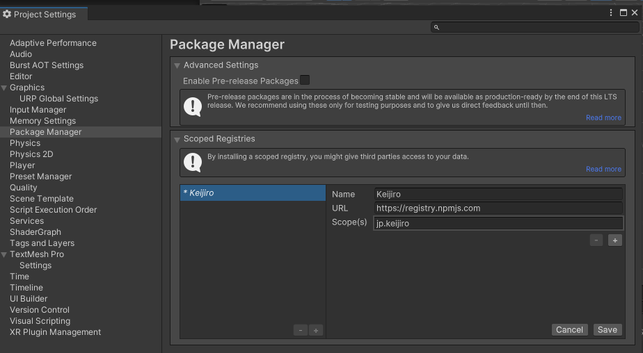
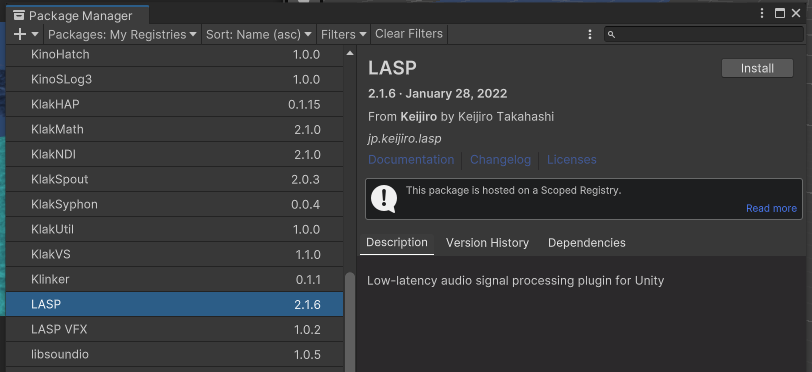
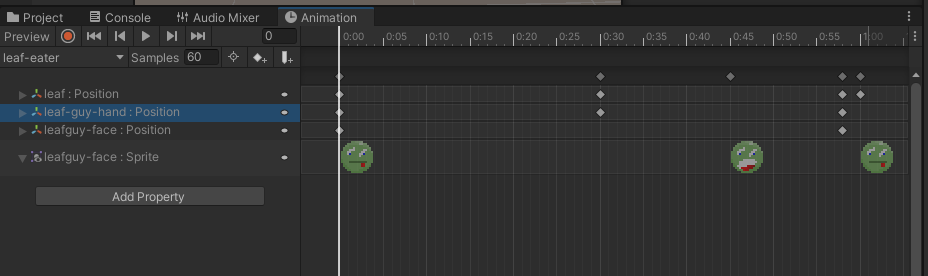
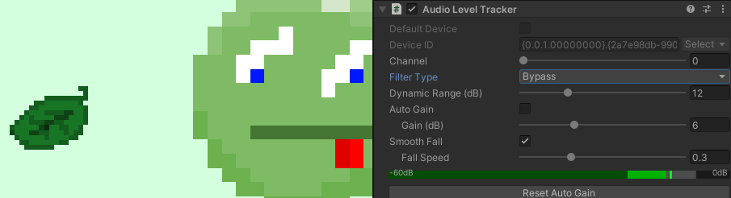

# Homeplay 3

Sign up here:
https://docs.google.com/spreadsheets/d/16Q30e3dV3oBYqcNBkZU3OUfUtbhKppxvfDuS4Yjc6zo/edit?usp=sharing

For this homeplay, a lot of the projects are old and unavailable in their original form, broken, or not meant to be played. Some of the artists may also have works that address videogames very loosely or not at all. 

What we’d like you to do is to pick a Game/Artist/Group and research how the work (or examples within a body of work) reveals the potential “engine” or metagame of an object, medium, or existing game.

Check the “notes” column for starting points if you aren’t sure where to begin.

# Inputs and Interfaces for Sound


[Buchla Easel](https://buchla.com/easel-k/) - reconsider the orientation of inputs and buttons for alternative performance approaches


[Clara Rockmore](https://www.youtube.com/watch?v=pSzTPGlNa5U) - Virtuosa Thereminist - the theremin (Leon Theremin (1920)) uses a proximity-based approach to controlling the frequency and amplitude of a monophonic synthesizer.


David Rokeby's [Very Nervous System](http://www.davidrokeby.com/vns.html) (1986-1990) uses processed video as input to control sound


Laurie Spiegel's Music Mouse (1985) - used software to reconsider the computer mouse as a musical instrument ([playable online version](https://teropa.info/musicmouse/))


[COBRA](https://youtu.be/yp-oZbmsQVw?si=RpTeHjF0mfxq6uQ1) and other "game" works in the 1970s and 80s by composer John Zorn called for improvisation within a framework of rules. Other works included Lacrosse (1976), Hockey (1978), Pool (1979), and Archery (1979)

> Playing John Zorn’s Cobra is akin to playing Monopoly with an ogre: the rules apply until your opponent, gristly hands snapping the board in two, decides they don’t. There is no sheet music, no conductor, no requisite number of players, no instrumentation. A cherished staple of experimental music, Cobra is a game piece—a genre that Zorn in part originated—in which players improvise according to rules that can change at anyone's whim.
> 
> [Jennifer Gersten](https://www.wqxr.org/story/watch-rare-video-john-zorn-recording-his-experimental-piece-cobra-1992/)

Zorn's game pieces might be akin to a TTRPG for improvised music. 

Ultimately, the combination of inputs, sensors/transducers, hardware and software interface design, and computer-mediated rule systems is more or less what we build and consider when developing a game using an engine like Unity.

# LASP


LASP is a plugin for routing audio directly into Unity. It also comes with some useful tools for controlling Unity properties with the incoming audio. 

LASP can be found here: [https://github.com/keijiro/Lasp](https://github.com/keijiro/Lasp)


> Secret Tip: [Keijiro](https://github.com/keijiro) is a prolific developer of Unity plugins. Check out their github for all sorts of things
> 

Installing can be a bit more involved than adding a package from the Unity Registry. 

First, add the keijiro's scoped registry in the project settings:


Then add this info in the "scoped registries section"

```
name: Keijiro
url: https://registry.npmjs.com
scopes: jp.keijiro
```

It should look like the image below. Click "Save".


Back in the package manager, select the "My Registries" dropdown


You'll see all of Keijiro's packages. Find LASP and click install.



You'll have to click RESTART in the next section to make sure you're using the new input system


# Notes on using LASP

Sound comes in from the AudioLevelTracker component (**Add Component > LASP > Audio Level Tracker**)

> Note: For me, the "Default Device" property almost never works and I need to uncheck the box and manually select the input device from the dropdown


After adding the component and selecting the input device, you should try pressing play to see that the green level meter is reacting to incoming audio.

You can optionally filter high, low, or mid frequencies of the incoming audio if you want to track a slightly more specific band of frequencies. Check out the spectrum analyzer component if you want to listen for more specific frequencies.

## Adding a property

You can bind the incoming audio to any property within Unity:

1. Click the Add Property Binder
2. Select the type of property to bind (float, Vector3, Rotation, Color)
3. Drag a Game Object into the Target
4. Select the component
5. Select the property
6. Set the range of values for when the audio is completely muted (0) and full volume (1)

You can hook the property binder to variables in your scripts as well. Because it is a "property" binder, it means that you'll need to define your variable as a [property](https://learn.microsoft.com/en-us/dotnet/csharp/programming-guide/classes-and-structs/properties). 

The easiest way to do this is like this:

```csharp
public float MyFloatProperty {get; set;}
```

You'll declare the property in the same place that you'd normally declare public variables. When declared this way, you can use the property just like any other public variable.

```csharp
using UnityEngine;

public class testprop : MonoBehaviour
{
    public float MyFloatProp { get; set; }
    
    void Start()
    {
        MyFloatProp = 5f;
        MyFloatProp += 1f;
        print(MyFloatProp);
    }
}
```

# Quick Game

To show a bit more about controlling objects with sound. Let's progressively move something by having to sustain a sound over time. 

First, I'll start with a script that directly links the current amplitude / volume level of the sound to a position along an animation:

```csharp
using UnityEngine;

public class SoundToAnimation : MonoBehaviour
{
    public Animator animator;
    public float SoundInput { get; set; } = 0f;
    void Start()
    {
        // "pause" animation
        animator.speed = 0f;
    }

    void Update()
    {
        // move the playhead to the position of the sound
        animator.Play(0, -1, SoundInput);
    }
}
```

Notice that the `SoundInput` variable is a property. The first two parameters of `animator.Play` are to target the very first animation clip associated with the controller. Drag an animator component into the script, then set up the [property binding](#adding-a-property) with the Audio Level Tracker. Try it out to make sure things are working.

Now, rather than directly link the volume level to the animation. We'll check to see if the volume is louder than a threshold, and we'll increment the animation playhead on frames when the volume is above the threshold:

```csharp
using UnityEngine;

public class ScrubAnimation : MonoBehaviour
{
    public float playhead = 0f;
    public float threshold = 0.7f;
    public float sensitivity = 1f;
    public float SoundInput { get; set; } = 0f;

    public Animator animator;
    void Start()
    {
        // pause animation
        animator.speed = 0f;
    }

    void Update()
    {

        if (SoundInput > threshold) 
            playhead += sensitivity * Time.deltaTime;

        animator.Play(0, -1, playhead);
    }
}
```

Try making something animate using sound. Play with how loud the sound needs to be. What sorts of things might be fun to animate when connected to different types of sound? 





# More Demos

The [LASP github](https://github.com/keijiro/Lasp) is itself a Unity project. You can download the whole repo as a zip and open it with Unity Hub if you want to try it out.

Keijiro describes all the scenes in the github along with some nice gifs:


## Music Engine Examples 

Last year the UCLA Laboratory of Game put on a small [workshop](https://docs.google.com/presentation/d/1Ao0IEBOSMtFcjHfaE6MB1gL6tPvWausfL0rmZfB68tM/edit?usp=sharing) about the possibility of a game engine becoming a musical engine.

There's a whole [unitypackage](https://drive.google.com/file/d/1Cl2icx8AOoimZ4VekdTNyZC9ygZsMZxx/view?usp=drive_link) of scenes developed for the workshop. Lots of examples use Unity's physics and input systems for generating alternative musical instruments.


Construct a force-based sequencer that uses physics to push the step trigger around 


Control a pendulum with the analog sticks of a game controller to try and reach samples.


Click on hinged keys that play a sample when crossing the center line.

# Extra Useful Tools

## Loopback recording

If you need to route audio between two programs you can create a virtual audio cable. This is great for quickly grabbing samples!

Soundflower (mac)  :: [https://github.com/mattingalls/Soundflower](https://github.com/mattingalls/Soundflower)
VB Audio Cable (win) :: [https://vb-audio.com/Cable/ ](https://vb-audio.com/Cable/ )

## Other things
[BBC](https://sound-effects.bbcrewind.co.uk/) [FreeSound](https://freesound.org/) [GDCAudioLib](https://sonniss.com/gameaudiogdc) 

Browser based SFX Generator
[https://sfbgames.itch.io/chiptone](https://sfbgames.itch.io/chiptone) [https://sfxr.me/](https://sfxr.me/) (others / all a bit similar)

Browser based audio tracker
[https://jummbus.bitbucket.io/ ](https://jummbus.bitbucket.io/ )

More thing (EP’s Tools List) – [https://github.com/everestpipkin/tools-list#Sound-music](https://jummbus.bitbucket.io/ )


# Tiny Simulations Package

You can download this [unity package here](https://drive.google.com/file/d/1xOWhh4aRWCeEesZZglBNhmk6KkrNkx0d/view?usp=sharing), it contains some demos of commonly used techniques for building simulations.


# Randomization, Simulation, Generators

Why? Computers are great at receiving some input and returning a result. The deterministic qualities of a computer are what make it useful. 

You want to know that when you create a text file or save a png that the text or the pixels won’t change every time you open the file.

Compare this with how our own brains recall memories, each recall is slightly distorted and affected by time, environment and mood.

Apps can play with our expectations of permanence ([most dangerous writing app](https://www.squibler.io/dangerous-writing-prompt-app)) and it isn’t uncommon to encounter an image or video that is a rip of a photo or a screenshot of a backup of a video recorded from a tv screen ([In defense of the poor image](https://www.e-flux.com/journal/10/61362/in-defense-of-the-poor-image/)).

  


So it takes a bit of human intervention to introduce randomness to deterministic machines. Maybe this is why randomness is so alluring, it adds a touch of humanity. 
# Process

1. What do you want to generate?
2. What are the properties and constraints of your thing? 
3. What are the methods for generating these things?
4. Generate things  
5. Evaluate, modify, repeat

([alt approach](https://www.youtube.com/watch?v=s_eyo_m_hnc&t=958s) – start with method first or reverse engineer some objects)

Consider perceptual differentiation vs perceptual uniqueness. Is it enough to tell that each new output is different from the previous one, or should the output also be totally unique? All discussed in [So you want to build a generator](https://galaxykate0.tumblr.com/post/139774965871/so-you-want-to-build-a-generator)

## Generating things


*A hundred thousand billion poems* - Raymond Queneau ([coded](https://codepen.io/olliepalmer/pen/YOzbYb))

You don’t need to build every single house in a city as long as you have a set of blocks and components that would ultimately comprise enough variety to give the impression of a complex city. 


[video](https://youtu.be/FaswJcEWTfE)

A big part of generation involves understanding a particular typology, recognizing the core components of what might define a character/story/object/sound and defining the variations that you can explore within that theme


Hans Eijkelboom – [People of the Twenty-first Century](https://www.phaidon.com/agenda/photography/articles/2014/october/09/hans-eijkelboom-laureate-of-normcore/) 
## Creating images, simulations and movements


[Mirror Lake](https://everestpipkin.itch.io/mirrorlake) - Everest Pipkin  


[Lichenia](https://molleindustria.org/lichenia/) - Molleindustria 

## Emergent behavior 


Braitenberg Vehicle - [more info here](http://users.sussex.ac.uk/~christ/crs/kr-ist/lecx1a.html)
[](https://youtu.be/yYgjx3vpvN0)


Steering algorithms / boids / agent behaviors ([nature of code](https://natureofcode.com/book/chapter-6-autonomous-agents/))

Emergent behavior refers to the phenomenon where complex systems exhibit properties, patterns, or behaviors that arise from the interactions of simpler components within the system.

These emergent properties are not explicitly programmed or designed but arise spontaneously as a result of the interactions and relationships between the system's components.  

See also Autopoiesis –  the self-maintaining and self-reproducing nature of living systems. Autopoietic systems give rise to emergent properties. ([book](https://monoskop.org/images/3/35/Maturana_Humberto_Varela_Francisco_Autopoiesis_and_Congition_The_Realization_of_the_Living.pdf))

 


[Reaction diffusion](https://www.karlsims.com/rd.html) – simulation of two virtual chemicals 


[https://ncase.me/sim/](https://ncase.me/sim/) – Cellular Automata


[Emissary Forks For You (2016)](https://www.artspace.com/magazine/interviews_features/art-bytes/ian-cheng-interview-54128) – Ian Cheng 

Boid simulation, steering, autonomous agents, and “Sim” games. Stories and narratives can come into being even when based on simple sets of rules.


[The Sims](https://www.ea.com/games/the-sims)


[Dwarf Fortress](http://www.bay12games.com/dwarves/) 

See [patch notes](https://www.pcgamer.com/the-most-ridiculous-patch-notes-from-10-years-of-dwarf-fortress/) for unexpected outcomes of the dwarf fortress systems: 


## Modular Architecture

Create a program that designs buildings out of modular parts, with a variety of terraces, flags, windows, roofing, materials, telephone wires, banners, and more.

Are you emulating an existing architectural style? Or are you designing Escher-like impossible architectures?


Vietnam Romance - Eddo Stern Features cityscapes made out of randomly generated modular buildings. Each building is constructed from a variety of roofs, floors, window decorations, awnings, and signs.

See also: Wave Function Collapse

[https://selfsame.itch.io/unitywfc](https://selfsame.itch.io/unitywfc) or [https://marian42.de/article/wfc/](https://marian42.de/article/wfc/) – based on : [https://github.com/mxgmn/WaveFunctionCollapse](https://github.com/mxgmn/WaveFunctionCollapse) 


While the final result may seem effortless. There is quite a bit of preparatory work in designing modular sections as well as defining the rules for how each section fits together. 

Most often used in generating landscape / maps. However [this is not the only algorithm](https://christianjmills.com/posts/procedural-map-generation-techniques-notes/) 


[https://www.badnorth.com/](https://www.badnorth.com/) – see Oskar Stalberg give a [talk on WFC usage in Bad North](https://youtu.be/0bcZb-SsnrA) 

## Generative Landscape

Write a program that presents an ever-changing, imaginative landscape. Populate your landscape with features that are suitable for your concept: trees, buildings, vehicles, animals, people, food, body parts, hairs, seaweed, space junk, zombies, etc.

While there are many techniques for generating “realistic” landscapes (see Sebastian Lague’s [series of videos](https://youtu.be/wbpMiKiSKm8)), your landscape does not need to follow those conventions. Consider Mirror Lake above. While the scale isn’t completely clear, there is a consistent substrate (the lake / bowl / pot), and the random variation happens in the growth and surrounding areas.

Really consider the scale that you are trying to generate. Is it a planet, a garden, or a leaf? How does the viewer navigate or experience your landscape? Are things constantly being generated or does the interaction take place post-generation? Does the camera fly through it? Does the camera orbit?


Proteus - David Kanaga Players explore a large, generative island in 3D. The island is populated by low-res trees, flowers, and more. The soundscape changes based on the weather, time of day, and other factors.
## Genetic Algorithm

Write a program that presents the user with several randomly generated options. The user picks a few, and a new set is produced based on the user's selections.

A genetic algorithm needs three things:
- A thing you can modify (a 'genotype’)
- A thing you can judge (a 'phenotype’)
- A way to turn the first into the second


Kate Compton - Flower Generator

## Automata

Write a program that creates a dynamic visual system using cellular automata or other dynamic agents that change state based on their neighbors.

See the [Emoji Simulator](https://ncase.me/sim/) by Nicky Case for a great interactive example of cellular automata in action.

This blog post does a decent job explaining cellular automata: [https://tatasz.github.io/compound_ca/](https://tatasz.github.io/compound_ca/)


# Tiny Simulations Package

You can download this [unity package here](https://drive.google.com/file/d/1xOWhh4aRWCeEesZZglBNhmk6KkrNkx0d/view?usp=sharing), it contains some demos of common 


  

## Scene 1: Generating objects

After downloading the unitypackage. Open the package in a new or existing URP project and open the “generate-objects” scene under Scenes > generate-objects.

This scene is pretty simple: a platform and a few spawners that we can use to test out different methods for instantiating objects.

Let’s start with the basic spawning script:

```csharp
using System.Collections;  
using UnityEngine;  

public class SpawnGameObject : MonoBehaviour  
{  
	// prefab to spawn  
	public GameObject prefab;  
	
	[Range(0.1f,8f)]  
	public float ratePerSecond = 1f;  
	
	void Start()  
	{  
		// use a coroutine to control the spawn rate  
		StartCoroutine(Spawn());  
	}  
	
	IEnumerator Spawn(){  
		// infinite loop  
		while(true){  
			// spawn the prefab  
			Instantiate(prefab, transform.position, transform.rotation);  
			// wait a moment before next loop  
			yield return new WaitForSeconds(1f/ratePerSecond);  
		}  
	}  
}
```

  

This combines [Instantiate](https://docs.unity3d.com/ScriptReference/Object.Instantiate.html) with a [Coroutine](https://docs.unity3d.com/Manual/Coroutines.html) to continuously spawn a new prefab at a specific interval. 

Attach the script to an empty game object. Create a [prefab](https://docs.unity3d.com/Manual/Prefabs.html) and drag it into the script's prefab slot in the inspector. Press play and see if the prefab spawns.


What are ways to complicate things?  
  
Spawn prefabs over a range of positions…

- Using [Random.InsideUnitSphere](https://docs.unity3d.com/ScriptReference/Random-insideUnitSphere.html) or [Random.OnUnitSphere](https://docs.unity3d.com/ScriptReference/Random-onUnitSphere.html) or [Random.Range](https://docs.unity3d.com/ScriptReference/Random.Range.html) 
  
Spawn multiple prefabs each time…

- For loop wrapped around Instantiate


Animate the spawner to create a pattern of prefabs…

- Using the Animation system
- Animating the position and rotation with script … in Update loop
- … or give the spawner a RigidBody and add forces to it

Adding a force to the spawned prefabs (could also be done on the prefab itself)

- [GetComponent](https://docs.unity3d.com/ScriptReference/Component.GetComponent.html) -> [AddForce](https://docs.unity3d.com/ScriptReference/Rigidbody.AddForce.html) (don't forget `ForceMode.Impulse`) 

Adding collision detection to the prefabs

- Spawn more objects/images/sounds/particles on collision
- Change colors on collision

Randomly spawning from an array of prefabs…

```csharp
// array to fill with prefabs in the inspector  
public GameObject[] prefabs;  

//...  
// inside the coroutine  

// pick random prefab from the array  
GameObject randomPrefab = prefabs[Random.Range(0, prefabs.Length)];  
// spawn it  
Instantiate(randomPrefab, transform.position, transform.rotation);
 ```

Add to the array of prefabs in the inspector:


## Face Shuffler

We could use this technique to spawn prefabs at specific locations. Here’s an example script that uses preset GameObjects, but randomly switches the textures on the objects:


```csharp
using UnityEngine;  

public class FaceShuffler : MonoBehaviour  
{  
	public GameObject eyes;  
	public GameObject nose;  
	public GameObject mouth;  
	
	public Texture[] eyeTextures;  
	public Texture[] noseTextures;  
	public Texture[] mouthTextures;  
	
	void Start()  
	{  
		Shuffle();  
	}  
	
	public void Shuffle()  
	{  
		// pick random textures  
		var randEye = GetRandomTexture(eyeTextures);  
		var randNose = GetRandomTexture(noseTextures);  
		var randMouth = GetRandomTexture(mouthTextures);  
		
		// update the texture on each object  
		SetTexture(eyes, randEye);  
		SetTexture(nose, randNose);  
		SetTexture(mouth, randMouth);  
	}  
		
	public void SetTexture(GameObject obj, Texture tex)  
	{  
		obj.GetComponent<Renderer>().material.SetTexture("_BaseMap", tex);  
	}  
		
	public Texture GetRandomTexture(Texture[] textures)  
	{  
		return textures[Random.Range(0, textures.Length)];  
	}  
}
```


You can download [this unitypackage](https://drive.google.com/file/d/1ehZKqJ_Dq3EurMjSftbrkZN2w0K1bpXl/view?usp=share_link) with the scene to test it out.


## Spawning prefabs from spawned prefabs: Chain Link

You can spawn prefabs that also contain an object spawner. It’s important to be careful to avoid runaway spawners that could cause crashing or freezing. In this example, there is a maximum number of layers that are allowed to spawn and the spawner will only spawn when the linkPrefab variable is not null. It’s possible to prevent further generation by setting the linkPrefab value to null in the newly instantiated game object.

[Unity package](https://drive.google.com/file/d/1KOeK9PLpm2CglfuJA63ZcXkmKQSBk1PD/view?usp=share_link)


```csharp
using UnityEngine;  

public class SpawnLink : MonoBehaviour  
{  
	public GameObject linkPrefab;  
	public float length = 5f;  
	public float angleVariation = 10f;  
	public float delay = 1f;  
	public int branchesPerSpawn = 2;  
	public int maxLinks = 5;  
	
	static int linkCount = 0;  
	
	void Start()  
	{  
		// add more to the link count  
		linkCount++;  
		// spawn after delay  
		Invoke("Spawn", delay);  
	}  
	
	void Spawn()  
	{  
		if(linkPrefab != null)  
		{  
			for(int i = 0;  i < branchesPerSpawn; i++)  
			{  
				// move to end of this prefab  
				Vector3 spawnPos = transform.position + transform.up * length;  
				
				// adjust the direction  
				Vector3 spawnRot = transform.rotation.eulerAngles + new Vector3(  
				Random.Range(-angleVariation, angleVariation),  
				Random.Range(-angleVariation, angleVariation),  
				Random.Range(-angleVariation, angleVariation));  
				
				// spawn the link  
				GameObject link = Instantiate(linkPrefab, spawnPos, Quaternion.Euler(spawnRot));  
				
				if (linkCount > maxLinks)  
				{  
					link.GetComponent<SpawnLink>().linkPrefab = null;  
				}  
			}  
		}  
	}  
}
```


  


  

# Particle Systems


The Unity Particle System is a tool for creating and controlling dynamic visual effects such as fire, smoke, explosions, and more. It simulates the behavior of individual particles, which can be emitted, move, change color, size, and fade over time, creating effects in real-time.

Adding a new particle system involves adding the Particle System component to a game object. In addition to the built-in particle system, the [Visual Effect Graph](https://docs.unity3d.com/Packages/com.unity.visualeffectgraph@16.0/manual/GettingStarted.html) is a newer, node-based system that is GPU optimized and only runs in URP and HDRP 


Built-in particle system component


Empty VFX Graph

## Firework Effect

We will be taking a short tour of the built-in particle system by building a firework effect.

What are the parts of a firework? How to break down the effect?


## Launching

1. In a new scene, create an empty game object named “firework” and add a particle system component.
2. Clicking on the object in the hierarchy should show a preview of the effect in the scene view. If it looks like a bunch of pink squares, you’ll need to assign a material to your effect.
   

3. In your project’s assets, create a new material and select it. In the inspector for the material, set the shader to Universal Render Pipeline > Particles > Unlit
4. Select the firework game object in the hierarchy and expand the Renderer section of the particle system component in the inspector. Set the Material field to the material you just created. URP should also come with a default ParticlesUnlit material that you can use.
   
5. The particles aren’t going in the right direction, so rotate the system to make the particles move upward. You can either rotate the x-value of the transform by -90 degrees. Or you can expand the Shape section of the particle system and rotate its x-value by -90 degrees.
   


6. Reduce the number of fireworks being launched. In the Emission section of the particle system, lower the Rate over time value to around one or less. 
7. Increase the launch speed. Change the Start Speed of the particle system to something a bit faster. Also, increase the Gravity Modifier to one. Play with the values until the behavior looks right.
8. Now reduce the Start lifetime of the particle so it disappears at about the apex of its trajectory. 
9. Scale the size of the launcher using the Start Size value. It might be useful to create a default cube somewhere in your scene to get a sense of scale.

## Exploding

10. Create another particle system named “explosion”. In addition to adding the particle system to an empty game object. You can also use Game Object > Effects > Particle System
    

11. Open the Shape section of this particle system and change the shape to Sphere. Now the particles will emit outward in all directions.
12. Make it so the particles all emit together. Under the Emission section, change the Rate over Time value to zero and add a new Burst to the burst list. Adjust the Count (even set the count to be randomized).
    

13. Adjust the Start Speed, Start Size, Start Lifetime, Gravity Modifier until you are happy with the effect. 

## Connecting the two. Sub Emitters

14. Select the firework launcher game object and expand the Sub Emitters section of the particle system component. If it’s grayed out, you’ll need to select the check-box next to the name.
    
15. Change Birth to Death and then drag the explosion particle system into the empty slot. When a popup appears, select Yes, reparent to make the explosion a child of the launcher game object.
16. Additionally, change the Inherit property to Color so that the explosion will inherit the color of the launched firework.
    

17. Now the preview should be showing the launch and explosion of the firework. 
18. Add random colors to the system. Change the Start Color of the launcher to Random Color. Then click the color swatch and add in a few different colors inside the gradient editor. Selecting the bottom arrow lets you change the color at that position, the top arrow lets you change the alpha value of that position (note: make sure the material you are using in your particle system is set to transparent, otherwise the alpha values will be ignored).
    
    
    
20. Now you should see randomized colors for each firework. Try playing around with other settings on the particle system. Color over Lifetime could be used to fade out the explosion. Trails can add some more effects.

What other things could you build? Snow? Fire? Rain? Confetti?

  

 

# Perlin Noise

Calling successive random values from Random.value results in successive, but disconnected values. When you’d like to sample random values that can smoothly move from one value to another, you can use the Perlin Noise algorithm.


Perlin noise can be useful for adding more organic movement to objects, variation in textures, and heights in a landscape.

[Check this update to the Unitypackage for demos involving Perlin Noise](https://drive.google.com/file/d/1s7B0HBBwFQzAWcH7d3ql7fDOvr1biOJl/view?usp=sharing)

Import the Unitypackage into your project (URP) and open the scene called “Noise”
## Generating a noise texture

In the scene, the active object called “PerlinNoiseTexture” contains a script that will generate a texture and apply it to a cube. Generating a texture is also something new that you could use elsewhere if you need to create custom textures while your game is running.

In Unity the [Mathf](https://docs.unity3d.com/ScriptReference/Mathf.html) class contains [Perlin Noise](https://docs.unity3d.com/ScriptReference/Mathf.PerlinNoise.html) which can be used to sample 2D noise values at different x and y coordinates.

```csharp
float value =  Mathf.PerlinNoise(xCoord, yCoord);
```
  
Each coordinate will return a value between 0.0 and 1.0. The distance between successive coordinates can control the variation of the sampled values. Smoother changes will have shorter distances between two points.

Creating the texture involves defining a new [Texture2D](https://docs.unity3d.com/ScriptReference/Texture2D.html) with a width and a height. This creates a canvas where you can specify the color of each pixel. 

```csharp
Texture2D texture = new Texture2D(width, height);
```

Set the pixel color by giving the coordinates of that pixel and a [Color](https://docs.unity3d.com/ScriptReference/Color.html) (all values are between 0 and 1):

```csharp
Color color = new Color(1, 0.92, 0.016); // set RGB of the color  
texture.SetPixel(x, y, color);
```

When generating a perlin noise texture, we’ll use the pixel X and Y coordinates of the texture as coordinates for the Perlin Noise method.

The script encapsulates all of this into a method:

```csharp
Color CalclulateColor(int x, int y)  
{  
	// convert from pixel coords to perlin coords  
	float xCoord = (float)x / width * scale;  
	float yCoord = (float)y / height * scale;  
	
	float value = Mathf.PerlinNoise(xCoord, yCoord);  
	
	return new Color(value, value, value);  
}
```

While you could directly use the pixel coordinates, the conversion lets us vary how “zoomed” we are in the noise space.

The script loops through every pixel of the texture and sets the color using this CalculateColor method:

```csharp
Texture2D GenerateTexture()  
{  
	Texture2D texture = new Texture2D(width, height);  
	
	for (int x = 0; x < width; x++)  
		{  
		for (int y = 0; y < height; y++)  
		{  
			Color color = CalclulateColor(x, y);  
			texture.SetPixel(x, y, color);  
		}  
	}  
	
	// have to call this or the texture won't update  
	texture.Apply();  
	
	return texture;  
}
```

Take a look at the script in the unity package to see it in its entirety. There is a separate method that demonstrates using multiple layers of noise, also known as multi-octave or fractal noise which are often used to generate more “natural” looking noise. See Catlike-coding for a bunch of in-depth tutorials on [pseudorandom noise](https://catlikecoding.com/unity/tutorials/pseudorandom-noise/)
## Movement with randomness and noise

Comment out the PerlinNoiseTexture game object and uncomment the RandomWalk object.

This object has a script that demonstrates three different types of random movement.

### Using Random.onUnitSphere to pick random directions for a cube to move

```csharp
void MoveRandom()  
{  
	// pick a random direction  
	Vector3 randomDirection = Random.onUnitSphere;  
	
	// move a bit in that direction  
	transform.position += randomDirection * Time.deltaTime;  
}
```

### Using a random value with different thresholds to determine the direction of movement


```csharp
void MoveWeightedRandom()  
{  
	// pick random value  
	float value = Random.value;  
	
	Vector3 movement = Vector3.zero;  
	
	// use these values to control the weights of the agent's movement  
	if (value < 0.4)  
	{  
		movement = Vector3.left;  
	}  
	else if (value < 0.6)  
	{  
		movement = Vector3.right;  
	}  
	else if (value < 0.8)  
	{  
		movement = Vector3.forward;  
	}  
	else  
	{  
		movement = Vector3.forward;  
	}  
	
	
	// move that direction  
	transform.position += movement * Time.deltaTime;  
}
```

### Using perlin noise to control movement

```csharp
void MoveWithPerlinNoise()  
{  
// move through perlin space over time  
float newX = Mathf.PerlinNoise(Time.time, 0) * 10f;  
float newZ = Mathf.PerlinNoise(0, Time.time) * 10f;  

Vector3 movement = new Vector3(newX, 0, newZ);  

// move that direction  
//transform.position += movement * Time.deltaTime;  
transform.position = movement;  
}
```


By using Time.time, it’s possible to walk through the noise space.

## Spawning with noise

Just as we used the coordinate values of noise to pick a color for a texture, the value can also be used to set the height of many objects. 

The next game object, RandomSpawning, has a script that generates a grid of prefabs. The grid coordinates are also used to sample from perlin noise, and that value determines the height at which the prefab will be spawned.

```csharp
for (int i = 0; i < width; i++)  
{  
	for (int j = 0; j < height; j++)  
	{  
		// calculate the height  
		float height = heightScale * Mathf.PerlinNoise(i * noiseScale, j * noiseScale);  
		Instantiate(prefab, new Vector3(i, height, j), Quaternion.identity);  
	}  
}
```

The script in the scene also stores each instantiated object in an array. This allows values to be adjusted during the update loop.