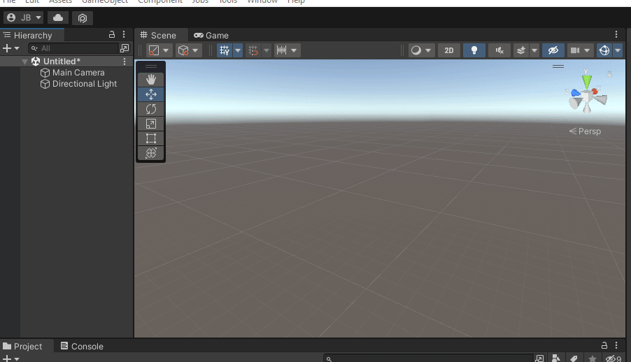
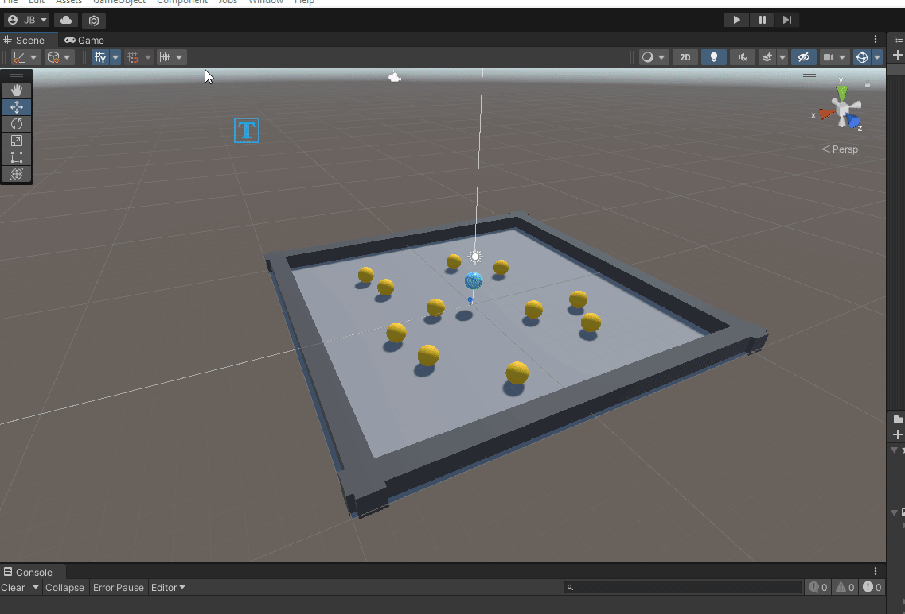

  

  
# Project 1

In the not so distant future, Project 1 will be due. 

So let’s chat about Roll-a-ball and Project 1

Thoughts on Roll-a-ball, was it a nice tour of Unity? 

We’ll eventually cover everything again, but are there any burning questions that you’re curious about now?

## Parts of Unity that Roll-a-ball covers
- Lighting and Materials 
- Rigidbody Component / Physics
- Vectors, Colliders 
- Triggers, UI
- TextMeshPro
- Input System, Prefabs

While the tutorial only introduces each one, we'll eventually spend more time covering each one in depth.
# Beyond the demo

Consider the definitions and expectations of the roll-a-ball demo. 

What assumptions is Unity making about it's userbase and the engine itself? 

What are some critiques of this demo? 

[Project 1 Info](project-1.md) 
# How can we enhance this game

Think about all the different components of the demo … try and make a sentence that encapsulates the game
.

..

…

….

…..

……

…….

……..

………

……..

…….

……

…..

….

…

..

.

..

…

….

…..

……

…….

……

…..

….

…

..

.

..

…

….

# A ball that rolls around in a level and collects items

Walter De Maria, *Time / Timeless / No Time* (2004)

Which words could you swap, remove, add to the phrase to make it more interesting? 

What is the major challenge of roll-a-ball? 

Is winning too easy? What about losing? What about the platform and collectibles?

# Variations of Roll-a-ball

There are lots of games that are more-or-less fancy variations of roll-a-ball, for example this game, [https://pirxos.itch.io/a-red-boat](https://pirxos.itch.io/a-red-boat) , could modify the roll-a-ball sentence as "A boat in the ocean finding messages"

<!--
<video loop="" autoplay="" muted="" playsinline="" poster="" class="HeroFullScreenVideo_video-without-pointer-event__EmJi7" style="width: 100%;"><source src="https://media.graphassets.com/IoPFra8zQ2eH5iqGZwPS" type="video/mp4"></video>
-->
## A (noun) that (verbs) around a (noun) and (verbs) (nouns) 

When considering your own variations, try out different sentences that might be interesting. Jot down any ideas as short sentences or even full written-out documents.

_Joust (1982)_ proposal document (Source: [Patrick Scott Patterson](https://twitter.com/OriginalPSP/status/878426207200694273))

# Building your level

_Flying Fortress (1976)_ concept. (Source: [Seth at Arcade 72](https://twitter.com/arcade1972/status/989477055384444928))

After creating your own modified roll-a-ball sentence, you'll need a place for it to occur. 

Defined by [The Level Design Book](https://book.leveldesignbook.com/introduction) (Plug to check out this book!)

> A level is a space where a game happens.

But the biggest question you'll need to answer before starting level layout:
## What is your level trying to accomplish?

- Are you teaching the player a new mechanic?
- Are you telling a story?
- Are you making a space to hang out and relax?

Think through what you're trying to do and jot down what a player should experience over the course of the level and what should they take away at the end? 

### Quick Exercise! (for later today)

Think of an idea for what a potential level might be in your improved roll-a-ball game. Write it down and keep it in mind while we talk about different aspects of level design.

Early _Battlezone (1980)_ game description (Source: [Atari](http://www.ionpool.net/arcade/atari_docs/fpsdescription.pdf))

# Parti

Brenna Murphy. [*Memory Chips*](https://lattice.tools/memoryChip) (2019)

If you like, you could borrow an architectural term *parti* meaning the central concept or organizing principle of a structure.

- Sometimes the parti can be in the form of a statement, but often is tied directly to a diagram. 

- The parti can be wholly inclusive, informing all aspects of a structure from exterior and configuration down to fixtures and tile patterns. 

- Not only limited to formal aspects, parti can describe massing, zoning, community, and other concerns.

# Phenomenology of the Player

While parti gives primacy to the architecture of a level. The experience of the player-character and the sensual elements of the level which reveal themselves (at the discretion of you, the level designer) to the player-character during playtime are just as important and deserve equal attention.

*Promesa*, Julian Palacios ([itch page](https://julian-palacios.itch.io/promesa))

Phenomenology is the philosophical study of affect, perception, and cognition—that is, of consciousness—as experienced in the first-person. So to incorporate the phenomenological experience of the player into your design opens up more considerations:

- The intentionality of the player. How does the level direct a player's experience?
- How are objects revealed to the player. Are objects clear, blurry, blinding, loud? Do qualities of an object or place represent something about the player-character beyond the physical signifier?
- How does time unfold for the player?
- How can you work *with* the imagination of the player?

In many video games, experience is often split. One is that of the person playing/viewing the game. The other is the character in the game who the player is controller. The distance between these two can vary depending on how much the player identifies and embodies the character in the game.

> "In a house, we all feel the need for closed doors. A closed door is before all a symbol of desire. It conceals absolutely essential mysteries. What might be behind it? What is hidden behind that secret panel, that unknowable portal? What is in the chest that my father never opened? The chest that I can never open? A closed door is given a much greater significance than an open door. Our reveries dwell on what might be behind that door, the desire to go beyond it, the feeling that certain doors are forbidden."

*Promesa*, Julian Palacios ([itch page](https://julian-palacios.itch.io/promesa))

> ...all really inhabited space bears the essence of the notion of home... We shall see that the imagination functions in this direction whenever the human being has found the slightest shelter: we shall see the imagination build "walls" of impalpable shadows, comfort itself with the illusion of protection-or, just the contrary, tremble behind thick walls, mistrust the staunchest ramparts. In short, in the most interminable of dialectics, the sheltered being gives perceptible limits to his shelter. He experiences the house in its reality and in its virtuality, by means of thought and dreams. 
> 
> Bachelard, *The Poetics of Space: the house. from cellar to garret. the significance of the hut*

# Level Layout

After you've nailed down what your goals and concepts are for your level. you can begin sketching or laying out ideas. 

_Super Mario Bros._ (1985) planning sheet (Source: [Nintendo](https://www.youtube.com/watch?v=DLoRd6_a1CI))

If you need to communicate your level to others in a team, you'll need to be more detailed and clear about your level. If it's just you, then your layout can be a sketch, scribble, or anything that will aid in planning the space.

# Environmental Expressivity

Environmental Expressivity could be another term for level design. When thinking about a player's movement through your level, at both micro and macro scales, there are features to consider about the environment that can exist from intrinsic to the concept of the game to helping a player know where to go next.

*[A short hike](https://ashorthike.com/) (2019) - Adam Robinson-yu*

These are just a few strategies identified by Paolo Pedercini [here (currently broken 🦗 )](http://mycours.es/gamestudio2022/a-pattern-language-for-expressive-environments/) (with a lot of example games to check out)

## **Choice**
Which path to take? Is there a point where you can’t go back? [Point of](https://youtu.be/2v8YragSIuI) [no return](https://youtu.be/yavaJNXoMe8).

## **Legibility** (affordances of the space)
How does the player understand what they can do in the world. A ladder implies climbing. A door might indicate another space or goal.

## **Signposting** 

> “See that mountain…”
> - Todd Howard

Showing where to go with a big landmark (see [weenies](https://theoryofthemeparks.blogspot.com/2015/08/wayfinding-in-themed-design-weenie.html)) - another method can be leading using lighting (tendency to avoid darkness, trying to find a light)

## **A Trail** 
A literal pathway or breadcrumbs that a player can choose to follow

*[Katamari Damacy](https://youtu.be/bKl-PMCNuCY) (2004)*

## **Progression of different space** 
Unlocking new areas, moving from small tunnels to open fields, different types of rooms (or a series of the same room)

[One button Nipple Golf](https://jrap.itch.io/obng)  – The concept/level reveals itself by zooming further back with each level.

How a player experiences a space is strongly influenced by how they arrive in it. Play with dichotomies: cramped -> open, light -> dark, mundane -> sacred
## **Vistas** 
Observation points let a player set new goals, see how far they’ve come, take a break, foreshadow the next challenge

*Elden Ring (2022)*

## **Denial and reward** 
Add weight to a reveal, induce momentary "lostness" 

Alternative approaches can "teach" players to read levels differently.

Pearson & Youkhana, *Videogame Atlas: Mapping Interactive Worlds* ([link](https://www.youandpea.com/atlas))

## **Easter eggs** 
Hidden objects, images, and notes elicit close focus on the environment 

*[Hidden Folks](https://hiddenfolks.com/) (2017)*

## **Confusion** 
Did I break the game? Am I supposed to be in this place? Jank can be a form of storytelling  

*[Oikospiel](http://www.oikospiel.com/) (2017) - David Kanaga*

## **Spatial sound** 
A call from afar, music in the distance, something’s on the other side of the door!?!?

*[Little Party](https://turnfollow.itch.io/littleparty) (2015)* 

## **Climbing, falling, descending, flying, etc**
Where are you taking us? 

Are we going down into the underworld or climbing towards heaven? 

How are we getting there and how does that feel?

*[Getting Over It with Bennett Foddy](https://youtu.be/DYjbCJXxWLg) (2017)*

# Spatial Memory

Levels of games, virtual environments, can become part of our spatial memories.

*[Dust](https://www.johnsto.co.uk/design/making-dust/), Counter Strike / [https://arambartholl.com/dust-1-333/](https://arambartholl.com/dust-1-333/)* 

More abstractly, we all have a sense of spatial memory relating to software that isn’t necessarily meant for gaming.

Can anyone name this map:

# Scene breakdown

<iframe width="560" height="315" src="https://www.youtube.com/embed/EPKRAWUtKCE?si=yf8aL5OVO4Vo3OA_&t=325" title="YouTube video player" frameborder="0" allow="accelerometer; autoplay; clipboard-write; encrypted-media; gyroscope; picture-in-picture; web-share" allowfullscreen></iframe> 
*54:19 - Opening section* - how many of the previously mentioned techniques can you spot?

# Back to Roll-a-ball

Given all of these possibilities for navigating the space, what are some ways to spruce up Roll-a-ball?

Lose Conditions / Challenges / Situations:

1. …
2. …   
3. …  

Changing the field of play, the level, the space:

1. Holes in the field (see [donut county](http://www.donutcounty.com/))
2. ...   

# Roll-a-ball as a platform 

Consider the basic components that define the base game? 

- Rolling
- Platform with walls
- Collecting
- Winning

How can you complicate these components? Does changing/removing/amplifying/negating any of these make for something more interesting?  

Maybe the result isn't a “good” game, but it becomes interesting, unexpected, outrageous… 

*Nicolas Collins - [Handmade Electronic Music](https://routledgetextbooks.com/textbooks/9780367210106/) (2006) - Appendix D*

# Exercise

Let's try creating some maps by hand. 

Go back to the level idea that you wrote down earlier and sketch out a level for the ball.

Consider a setting/activity/goal/history/idea and the tools of environmental expression we just discussed.

You can use additional verbs to expand on what the ball is doing. A ball that rolls to explore/investigate/decompress/etc

In addition to the form of the map, include any other things that might live there: objects, plants, creatures, buildings, cities, planets, etc.

This doesn't have to be the world you use in Project 1, but if you already have an idea feel free to work on that. 

## Ideas, inspirations
- Go to [https://noclip.website/](https://noclip.website/) and explore some digital versions of maps
- Check out the [Videogame Atlas](https://www.youandpea.com/atlas) for different geographies of game levels
- Try and re-imagine a familiar building or space, but distort the proportions and distances to represent other tangible/intangible aspects (temp, time spent, feeling, safety)
- Adapt another piece of media into a level. A chapter of a book. A song. 
- Draw a map from memory of something you do every day on the computer / phone / internet … how could you represent a non-spatial thing as a place to be navigated through?

> "During the eight years Pnin had taught at Waindell College he had changed his lodgings... about every semester. The accumulation of consecutive rooms in his memory now resembled those displays of grouped elbow chairs on show, and beds, and lamps, and inglenooks which, ignoring all space-time distinctions, commingle in the soft light of a furniture store beyond which it snows, and the dusk deepens, and nobody really loves anybody."
> 
>- Nabokov, *Pnin*

# Optional reading

[Anna Anthropy’s Level Design Lessons](https://drive.google.com/file/d/14EuDZDhZcKhtsR3nvTIGMG25DE1niqun/view?usp=share_link) - level design in a few classical 8-bit era games

# Grayboxing your level in Unity

Now that you've sketched out an idea for a level. Let's try and build a very low-fidelity version of that level using simple shapes, also known as Grayboxing, within Unity.

[download roll-a-ball package](https://drive.google.com/file/d/11D1Fc2bgz-aeXeSN_7UL0MTsbNEZ8B46/view?usp=drive_link)

# Prototyping, Gray boxing, Blocking out

Check out the [level design book](https://book.leveldesignbook.com/) which contains much more thorough dives into these concepts. 

[Neon White](https://www.gameinformer.com/feature/2022/11/25/how-a-neon-white-level-is-made)

When developing a level or game mechanic, it’s useful to separate the “art” (modeling, lighting, texturing, etc.) from the movement, trajectory, and feel of the game. A common technique in game development is known as "grayboxing" or "blocking out" involves this process. 

[https://book.leveldesignbook.com/process/env-art](https://book.leveldesignbook.com/process/env-art) 

You can compare this idea to wireframing a layout and using placeholder text and images. The content doesn’t need to exist before you can consider things like navigation, composition, or interaction.

# Here’s the process

1. Sketch layout (Done!)
2. Add ground plane, scale figures, walls (What we're about to do)
3. Playtest
4. Diverge, iterate, and playtest again
5. Repeat step 4 until done

(See here for [breakdowns](https://book.leveldesignbook.com/process/blockout#how-to-blockout) of each step )

# A quick refresher for navigating and working in the Unity Editor

Unity Editor interface, we'll mainly be working in the Hierarchy, Scene, and Inspector views for building the layout

# Navigating in Scene view

Positioning / Rotating / Scaling

Select an object in Scene view, then:
- W: Move Tool
- E: Rotate Tool
- R: Scale Tool

You can use the "Scene Gizmo" to quickly change the Scene Camera angle. See [Scene View Navigation](https://docs.unity3d.com/Manual/SceneViewNavigation.html) for more details.

# Game Objects, Transforms, Components

Making new game objects / primitives 

## Right-click or Press the '+' button in the Hierarchy to add things to the scene.
- Select the object you want to add from the menu
- Use Ctrl+D to duplicate objects (or right-click and select 'duplicate')

# Some extra tips

## Align to view: Ctrl + shift + F
Useful for quickly setting up camera shots. 

1. Select a GameObject (usually the Camera) 
2. Move your scene view to where you want it
3. Use the key shortcut or use Game Object > Align With View
## Snap Object to Surface 
Hold Ctrl + shift while dragging the center of the object
## Vertex Snapping 
Hold ‘v’ and select and drag a vertex of an object

You can combine vertex and surface snapping by holding "v + ctrl + shift"

# Probuilder for Gray Boxing / Blockouts

Unity Probuilder: [https://unity.com/features/probuilder](https://unity.com/features/probuilder)

This tool adds a bit more “modeling” functionality to the Unity Editor and comes with lots of default level objects like doors, stairs, arches, etc. and more tools for editing shapes.

# Installing ProBuilder
(optional)
## Window > Package Manager > (Packages: Unity Registry) > ProBuilder

After installing, make sure you include support for your render pipeline:

# Let's Prototype

We've only scratched the surface of level design, but you should be equipped with enough tools to get started with building out a graybox version of your level in Unity.

For now it's good to use your intuition about how things feel. After adding your player to the level and playtesting a bit, you'll realize that things are too far apart or the player moves much too slowly. 

## Create a new "Basic (URP)"" scene (Ctrl + N or File > New Scene) and get building!

editor screenshot of an early blockout of the open world landscape in Alba; image by Jessie Van Aelst (from https://medium.com/@ustwogames/the-environment-art-of-alba-a-wildlife-adventure-6bddd8b56955) -- from [Level Design Book](https://book.leveldesignbook.com/process/blockout/massing/landscape#example-landscapes)

p.s.

The Level Design Book (still a work in progress, but highly useful) has some very detailed sections related to making a [Graybox or Blockout level](https://book.leveldesignbook.com/process/blockout)-- including commentary on different approaches. 

From the book:

When blocking out, consider these aspects:
- [**Massing**](https://book.leveldesignbook.com/process/blockout/massing) is the general sense of volume and weight conveyed by the shapes.
    - _Is this structure thick / heavy, or thin / light? What kind of place is this?_
    - [Landscapes](https://book.leveldesignbook.com/process/blockout/massing/landscape) need special consideration.
    - [Composition](https://book.leveldesignbook.com/process/blockout/massing/composition) is currently over-emphasized in level design culture today.
- [**Metrics**](https://book.leveldesignbook.com/process/blockout/metrics) are the general scale, dimensions, and proportions of the level.
    - _Is this area too big or small? Can the player fit in this room?_
    - examples of useful measurements: [Doom metrics](https://book.leveldesignbook.com/process/blockout/metrics/doom), [Quake metrics](https://book.leveldesignbook.com/process/blockout/metrics/quake)
- [**Wayfinding**](https://book.leveldesignbook.com/process/blockout/wayfinding) is the player's navigation process for learning the map structure.
    - _How to help the player find the_ [_critical path_](https://book.leveldesignbook.com/process/layout/flow#critical-path) _/ level exit? Does the player feel too lost?_
- [**Playtesting**](https://book.leveldesignbook.com/process/blockout/playtesting) is when you run an experiment to see if the level meets its design goals.
    - _Can most players complete the level? Do the_ [_encounters_](https://book.leveldesignbook.com/process/combat/encounter) _work? Is it_ [_balanced_](https://book.leveldesignbook.com/process/combat/balance)_?_
    - Playtesting is really important. This is the whole point of making a blockout.

# Add your player to the level to test

Let's bring the titular ball from the Roll-a-ball demo into the grayboxed level.

1. To start, make a prefab of your player. In Unity, a prefab is a way to save a game object that will get reused multiple times.
2. Save your current graybox level scene (Ctrl + S).
3. Open the scene you built in the tutorial (probably named "minigame").
4. Select the Player game object in the Hierarchy.
5. Drag that game object into your Assets folder in the Project panel. This creates a prefab of the Player game object.
6. Re-open the graybox scene.
7. Drag the Player prefab from your Project panel into the Hierarchy of the graybox scene.

You'll have to fix the camera in the new scene since it hasn't been set up to follow the player.

1. Select the Camera
2. Scroll to the bottom of the Inspector and click "Add Component"
3. Start typing "Camera" and select the "Camera Controller" script.
4. Drag the Player into the "Player" property of the Camera Controller.
 
Then make sure the Camera is looking at the player. Be careful about accidentally reversing the controls, the x-axis (red-arrow) should be pointing to the right.

1. Move the Scene Camera until it's looking exactly where you'd like the Main Camera to be. Note that the axes in the top-right of the scene view have the x-axis pointing to the right, otherwise your controls might be rotated.
2. Select the Camera game object in the Hierarchy.
3. Click GameObject > Align With View.

## Press play to check that everything is working and start playtesting!

*Note: An error will appear in the console because we left some properties empty in the Player Controller. You can either recreate the UI system from the "minigame" scene in this scene, or you can go back and work in that scene when building out the rest of Project 1.*

After you've tried out your level and made some changes, ask another person to play.

# Homework

## Project 1 Sketch (Next Class)
[Part 2 of Project 1 is due this Thursday](https://johnbrumley.github.io/desma158/project-1.html#2-beyond-roll-a-ball) so create some more sketches (you can use the one we did in class as one of the sketches). Also include ideas for possible title cards for each sketch.

## Reading (Next Class)

Take a look at the [readings](readings.md) page to find out which article you'll be reading. We'll be having a short discussion about them next Tuesday.

> “Game designers don't simply tell stories; they design worlds and sculpt spaces.”

Henry Jenkins. [Game Design as Narrative Architecture](https://web.mit.edu/~21fms/People/henry3/games&narrative.html)

## Homeplay (Next Thursday 4/11)
Check out the [homeplays](homeplays.md) page where you'll find a link to a sign-up sheet.

Next Thursday, we'll share a bit about the different games and how the each game's themes, ideas, structure, narrative, mechanics, flow, and/or ideology fits into what we've been discussing in class. 

For games that cost money, we've set up a computer/console in the Print Lab lounge where you can access them. 

I'll have some video documentation of most games that we can reference, but if your group has a specific section of the game that you want to share, you can make your own screenshots or recordings. 

If you're worried that you might miss something in the game, I recommend screen recording the entire session ([OBS](https://obsproject.com/) is a very lightweight recorder) to go back and clip any sections.

> All the world is an absurdist game of golf, but love is the most absurd golf game of all.
>  - [Bo Ruberg](https://twitter.com/MyOwnVelouria/status/1640915632115027969) 

*[What the Golf?](https://www.whatthegames.com/golf) (2019)*
