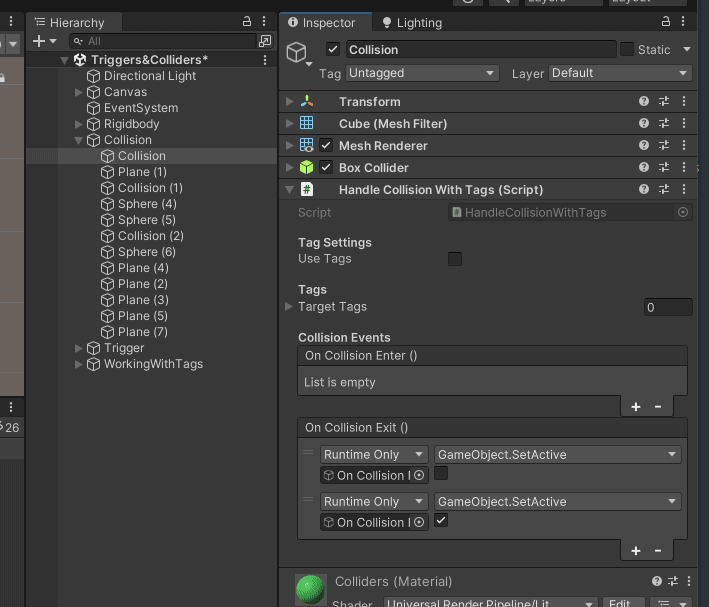
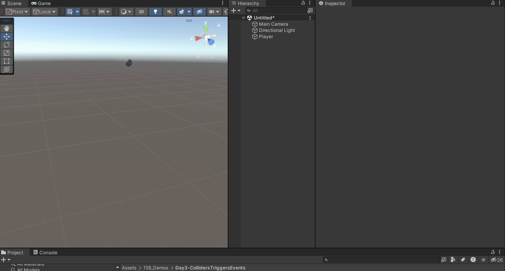

# Reading: Jenkins and Chang

Let's talk a bit about Jenkins’s [_Game Design as Narrative Architecture_](https://docs.google.com/forms/d/e/1FAIpQLSc1ZLvixfA21bt_kRndowxsdlBaY-MnXRQyjz5l445WW4OCIg/viewform?usp=sf_link) and  Chang's [Rambunctious Games: A Manifesto for Environmental Game Design

> “Game designers don't simply tell stories; they design worlds and sculpt spaces.”
> - Henry Jenkins. *Game Design as Narrative Architecture*

> The landscapes we inhabit are in part a product of our representations...
> - Chang, *Rambunctious Games* (2020)

[Journey (2012)](https://thatgamecompany.com/journey/)

A bit of summarizing both:

Jenkins:
> In the case of evoked narratives, spatial design can either enhance our sense of immersion within a familiar world or communicate a fresh perspective on that story through the altering of established details. In the case of enacted narratives, the story itself may be structured around the character's movement through space and the features of the environment may retard or accelerate that plot trajectory. In the case of embedded narratives, the game space becomes a memory palace whose contents must be deciphered as the player tries to reconstruct the plot and in the case of emergent narratives, game spaces are designed to be rich with narrative potential, enabling the story-constructing activity of players.
> 
> - Jenkins, *Game Design as Narrative Architecture*

Chang:
> With \[Emma\] Marris’s rambunctious gardens in mind, I argue in the following deliberately polemical theses that not only should we learn to study and play games while attuned to their environmental content, but also we should design games in an environmentally conscious fashion.... 
> 
> ...to create more rambunctious games, or to play more rambunctiously, to slough off the illusion of control and dwell deeply in the precarity common to our post-400-parts-permillion (of CO2) times
> 
> - Chang, *Rambunctious Games*

# Universal Render Pipeline

A [render pipeline](https://docs.unity3d.com/Manual/render-pipelines-overview.html) takes the objects in a scene and, through a series of operations, displays them onto a screen. Unity comes with a built in render pipeline, but in recent years has created the option for making custom render pipelines using their Scriptable Render Pipeline (SRP). 
  

*Demo scene using HDRP*

*URP demo scene*

After introducing SRP, Unity also released two prebuilt render pipelines aimed at different purposes. The **High Definition Render Pipeline (HDRP)** is aimed at high end systems and meant for developing cutting-edge graphics. The **Universal Render Pipeline (URP)** is meant to be a more flexible and approachable pipeline that can target a variety of platforms.

Depending on the lighting, material, and postprocessing needs in your scene. You might choose one pipeline over another. See this [comparison](https://docs.unity3d.com/Manual/render-pipelines-feature-comparison.html) for details.

**We’ll be using URP for this class**, but if you find that you need to change pipelines let us know.

# Lighting in Unity 

All the shadows, highlights, colors, etc. need to be calculated based on the lights, skybox, and other things within a scene. Let's take a quick and more general look at how lighting is done in Unity.

See Official Unity documentation:
- Manual: [https://docs.unity3d.com/Manual/LightingOverview.html](https://docs.unity3d.com/Manual/LightingOverview.html) 
- URP e-book; https://unity.com/resources/introduction-universal-render-pipeline-for-advanced-unity-creators

## Direct and indirect lighting

Direct light is light that is emitted, hits a surface once, and is then reflected directly into a sensor (for example, the eye’s retina or a camera). Indirect light is all other light that is ultimately reflected into a sensor, including light that hits surfaces several times, and sky light.

## Real-time and baked lighting

Real-time lighting is when Unity calculates lighting at runtime. 

Baked lighting is when Unity performs lighting calculations in advance and saves the results as lighting data, which is then applied at runtime. 

In Unity, your Project can use real-time lighting, baked lighting, or a mix of the two.

## For now we’ll stick with real-time lighting and we will introduce baked lighting another time.

# Lights in URP

[https://docs.unity3d.com/Packages/com.unity.render-pipelines.universal@14.0/manual/light-component.html](https://docs.unity3d.com/Packages/com.unity.render-pipelines.universal@14.0/manual/light-component.html)

The main sections of the lighting component to focus on now are, depending on the type of light selected, some of the options will change:

- Type: Directional, Point, Spot, Area (baked only) – see examples of each [here](https://docs.unity3d.com/Manual/Lighting.html) 
- Light Appearance / Color: Set color of the light based on color or temperature
- Intensity: Amount to multiply the light color to control the brightness of the light
- Indirect Multiplier: Intensity of indirect lighting
- Shadow Type: None, Soft, Hard  

# URP Shaders and materials

In Unity a [material](https://docs.unity3d.com/Manual/materials-introduction.html#fundamentals) defines the surface properties of an object. Each material will make use of a [shader](https://docs.unity3d.com/Manual/shader-introduction.html) that defines the position and color of the pixels on the screen. Shaders in URP aren’t compatible with shaders in the built-in pipeline and HDRP. If all your materials suddenly become magenta, usually it means that there’s an error with the shader (often problems [converting](https://docs.unity3d.com/Packages/com.unity.render-pipelines.universal@12.1/manual/upgrading-your-shaders.html) between render pipelines).

Shaders are not exclusive to Unity and are commonly found in many different environments. See [here](https://itp-xstory.github.io/p5js-shaders/#/) for an introduction to shaders in p5.js. 

*example of a broken shader*
  
Here’s a list of all the shaders available in URP: [https://docs.unity3d.com/Packages/com.unity.render-pipelines.universal@12.1/manual/shaders-in-universalrp.html](https://docs.unity3d.com/Packages/com.unity.render-pipelines.universal@12.1/manual/shaders-in-universalrp.html) 

The two that you’ll want to focus on are the Lit and Unlit shaders. After creating a new material, you can set the shader used by the material at the top of the inspector:

## URP Unlit Shader: 

[https://docs.unity3d.com/Packages/com.unity.render-pipelines.universal@12.1/manual/unlit-shader.html](https://docs.unity3d.com/Packages/com.unity.render-pipelines.universal@12.1/manual/unlit-shader.html) 

  
  

The Unlit shader does not receive any lighting from the scene, no shadows, nothing. Can be useful for creating certain effects. Also a good material for video playback if you want the video to maintain full brightness (as if it were on a bright screen).

- Surface Type: Opaque vs Transparent, when transparent there are options for alpha blending.
- Base Map: The underlying color and image texture.
- Tiling: The scale of the texture as it’s mapped across the surface on the UV axis.
- Offset: The position of the texture along the UV axis. 

## URP Lit Shader:
[https://docs.unity3d.com/Packages/com.unity.render-pipelines.universal@12.1/manual/lit-shader.html](https://docs.unity3d.com/Packages/com.unity.render-pipelines.universal@12.1/manual/lit-shader.html) 

  

The lit shader interacts with the lights in your scene and works best for rendering realistic surfaces. You can download the Samples to see a few different examples of surfaces and how different texture maps can influence how the surface is rendered.

Some properties to pay attention to:

- Surface Type: Opaque vs Transparent
- Base Map: The underlying color and image texture
- Metallic / Specular Map: how smooth / shiny your surface is. The map can control which parts are metallic (R channel usually) and smooth (alpha channel)
- Normal Map: The normal map is a texture that can add surface details which react to lighting as if they were part of the mesh. It is common to create a normal map from a high resolution 3D model and map it to a low resolution model to retain details but improve performance. More [here](https://docs.unity3d.com/Manual/StandardShaderMaterialParameterNormalMap.html).
- Height Map: An extension of normal mapping for rendering larger bumps. Creates the sense that the side of the bump facing the camera is blocking the far side (greyscale with white = high and black = low). More [here](https://docs.unity3d.com/Manual/StandardShaderMaterialParameterHeightMap.html).
- Occlusion Map: How indirect lighting should affect different parts of the model (greyscale with white = full indirect and black = no indirect lighting). More [here](https://docs.unity3d.com/Manual/StandardShaderMaterialParameterOcclusionMap.html).
- Emission: Creates the appearance that the model is emitting light. You can set a color and intensity as well as a texture for which parts of the model should appear to emit light.
- Tiling: The scale of the texture as it’s mapped across the surface on the UV axis.
- Offset: The position of the texture along the UV axis.   
  
Also see the [Simple Lit](https://docs.unity3d.com/Packages/com.unity.render-pipelines.universal@12.1/manual/simple-lit-shader.html) shader for a less features but less graphically intense materials.

Base Map

Specular

Metallic

Emissive

Normal Map

Height / Displacement

Ambient Occlusion

## PBR

Physically Based Rendering – provides a more accurate representation of how light reacts to different material properties (color, roughness, metallic, shininess, bumpiness, etc.). 

The URP Lit shader uses different *maps*, sometimes called textures, to define these properties. Today we will only looks at some of the more common ones.

Feel free to grab a material from here: [https://ambientcg.com/](https://ambientcg.com/), you can follow along with adding the maps to a model using a URP Lit material.

**Maps** are 2D image files that are mapped onto a 3D surface based on UV coordinates.

The following model uses a number of maps to achieve a realistic look even though the complexity of the geometry is not very high

Here is the untextured model:

This is the Base Map – The underlying color also known as Albedo 
  
  

This is the normal map – Adds surface details which react to lighting as if they were part of the mesh. Creates the impression of a higher resolution mesh.

This is the specular/metallic map – How smooth / shiny your surface is. The map can control which parts are metallic (R channel usually) and smooth (alpha channel)  

The maps are all used by the shader to determine how the light will react to different parts of the surface of the object. Here is the combined result:

Different programs use different types of maps and may separate maps into separate textures or combine multiple maps into channels of a single texture. It’s good to know about the different types of maps, so you can decide where to apply the maps to your materials.

Adobe's Substance Painter export options have a template for Unity URP:

## Skyboxes

The skybox itself is a material that uses a special type of shader to create the impression of an image or color that surrounds the entire scene.

The skybox can contribute to the overall color and brightness of a scene. To set the skybox, first open the Lighting window (**Window > Rendering > Lighting** ) and then select the “Environment” section. You can set the material in the Skybox Material slot at the top.

This tab is also where you can turn on Fog.

It’s common to use either 360 degree HDR images or Cubemaps for seamless skybox image textures

HDRi

Cubemap

There are also shaders that can procedurally generate skyboxes and other colors.

# Rigidbodies, Collisions, and Triggers

We'll be diving more into Trigger and Collision events directly in Unity. Import this [UnityPackage](https://drive.google.com/file/d/1V2kN7fv_UETnup2BQt0p8uhgGOF8LgxR/view?usp=sharing) into your project to follow along:

Check the [how to submit](how-to-submit-projects.md) page on the site for how to import and export unitypackages.

Included with this scene are some custom scripts that might come in handy with Project 1. The next section will cover how they work internally and how they can be used.
## Some helper scripts and prefabs

- Handling Collision and Trigger Events
- Quit and Restart the game
- Make a Game Object look at the Camera
- Countdown Timer (see the Timer prefab in the unity package)
- Attach an object to the player
- Event on keypress
## Triggers

Open up the [collision and trigger demo unitypackage](https://drive.google.com/file/d/1V2kN7fv_UETnup2BQt0p8uhgGOF8LgxR/view?usp=sharing) for a live demo on collisions and triggers using rigidbody physics.

## Active Game Objects 

Many of these helper scripts rely on toggling the Active state of a game object. You can see the state of a game object by the checkbox next to the game object's name in the Inspector:

This object is active, because the checkbox is checked. 

You can uncheck these boxes to hide a game object and all of its children from the game.

Many components in Unity will do something as soon as an object becomes active. This happens as soon as the game starts, or when an object's active checkbox becomes checked.

An audio source component has the "Play On Awake" property, which automatically plays it's audio clip as soon as the game object it is attached to becomes active.

## Events

Using Events to Set the Active State of a Game Object

One way to connect or relate game objects to one another, is to use **events**

The *HandleCollisionWithTags.cs* script that comes with the unitypackage reacts with an [Event](https://docs.unity3d.com/ScriptReference/Events.UnityEvent.html) that can send messages to any objects that subscribe to the event. In the above image, the *OnCollisionEnter()* event has two subscribers (added by clicking the '+' button at the bottom of the event's box). 

Both subscribers are Game Objects which were dragged into the slot below the "Runtime Only" dropdown. The event will make one of the objects active or checked (also called 'true') when it fires, while the other object will be set to inactive or unchecked (called 'false').

## Out of bounds lose condition

Using some of these helper scripts, you can put together a lose or reset condition if a player falls off the edge of the scene.

The *RestartGame* script that comes with today's unitypackage has a setting that will reset the game as soon as it becomes active. 

To reset the game when the player falls below the edge, you can follow these steps:

1. Create a large Cube and place it below your level, it should cover any areas that the player could reach when falling off the course.
2. Uncheck the MeshRenderer component to hide the mesh
3. Make the BoxCollider component a Trigger by clicking the IsTrigger property.
4. Click Add Component at the bottom of the Inspector and attach the *HandleCollisionWithTags* script to the game object. **Uncheck the "Use Tags" box.**
5. Create an empty game object and Add the *RestartGame* component to the object. Check the "Restart on active" checkbox. Then set the empty game object to inactive by unchecking the box next to its name at the top of the Inspector.
6. Select the cube game object and press the '+' button at the bottom of the *OnTriggerEnter()* collision event within the *HandleCollisionWithTags* component.
7. Drag the game object with the *RestartGame* component into the empty slot, then click the dropdown with "No Function" and select **Game Object > SetActive(bool)**
8. Check the checkbox below "Gameobject.SetActive"

# Sketch One-on-ones

We'll split up and chat with each of you for the rest of the class time. Feel free to work on your project during the meetings.

> Everything about the site remained wrapped in blandness and littered with shiny cars—one after another they extended into a sunny nebulosity. The indifferent backs of the cars flashed and reflected the stale afternoon sun. I took a few listless, entropic snapshots of that lustrous monument. If the future is “out of date” and “old fashioned,” then I had been in the future. I had been on a planet that had a map of Passaic drawn over it, and a rather imperfect map at that. A sidereal map marked up with “lines” the size of streets, and “squares” and “blocks” the size of buildings. At any moment my feet were apt to fall through the cardboard ground. I am convinced that the future is lost somewhere in the dumps of the non-historical past; it is in yesterday’s newspapers, in the _jejune_ advertisements of science- fiction movies, in the false mirror of our rejected dreams. Time turns metaphors into _things_, and stacks them up in cold rooms, or places them in the celestial playgrounds of the suburbs.
> 
> Smithson, Robert. "[A Tour of the Monuments of Passaic, New Jersey](https://holtsmithsonfoundation.org/tour-monuments-passaic-new-jersey)." Originally published as "The Monuments of Passaic." Artforum Vol.6, No.4 (December, 1967).
