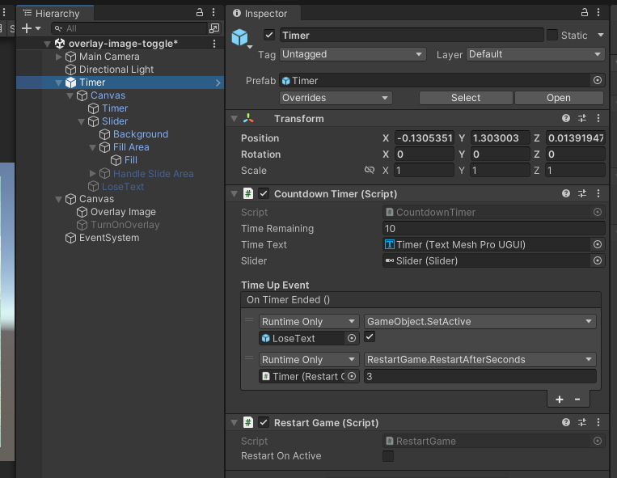
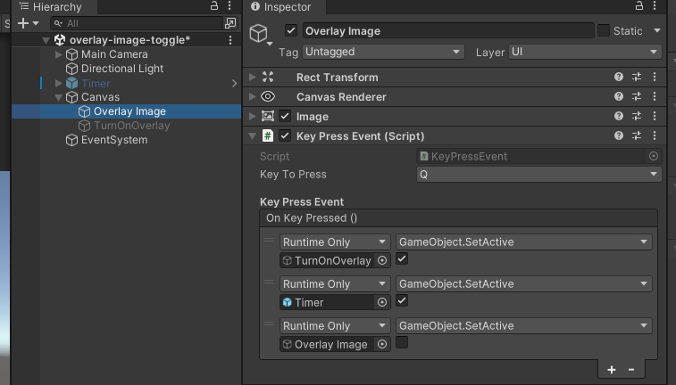
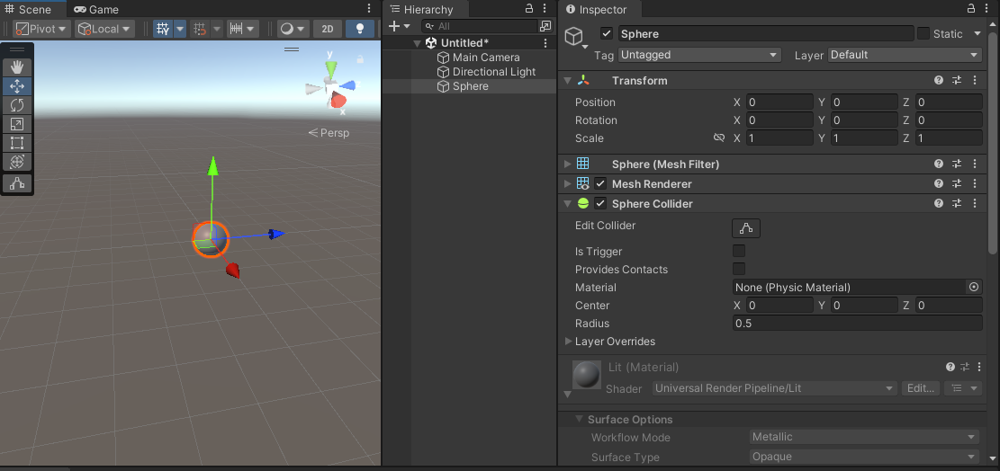
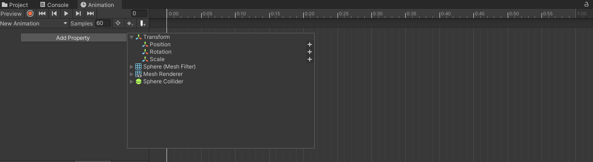
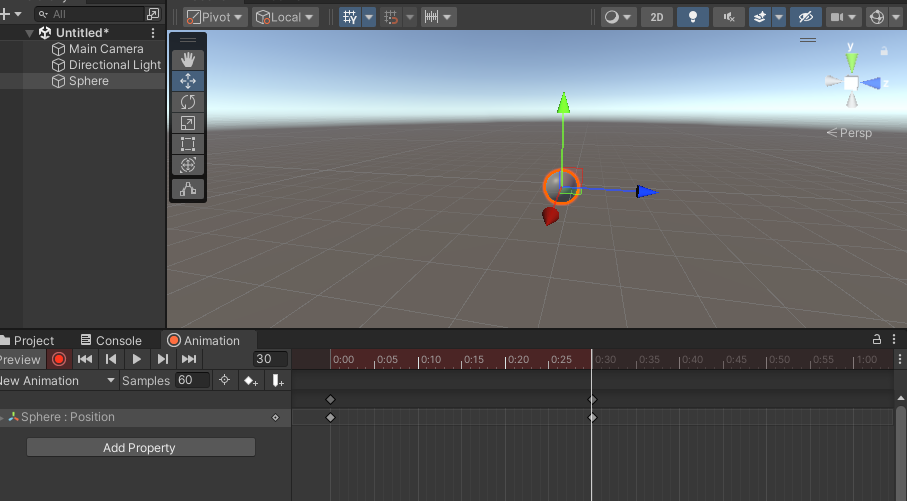
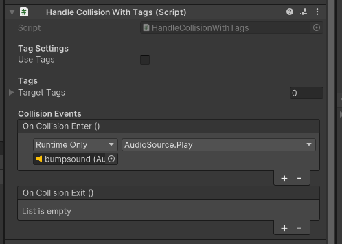

[](https://youtu.be/CvlbZwoWMgA)
[Marble Madness](https://youtu.be/CvlbZwoWMgA) 

# Homeplay Presentations 

We'll try and be efficient about switching over between groups, so be ready to present. You can either plug directly into the projector or drop any files into [this folder](https://drive.google.com/drive/folders/1Bha8xe9p8I5mMotWAwaaNpOaji0Opi2n?usp=sharing) for me to show.

# Notes on Project 1

## Things to remember for your build / exporting

Check the how to submit projects page on the website: [How To Submit Projects](how-to-submit-projects.md)

Remember that you need to zip all the files together for the Windows build to run on other computers:


The exe file will not run without all of the other files and folders.
## For Mac Users

If you’re on a Mac and didn’t add the Windows build when installing Unity. You can download and add it through Unity Hub


Select the “Add modules” button, scroll through the modules to find and add:

**Windows Build Support (Mono)**

You might need to close and reopen your project for the “Windows” option to appear in the Target Platform dropdown in Build Settings.

# UI System Basics

The UI system is useful for managing text, buttons, sliders, toggles and other menu related objects. Making screen overlays, HUDs, or minimaps can also be done with the UI system.

You can download this [official Unity book](https://resources.unity.com/games/user-interface-design-and-implementation-in-unity) for a thorough review of the Unity UI system. For a shorter overview of the components check out the [manual page](https://docs.unity3d.com/Packages/com.unity.ugui@1.0/manual/UIBasicLayout.html).

All UI objects must live somewhere in a [Canvas](https://docs.unity3d.com/Packages/com.unity.ugui@1.0/manual/UICanvas.html). When creating any UI elements using “Create > UI > xxx” a Canvas will automatically be created if there is not already one in the scene. There can be multiple canvases in the scene that serve different purposes.
# Canvas Scaling

For building a UI overlay, there are a few settings that will make your life easier in the future. Both are in the Canvas Scaler component on the canvas game object:

1. UI Scale Mode – Set to “Scale with screen Size”
2. Reference Resolution – Set X to 1920 and Y to 1080

 

Set your Game view tab to match the resolution (or aspect ratio) of your target platform: 


After changing these values, you may need to move your UI elements back into place. It's especially useful to make use of the anchoring system so that UI elements are always relatively positioned no matter what the screen size.
# Anchoring, Pivots, and Positioning

UI Components (Text, Buttons, Images) all use “Rect Transform” rather than the standard Transform. Rect transform allows you to anchor objects to positions on the canvas and adapt to the size of the canvas.

A few tips:

- Toggling to 2D mode helps with positioning and adjustments
- Use the [Rect Tool](https://docs.unity3d.com/Packages/com.unity.ugui@1.0/manual/UIBasicLayout.html#the-rect-tool) for adjusting position and size of UI elements
- Keep the Scale of the [Rect Transform](https://docs.unity3d.com/Packages/com.unity.ugui@1.0/manual/UIBasicLayout.html#rect-transform) at (1, 1, 1). To change the size of a UI object use the Width and Height properties
- Anchor your objects to roughly where they should be and then position. If an object should always be relative to the top-left corner of the screen, anchor it to the top left.

# Custom fonts

When using TextMeshPro. You’ll have to convert ttf files using the TextMeshPro converter. In general, it’s a good idea to use TextMeshPro UI elements over the legacy UI elements as the quality is much higher.

To convert the font to be used in TextMeshPro:

1. Drag the ttf files into your Unity project. 
    
2. Open the Font Asset Creator tool. Window > TextMeshPro > Font Asset Creator
    
3. Add the ttf file as the Source Font file. You can adjust any other settings as well.
    
4. Click Generate Font Atlas and then click Save to add it into your project.
    
5. Now you can use this font asset inside any TextMeshPro UI objects.
    

  


  

## Adding an overlay image

For Project 1, you aren’t required to build your entire overlay with the UI system. You can have your title and instructions as an image that is displayed when the game loads.

1. To get started, drag your image into your Project, You can create a separate folder called “images” or “textures”
    
2. Select the image inside of Unity to bring up the import settings in the inspector. Change the texture type to “Sprite (2D and UI)" – the UI system works with sprite images rather than default. 
    
3. In the hierarchy of your scene, create a UI Image object. Create > UI > Image
    
4. Add your sprite to the Source Image section of the Image component.
    
5. Let’s center the image and adjust the size. Click the square in the top left corner of the Rect Transform component to bring up the different anchor presets. Hold Alt + Shift and click the bottom-right box showing blue arrows stretching all the way to the edges.
    
6. If you look at the game view, the image should be covering the entire screen. You can adjust the margin by using the Left, Top, Right, Bottom values in the Rect Transform.
    

  


# Toggling the overlay

Pressing a key to show/hide the overlay

1. Create a new script called ToggleGameObject.cs
2. Add the input system.

```csharp
using UnityEngine.InputSystem;
```

3. Create a public variable called toggleKey. This will let you select the toggle key in the Inspector with a drop down menu.
  
```csharp
public Key toggleKey;
```  

4. Add a public GameObject for the thing you want to toggle.

```csharp
public GameObject toggleGameObject;
```

5. In the Update function, check if the toggle key was pressed

```csharp
if (Keyboard.current[toggleKey].wasPressedThisFrame)  
{  
    // toggle the object here  
}
```
6. In the conditional, get the active state of the object and set the object to the opposite of that state

```csharp
// get the current state of the object  
bool activeState = toggleGameObject.activeSelf;  
// flip the state and set the object  
toggleGameObject.SetActive(!activeState);
```  

7. Save the script. Back in the Unity Editor, don’t forget to pick a key and connect the GameObject that you want to toggle on and off.
  


Here’s the full script:

```csharp
using UnityEngine;  
using UnityEngine.InputSystem;  
  
public class ToggleGameObject : MonoBehaviour  
{  
    public Key toggleKey;  
    public GameObject toggleGameObject;  
  
    void Update()  
    {  
        if (Keyboard.current[toggleKey].wasPressedThisFrame)  
        {  
            // get the current state of the object  
            bool activeState = toggleGameObject.activeSelf;  
            // flip the state and set the object  
            toggleGameObject.SetActive(!activeState);  
        }  
    }  
}
```
# Timer Walkthrough

In the project 1 unitypackage there is a prefab for creating a countdown timer. This timer could be abstracted to represent any number of values from energy, oxygen, patience, etc.



In addition to managing a timed value that decreases by seconds. This prefab also demonstrates how to show a message when the timer runs out ("LoseText") and how to restart the game after a few seconds.


One thing to note is that the timer begins as soon as it becomes active, so it might also be useful to connect it to the toggle overlay so the timer only begins after the player presses a key.




# Basic Animation


The [Unity animation system](https://docs.unity3d.com/Manual/AnimationOverview.html) allows you to create keyframe animations that control component properties and trigger functions. For objects that have multiple, conditional animations, there is an animation state machine.

There are two aspects to working with animations in Unity:

1. [Animation Clips](https://docs.unity3d.com/Manual/AnimationClips.html) - contain animation data
2. [Animator Controller](https://docs.unity3d.com/Manual/class-AnimatorController.html) - state machine organizing animation clips

Today, we will focus on creating animation clips

Let’s get started by animating a sphere to move back and forth.


Starting with a new scene and add a sphere:

1. Add the “Animation” tab to the editor by clicking the three dots on the top right of an existing panel, then Add Tab > Animation (you can also go to Window > Animation > Animation)


2. In the Animation tab, with the Sphere selected in the Hierarchy, click "Create" and save the new animation in your assets. You can create a new folder called Animations to keep things organized.


This creates an Animation Clip and an Animator Controller in your project assets. It will also automatically add an Animator component to the Sphere game object and with the Animator Controller set in the controller property. You can leave the default settings for now.


3. The Animation tab should now show a button that lets you assign a property to animate. Click the **Add Property** button and select **Transform > Position** to add the position property to the timeline.



4. Record some keyframes. Press the red, circular **Record Button** on the top left of the Animation tab. Move the sphere to a “starting position”. Since the playhead in the Animation tab is currently at frame zero of the animation this will set the object’s position at the start. 

If you drag the playhead towards the end of the end of the timeline, you’ll see the position of the object animating back towards its original position. 

5. Move the playhead to the halfway point and move the sphere’s position to a different position. This will add new position keyframes to the timeline. De-activate the Record Button.


6. Now select the keyframes at the starting position, copy them (*ctrl/cmd + c*), move the playhead to the final frame of the animation, and paste (*ctrl/cmd + v*) the keyframes.
7. You should now have a looping animation. Preview it by clicking the play button on the Animation tab. The Animator Controller is also set to start the animation as soon as the object is active in the scene, so pressing the global play button also plays the animation. 
8. You can scale the length of the animation by selecting all the keyframes and dragging on one of the ends. Dragging to the right will also expand the overall animation length.


# Sounds

Adding sounds to your scene. Here’s the [Unity audio reference](https://docs.unity3d.com/Manual/AudioOverview.html).

There are three components that make up the basic parts of Unity's audio system.

1. Audio Clip - these are audio files that have been imported into your project.
2. Audio Source - component that plays Audio Clips. Can be attached to any game object.
3. Audio Listener - component for calculating the playback volume of audio sources. 

When creating new scene, the Main Camera object will have an Audio Listener. There should only be one Audio Listener in your scene at a time.


You can find lots of free sound effects on [https://freesound.org/](https://freesound.org/) and [https://sound-effects.bbcrewind.co.uk/](https://sound-effects.bbcrewind.co.uk/) . You can also generate sound effects using [https://sfxr.me/](https://sfxr.me/) or even use an online tracker to make your music: https://jummbus.bitbucket.io/ 

0. Drag some audio files into your project panel, this will convert them to audio clips.
1. Create a new scene File > New Scene.
2. You can build a small environment (Right click in the Hierarchy then **3D Object > Cube** you can duplicate objects with *ctrl/cmd + d*), creating and resizing cubes. (this isn’t absolutely necessary for the sound part)
3. Create a new game object with an **Audio Source** component. A quick way is to drag an Audio Clip from your Project panel into the Hierarchy. 
4. Configure the Audio Source component settings. Play on Awake. Loop. Volume. Pitch. Spatial Blend.


You can also directly link to the Play method of an Audio Source to a collision or trigger event:




# Notes on Building

Let's take a look at [How To Submit Projects](how-to-submit-projects.md) for more details on building your games. We can also walk through an initial build, though you should have already done this in the roll-a-ball tutorial so it shouldn't be entirely new.


[Biisuke Ball’s Big Adventure](https://youtu.be/YR-jLbdwLzg)
