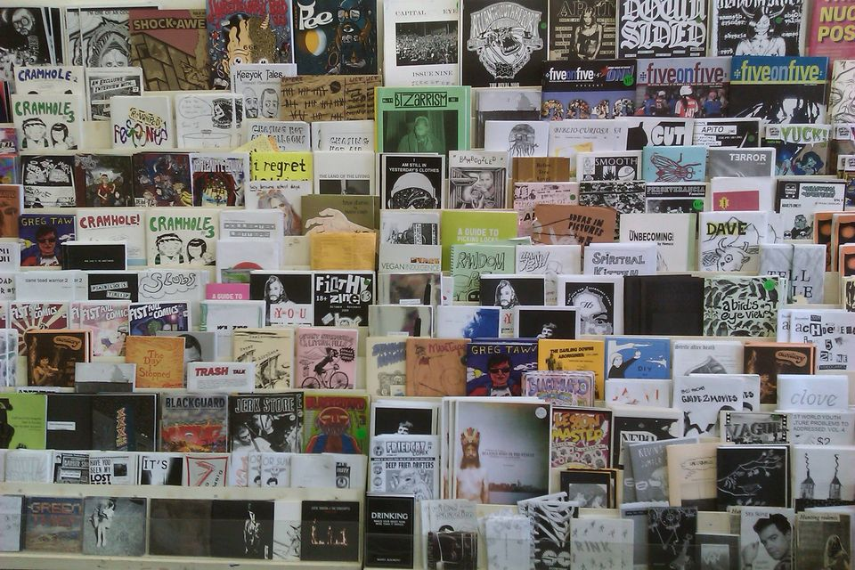
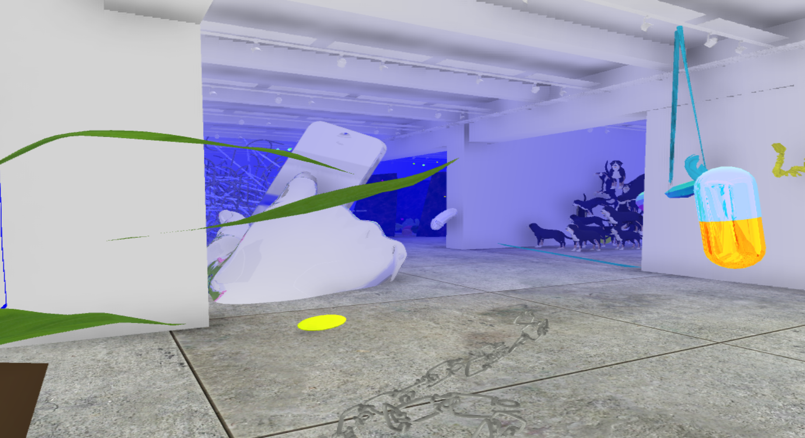

# Project 2

Let's take a look at [Project 2](project-2.md) and think about why a game might make a good zine.



From Anthropy's book:

>...what I want from videogames is a plurality of voices. I want games to come from a wider set of experiences and present a wider range of perspectives. I can imagine—you are invited to imagine with me—a world in which digital games are not manufactured by publishers for the same small audience, but one in which games are authored by you and me for the benefit of our peers.

Why not write a story, make a comic, or livestream? What are things that games can express a lot better than other forms of media?


*Papers, Please*. Lucas Pope (2013)

Systems and dynamics? Relationships? Choices and  consequences? Role playing? Alt spaces?


[New New Wight Gallery](https://projects.dma.ucla.edu/exhibitions/thegalleryisnaked/)

Some other zine things:
[Zines at UCLA Library](https://guides.library.ucla.edu/c.php?g=1046263&p=7591800)
List of [Southern California zine events](https://www.johndishwasher.org/zinefestsofsocal.html) 

### **Extra Credit**
Read Chapter 1 of Anthropy's [*Rise of the Videogame Zinesters*](https://drive.google.com/drive/folders/1sKj5MXsl1mBbyfCE_4lRQEAUbggBm7Ld?usp=sharing)

# Some notes on Arcade Cabinets and multiplayer


We have cocktail cabinets that you can design your game to be played on. With a few things to be aware of:
- Different inputs: No mouse, joysticks (switch-based, not analog).
- Screen is in the table, players have to sit.

## Multiplayer

Consider the affordances of an arcade machine: games situated in a particular place on a particular machine, in a particular social context.

Traditional arcade games offer multiplayer in two flavors:

1. Direct competition (fighting games, racing games, etc.)
2. Indirect competition (high score tables etc.)

Consider blending other genres / ways of playing

- Asynchronous multiplayer: players can affect the experiences of future players by changing the environment or leaving messages behind. ([FromSoft](https://youtu.be/ci5bleu3bGg), [Animal Crossing letters](https://youtu.be/KUzOOx6PDc0))
- Sandbox / simulation: there are no prescribed goals, but the state of the game world is persistent between play sessions. Gardening games, Minecraft, etc. 
- Asynchronous co-op: players play at different times but work together towards a common goal (perhaps unlocking new areas to explore or better powers?) ([Noby Noby boy](https://youtu.be/B0TdTe6-6ns))


# From 3D to 2D

Let’s create a new 2D project in Unity using one of the 2D templates.


Using the template will install a bunch of useful 2D packages from the package manager. If you create a project without the template, you can always install the packages manually.  


After your project has started up, you can check out this [unitypackage template](https://drive.google.com/file/d/1wl8eYa-01PaycjSLsaZzSBzm7S1s59S3/view?usp=sharing) with a few scripts and things that might come in handy. We'll be adding more things to this template in the next few weeks.

# Sprites

In Unity, a sprite is a 2D image or animation that is used to represent game objects or UI elements. Sprites can be used to create characters, backgrounds, environmental elements, and other visual assets in a 2D game.

A sprite can be thought of as a single image or frame in an animation, whereas a texture is a 2D image that can be applied to 3D objects or used to create materials in Unity.  
  
The 2D PSD Importer package helps out with mapping Photoshop layers to sprites, for both generating sprite sheets and rigged characters. → [demo of what the package can do](https://youtu.be/b2bIh8WPsi4). We’ll get more into the details when covering frame animations.

Sprites are rendered in 2D using the Sprite Renderer component


This handles drawing, tinting, and layering overlapping sprites. You can use the Order to tell sprites with a higher order to draw in front of sprites with a lower order. The sorting layer allows grouping of sprites to help with more complex ordering. You can also use the ‘z’ value of the transform to push sprites into the background, but it can also cause a lot of confusion when mixed with layer ordering.
# Physics and Collisions

The 2D system uses its own custom 2D rigid body and colliders. These allow two dimensional objects on the same plane to collide with each other and incorporate physics.


Because the colliders and rigid body are different from their 3D counterparts, the callback methods for collisions and triggers also need to be modified:

```csharp
void OnCollisionEnter2D(Collision2D col)
{
        print("2D Collision!");
}

void OnTriggerEnter2D(Collider2D col)
{
        print("2D Trigger!");
}
```

# C Sharp From the basics

If you're interested in C# without any Unity, you can take a look at this [Brackeys playlist](https://youtube.com/playlist?list=PLPV2KyIb3jR4CtEelGPsmPzlvP7ISPYzR) (though it’s part of a Unity channel) 

Also useful to know that if you’re trying to search for help with C#, you can also search for “csharp” to get more results.
## Creating a new script in Unity

There are two common ways to make a new script in Unity:

1. Right-click in the Project panel and select Create > C# Script. Type the name of the new script and press enter.
2. Adding one directly to a Game Object by clicking "Add Component" in the Inspector, typing the script's name into the search bar, clicking "New Script", then clicking "Create and Add"

Both methods will create a new ".cs" file in your project folder. The first method will be in whichever folder you right-clicked, while the second method will create the script at the top level of the Assets folder.

Double-click the script to bring it open in your code editor. You should see the default template for new Unity scripts.
## Default template

Here is a quick tour of all the components of the default template.

```csharp
using System.Collections;
using System.Collections.Generic;
using UnityEngine;

public class MyEmptyScript : MonoBehaviour
{
    // Start is called before the first frame update
    void Start()
    {
        
    }

    // Update is called once per frame
    void Update()
    {
        
    }
}
```

MyEmptyScript.cs - C# files end with “.cs”

# Classes 

Names and File names / Uniqueness / Namespaces

When you create a new C# script it automatically creates a new class with the same name as the script. It’s important to make sure that the filename and the class name are always the same. If you are copying and pasting code, you might accidentally change your class name and suddenly get a bunch of errors in the console.

In a Unity project every class name must be unique. There can never be more than one class with the same name. If you see errors like:  

```
The namespace '<global namespace>' already contains a definition for 'PlayerController'
```

Then you’ll need to go in and find the other class that’s also named “PlayerController”

# Namespaces

Namespaces are like containers which assist in organizing classes and avoiding duplicate naming errors. 

At the top of the default script you’re including a few namespaces with the “using” keyword in order to use the classes contained within them. In particular, the UnityEngine namespace allows you to use all of the classes contained within it.


[https://docs.unity3d.com/ScriptReference/](https://docs.unity3d.com/ScriptReference/) 

This also helps to reduce typing. Otherwise you would have to reference the namespace and then the class (e.g. UnityEngine.GameObject vs GameObject)

You can define your own namespaces by wrapping your classes with the keyword ‘namespace’ and the name of your namespace.

```csharp
namespace MyNamespace 
{
	class MyClass 
      {
          ...
      }
}
```

Likely, you won’t need to make a custom namespace for this class, but it’s pretty useful when collaborating with other people or creating your own plugins to share.
# Variables in C Sharp

A variable stores some information and the type of the variable specifies what sort of information it can store.

The main types of variables in C# are:

- Int - whole numbers: -1, -4, 0, 199
- Float - decimals up to 8 digits: 3.14159
- String - store text: “this is a string”
- Bool - true or false

Variables are declared using this structure:

```Type Name = Value;```

For example:

```csharp
int myInteger = 6;
float myFloat = -5.4f;
string myString = "hi there";
```

The naming convention for variables is to start with a non-capital letter with the first letter of each subsequent word capitalized.

```csharp
// declare a variable without assigning a value
bool myBool;
```

You also probably noticed that some variables are also marked as public or private. When a variable is marked as public, it becomes accessible to other classes. Marking a variable as public is also a way to have it show up in the Inspector.

```cs
public float speed = 0f;
private int count = 0;
```

The ‘f’ after a float makes sure that the variable is a float rather than a double.

When using the UnityEngine namespace, there are a [lot of classes](https://docs.unity3d.com/Manual/ScriptingImportantClasses.html) that can also be declared like variables

```cs
Transform myTransform;
Vector3 myPosition;
Rigidbody rb;
```
# Conditionals

Conditionals work in C# in nearly the same way as Processing and p5.js

```cs
if(numberOfEggs < 10)
{
   print("adding eggs");
} else if(numberOfEggs == 10)
{
   print("just enough eggs");
} else
{
   print("too many eggs");
}
```

You can also create compound statements with logical operators

**! - not
&& - and 
|| - or**

```cs
bool notscrambled = true;
if (notscrambled && numberOfEggs > 0)
{
    // call scramble egg function
    ScrambleEggs();
}
```

# Collections

Collections store groups of variables 
## Arrays

Arrays contain a fixed number of items and are declared with:

```cs
// fill an array with values directly
type[] nameOfArray = {value, value2, value3 };

// create an empty array to fill in later (maybe with a loop)
type[] nameOfArray = new type[50];  
```

To access a member of the array you can reference it by its index, with the first index beginning at zero and the last index at one less than the length of the array.

```cs
int[] myNumbers = { -1, 2, 6, 0, 6 };
print(myNumbers[3]); // prints 0
```
## Lists

If you don’t know how many values you’ll need, then a list is useful as it can vary in length.

To use a list, make sure you’re including the *System.Collections.Generic* namespace


```cs
// declare a list
List<type> myList = new List<type>();
// add something to the list
myList.Add(value);
```


```cs
// declare a list
List<string> niceWords = new List<string>();
// add something to the list
niceWords.Add("Nice!");
// get the number of items in the list
niceWords.Count
```

# Loops 

Repeating sections of code.

For loop in C#:

```cs
for (int i = 0; i < 10; i++)
{
    print(i);
}
```

This will loop until a conditional is met. In the above case, the variable ‘i’ will increment by one each loop until it is no longer less than 10.

Loops are great for working with collections:

```cs
float[] lotsOfFloats = new float[1200];
// fill the array with fives
for (int i = 0; i < lotsOfFloats.Length; i++)
{
    lotsOfFloats[i] = 5f;
}
```

When you want to iterate over an entire collection, use a foreach loop:

```cs
// calculate the average value
float total = 0;
foreach(float myFloat in lotsOfFloats)
{
    total += myFloat;
}
float average = total / lotsOfFloats.Length;
```

While loop in C#:
```cs
// infinite loop
while (true)
{

}
```
  
The loop will continue until the conditional statement becomes false.

```cs
//check if button is still pressed before each iteration
while (buttonIsPressed)
{
    buttonIsPressed = IsButtonPressed();
}
```

A bit less common is the Do loop, which evaluates the Boolean expression at the end of each iteration:

```cs
do
{
	buttonIsPressed = IsButtonPressed();
	// check if the button is pressed at the end of each iteration
} while (buttonIsPressed);
```


# Vectors

Generally a vector is simply a quantity with both magnitude and direction. This can be represented by an ordered list of numbers, where each represents the magnitude of the vector in a specific direction. <br>


<br>

Each number represents a dimension of the “space” that the vector occupies. In 2D space, you would use two values, X and Y, to describe a vector. In 3D space, X, Y, and Z. And so on.  

In Unity, a vector is an object that represents a quantity with both magnitude and direction. Vectors are used to represent all sorts of quantities including:

- Position and Movement (Transform)
- Velocity and Acceleration (RigidBody / RigidBody2D)
- Direction and Rotation (Transform)
- Physics Forces (RigidBody / RigidBody2D)
- Raycasting (Physics)

A vector in Unity is represented by a data structure called a [Vector3](https://docs.unity3d.com/ScriptReference/Vector3.html), which consists of three float values that correspond to the X, Y, and Z components of the vector. The X, Y, and Z values represent the magnitudes of the vector in each dimension and can be positive or negative.

When working in 2D, Vector3 becomes [Vector2](https://docs.unity3d.com/ScriptReference/Vector2.html), and only represents the X and Y components of the vector. See also: [Unity manual section on Vectors](https://docs.unity3d.com/Manual/VectorCookbook.html).

Take a look at [Nick's writeup](https://gem-kettledrum-799.notion.site/Introduction-to-Vectors-0f968b38da0f4e67932a1d3ce3ac2957) on vectors for lots of good visualizations. 

Having a good understanding of how vectors work in Unity is essential for things like programmatically positioning objects, calculating distances between objects, or adding forces to objects.

You can draw the velocity vector of an object in Unity using this script:

```csharp
using UnityEngine;

public class DrawVelocity : MonoBehaviour
{
    Rigidbody rb;
    void Start()
    {
        rb = GetComponent<Rigidbody>();
    }

    void FixedUpdate()
    {
        // draw the velocity vector (relative to this object)
        Debug.DrawLine(rb.position, rb.position + rb.velocity, Color.red);
    }
}
```

This is for a 3D vector, what about drawing vectors in a 2D game?


# Making a simple 2D Player Controller

If you haven't yet downloaded the [flat game template unitypackage](https://drive.google.com/file/d/1wl8eYa-01PaycjSLsaZzSBzm7S1s59S3/view?usp=sharing), please do!

Open up a new scene and create a 2D primitive to become a stand-in for the player.

1. Right-click in the hierarchy. **2D Object > Sprites > Circle** (or whichever shape you'd like to make)
2. Add a *Rigidbody 2D* to the player. Note the 2D!
3. In the Rigidbody 2D, set gravity to zero and Freeze the rotation (you might have to expand "Constraints").
4. Now create a new C# script called "PlayerController2D" and open it in your code editor.

I'll walk through how the script is built, but the complete version of the script is below


PlayerController2D:

```csharp
using UnityEngine;

public class PlayerController2D : MonoBehaviour
{
	Rigidbody2D rb; // reference to this GameObject's Rigidbody
	Vector2 direction; // a place to store the movement direction 
	
	void Start()
	{
		// this gets the rigidbody without having to drag it in the inspector
		rb = GetComponent<Rigidbody2D>();
	}

	// Update for Physics
	void FixedUpdate()
	{
		// calculate the next movement position
		Vector2 newPosition = rb.position + direction * Time.deltaTime;
		// move the game object via the rigidbody
		rb.MovePosition(newPosition);
	}
	
	void Update()
	{
		// using the old input system for getting values
		float xMove = Input.GetAxis("Horizontal");
		float yMove = Input.GetAxis("Vertical");
		// set the direction based on the input values
		direction = new Vector2(xMove, yMove);
	}
}
```

# Workshop

Let's change out the character for a custom sprite and give them a space to walk around in. But for this workshop, the rule is that your sprite images can only come from things in this classroom (that already exist). 

Take photos, feel free to crop/trim (save as PNG if you want transparency), import them into unity and add the new sprites to your scene. Create a level from these photos to walk around in. Replace the 2D primitive on the player with something from this room as well.

Try finding angles and orientations of objects that might create a pathway or level. Or create a collage of objects that might be interesting to traverse as your player.


*The Pedestrian*


*The Witness*

