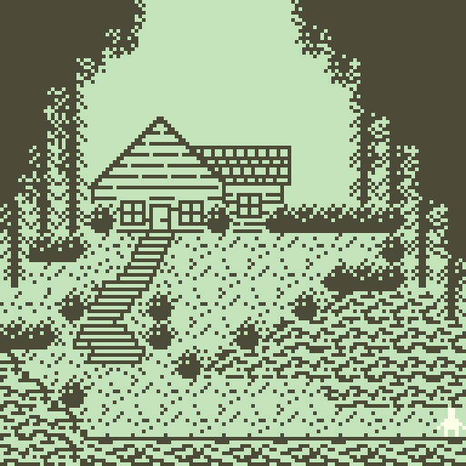
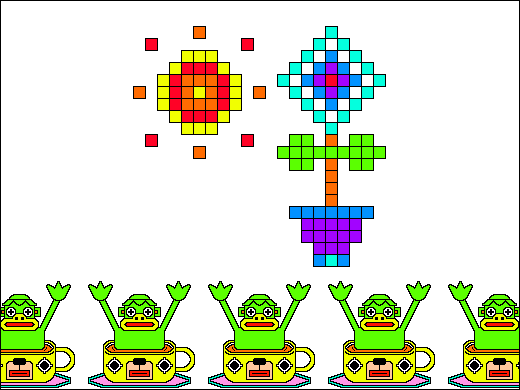
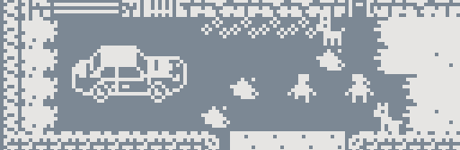
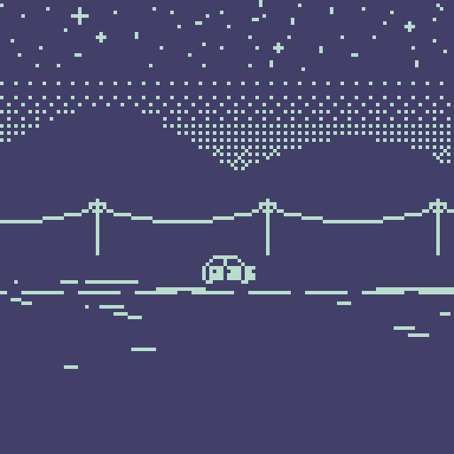
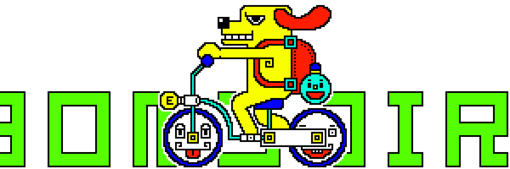

<iframe src="one_tuesday_morning_in_april.html" style="height:512px; width:512px;"></iframe>
# [Bitsy](https://www.bitsy.org/) Microjam

For this tiny game jam, we will use a "tiny" game engine ... [Bitsy](https://www.bitsy.org/) 

This engine was made by Adam Le Doux who writes:

> hi! bitsy is a little editor for little games or worlds. the goal is to make it easy to make games where you can walk around and talk to people and be somewhere.




[What Lies Underneath](https://andreablythe.itch.io/what-lies-underneath) - Andrea Bly
# Schedule

We "Gotta Go Fast"™ to give enough time to work on things in class and present at the end. So let's take a look at the schedule:

| Time | Activity                        |
| ---- | ------------------------------- |
| 0900 | Intro - Theme and engine reveal |
| 0905 | Short guide to the engine       |
| 0930 | Brainstorming ideas             |
| 0940 | Voting                          |
| 0950 | Form Groups                     |
| 1000 | WORK                            |
| 1120 | Fabulous Showcase               |
| 1150 | Done!                           |

# Theme

## The theme for the jam is ***combinations*** 

 

Parsley Bonsoir

## Generate your bitsy game ideas with an open prompt that allows you to create new story combinations between different things. 

Here's the prompt we'll use:

> a (noun) is wandering in (a place). upon arriving at / encountering (a specific location / object / person in the place), a story about (a topic) unfolds.

We'll return to this in a moment. But first how do you do things in bitsy?
# Bitsy

Get to the engine here: [https://make.bitsy.org/](https://make.bitsy.org/)

We'll take a stroll through the engine using this [bitsy pdf handout](https://zeroday.camp/wp-content/uploads/2018/09/Bitsy-Guides.pdf) 

Look at what others have made: [https://itch.io/games/tag-bitsy](https://itch.io/games/tag-bitsy)


If you want to look at even more tutorials / info / hacks/ etc...

- [Another tutorial](https://www.shimmerwitch.space/bitsyTutorial.html) (also in [Chinese](https://zhuanlan.zhihu.com/p/527178844) and [Japanese](https://gamewriter.jp/?p=4874)): 
- bitsy handout (lots of links to other things): [https://rahji.github.io/bitsy-handout/web/](https://rahji.github.io/bitsy-handout/web/)
- bitsy tools map (also lots of links): [https://haraiva.neocities.org/bitsytools#1,4](https://haraiva.neocities.org/bitsytools#1,4)





# Brainstorming

You've gotten a quick taste of the engine, so let's come up with some ideas!

1. Grab a paper
2. Write a version of this sentence with the parenthesis filled in with your own ideas:
   > a (noun) is wandering in (a place). upon (arriving at / encountering) (a specific location / object / person in the place), a story about (a topic) unfolds.
3. When you're done. Put your paper on the designated idea table.


## Voting

Each person gets ***Three votes***


## Read through the ideas. Draw a star ✰ on your favorite ones.


We'll take the top 4-5 ideas and write them on the board! 

# Groups

- Three people max
- Workshop the idea, make a sketch, storyboard, plan what you'll make (remember that your game can be small)
- Divide up the work if needed. (writing, drawing, sounds, bitsy assembly)


[flirting - josie brechner](https://visager.itch.io/flirting)


# Notes on sharing between Bitsy

Behind the scenes, bitsy is just storing everything as text.

Take a look at the "Game Data" tool. If you scroll around (or search for names), you'll be able to find the data connected with your sprite / room / color palette 

## Try copying and pasting things from one game data file to another. 

If you've decided to use any hacks or plugins this might be a bit more tricky.


# Exporting and sharing the game

From the "Download" tool you can export your game as an HTML file. You can embed it using an iframe:

```html
<iframe src="path/to/my-fancy-bitsy.html"></iframe>
```

You can also upload it [directly to itch.io](https://itch.io/docs/creators/html5#getting-started) and make a project page!




[endless scroll - cecile richard](https://haraiva.itch.io/endless-scroll)





