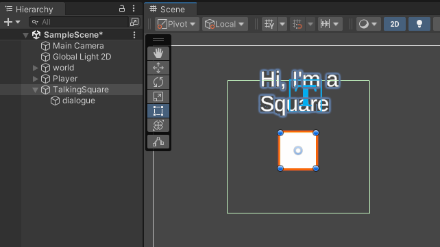

# Homeplay 2 (Due next Thursday!)

As some inspiration and research on Project 2, you'll be signing up in *Groups of 3* to play some zine game(s). Check out the [homeplays](homeplays.md) page for more details and the sign up sheet.


[https://www.suzannetreister.net/Ampages/Amenu.html](https://www.suzannetreister.net/Ampages/Amenu.html) – fictional video game screenshots (1991-1992) (see also her prior series [videogame paintings](https://www.suzannetreister.net/info/Videogame-paintings.html) (1989-1991))

Imaginary video games via only titles and screenshots – still very connected to the era / medium (made on an Amiga)

See also: [A Game By It's Cover](https://itch.io/jam/a-game-by-its-cover-2023) game jam based on [fictional game cartridge](https://famicase.com/23/index.html) art.

# Let's talk reading 2

What did those of you who read Chapter 1 think? How about Chapter 5? 

# Arcade games, culture, manipulation


[Musee Mechanique](https://museemecanique.com/) - San Francisco

Arcades, amusement centers, pinball parlors, penny arcades – mechanical and electro-mechanical games of skill and chance existed long before the video game. 

Devices that could fit into a cabinet were often found in bars and halls, more associated with adult-oriented amusement (full circle → Barcade, D&B). 
  


Pinball was banned from the 1940s to 1976 in New York City by Mayor LaGuardia due to the association with gambling and moral depravity. ([playfield of this game](https://www.ipdb.org/showpic.pl?id=2460&picno=59496))

Ultimately, with the addition of flipper mechanisms, it was demonstrated to be a game of skill and no longer outlawed.


Pong was introduced by Atari (Bushnell and Dabney) in 1972

>…arcade games train players in gaming behaviors by rewarding them through points, game time, and the ability to access subsequent levels, or by explicitly ranking them against other players on top score lists
>
> While video games are frequently understood as simulations, the arcade itself can also be seen as a simulation of emergent economic values and practices that have persisted long past the eclipse of the arcade’s zenith.
> 
> - Kocurek, Coin-operated Americans 

Before the magic lantern, you needed to go to a church or visit a wealthy acquaintance in order to see a large picture (i.e. a large painting). 


In the late 60s you would have had to visit a research lab if you wanted to see a video game, until 1972 when the first arcade machine was introduced.


Video arcades existed as locations where people would need to go in order to access these experiences (for a price). 

In the 1970s and early 80s were characterized by a few features:

## Access to technology 

Most people didn’t have access to computers, so arcades were an early way to demonstrate the potential of what computers could do. Having to leave home to visit these computers, creating social gathering points.
## Short loop of the game and gambling 

Part of the economics of the arcade meant that games needed to be finished quickly to increase revenue. A quarter might only give you 30-60s of gameplay. Learning a game meant spending a lot of money, often making only minor progress with each quarter. When some players were good enough to play for extended periods in a single quarter, some owners would force them to quit or cut the power to the machine.
## Strict rule systems (disciplinary machines) vs open-ended or emergent games

Arcade games are generally linear, “games of progression” with strict ways that the game is intended to be played. This results in a model of mastery of a particular rule set.  

> challenges \[are\] presented serially by way of special-case rules. 
> - Juul. Half-Real

A game like Pong is considered more of an emergent game, though the coin-operated nature of the arcade version, as opposed to a home version, doesn’t reward experimentation.


Arcade cabinets existed outside of the Arcade proper (where one would go with the intent to play games). In restaurants, waiting rooms, laundromats, bus stations, etc. one could have a more incidental encounter with a machine without needing to be considered a gamer. As mobile gaming emerged, and duplicating many classic arcade games, there was no longer any need to put quarters into a machine for gaming experiences.

Industry point of view - [https://departmentofplay.net/building-successful-games-6-lessons-from-arcades-heritage/](https://departmentofplay.net/building-successful-games-6-lessons-from-arcades-heritage/) 


[Ninja Baseball Bat Man](https://youtu.be/JpBysvAbnbs) (1993)

## High Scores and competition

“The fact that players can enter their initials into a high score list creates a different kind of competition: you compete against previous players, whom you probably have never met. This competition is more indirect: you compare your score with their scores, and if you are one of the top eight players, you get to enter your initials into the game for other players to see, bumping off the player at the bottom of the list. However, you might later be bumped off as well. Here, your numeric score is translated into a scaled rank: either your score wasn't high enough to put you on the list, or you entered the list at a specific rank.”
## Continue…  

Prior to the continue, being able to play for a long time was a mark of skill. The high scores represented a single-quarter’s measure in both time and ability to score points. Once players could simply pay extra money to continue from where they had lost, high scores became more about how many quarters someone was willing to spend. 

[https://www.denofgeek.com/games/the-origins-of-the-video-game-continue-screen/](https://www.denofgeek.com/games/the-origins-of-the-video-game-continue-screen/) 


SNK’s Fantasy - First arcade game to add a “continue” option


## Extractive capacity 
 

[](https://youtu.be/Qause0z-9tM)

Waterworld [parody arcade](https://youtu.be/Qause0z-9tM) game…. And someone actually made it in 2022: [https://macaw45.itch.io/kevin-costners-waterworld](https://macaw45.itch.io/kevin-costners-waterworld) ([playthrough](https://youtu.be/jgMYaPxfRlY))

## Mail order games

In the UK, budget-friendly personal computers were popular enough to support independent game makes who distributed games on cheap cassette tape via the mail. 

The ZX Spectrum from 1981 for about $200 (~$688), while other personal computers were much more expensive (Commodore 64 - $595 / $1,551 or IBM PC 5150 $1565 / $4332)


*Football Manager*. Kevin Toms (1982)


*Can of Worms*. Mel Croucher (1981) -- "10 games for 3 quid"

# Methods in Unity 

[Official Documentation](https://learn.microsoft.com/en-us/dotnet/csharp/programming-guide/classes-and-structs/methods)

A method is an encapsulated block of code that can be called elsewhere. Some methods that are probably already familiar are Start() and Update() which are built into Unity’s [Monobehavior](https://docs.unity3d.com/ScriptReference/MonoBehaviour.html) class.

The signature of a method contains the access modifier (public, private), the return value (void, int, float, Vector3), the name of the method, and any parameters that should be passed to the method when called. 

Here’s an example:
```c#
public void SayHello() 
{
	print("Hello"); 
}
```

This method doesn’t return anything and has no parameters. How about adding in a parameter and a return value:

```c#
public string SayHello(string name)  
{  
	print("Hello" + name);  
	return "said hello to " + name; 
}
```

And even more parameters and this one returns a value:

```csharp
public string SayHello(string name, int numberOfTimes)  
{  
	for(int i = 0; i < numberOfTimes; i++)  
	{  
		print("Hello" + name);  
	}  
	return "said hello " + numberOfTimes + "times";  
}
```

Call the method by its name and pass in any arguments, the return value can be used right away or stored in a variable

```csharp
// storing the return value in a variable  
string result = SayHello("Duane", 500);  
print(result);  

// or using it directly  
print(SayHello("Duane", 500));
```

# Cocktail Cabinet Input System

[Download Cocktail Input Asset](https://drive.google.com/file/d/1YVcr7K-cj00N_OxzMZAMPesqlxzEWfb2/view?usp=sharing) , also be sure to install the input system package for your 2D project. The template does not come with the input system package.  

> NOTE: This technique uses Unity’s newer [Input System package](https://docs.unity3d.com/Packages/com.unity.inputsystem@1.5/manual/index.html)  (just like roll-a-ball). So if you are trying to do Input.GetKeyDown("space") then you’re using the old system and the following info won’t work. If you want to use the older version, you’ll have to manually map the keys!

Currently the default input system uses “Actions” that are mapped to specific words like “Move” and “Fire”


The cocktail cabinet input actions still use “Move” for the joysticks, but have more generic names for each of the six buttons.  


## Adding the input actions

Download the unitypackage from the link above and import the unitypackage into your project.

After the import, you’ll see a new folder in your Project tab called “Inputs” which contains the GamelabCocktailCabinetControls input actions. You can double click it to see the mappings.


Notice that there are also separate action maps for each player.

Next, attach a **Player Input** component to the object you want to control with your inputs. Then drag the **GamelabCocktailCabinetControls** into the Actions property.

When using the *Default* Player Input component, the names of the actions are mapped to callback functions:

Move → OnMove
Fire → OnFire
Button1 → OnButton1

You can see a list of the callback functions at the bottom of the component:  


When inside of a script, the “Move” message is exactly the same between the two input action sets, it becomes *OnMove*:

```csharp
void OnMove(InputValue moveValue)  
{  
	movement = moveValue.Get<Vector2>() * speed;  
}
```

You can also check what type of value the action will return to the InputValue variable in the Action Properties when selecting the specific action:

  

For button types of actions like “Fire” and “Button1” there’s no need to pass a value into the function:


```csharp
void OnFire()  
{  
	var obj = Instantiate(
		throwingPrefab, 
		throwingPoint.position, 
		throwingPoint.rotation);  
}
```

## Setting the player input for specific player inputs

In the player input component, you can modify which player is being controlled with the Default Map field  


## Modify existing input methods

To use the Button1 inputs rather than something like Fire or Jump, you can change the name of the method in the script.

```csharp
void OnFire()  
{  
	var obj = Instantiate(
		throwingPrefab, 
		throwingPoint.position, 
		throwingPoint.rotation);  
}
```

Becomes

```csharp
void OnButton1()  
{  
	var obj = Instantiate(
		throwingPrefab, 
		throwingPoint.position, 
		throwingPoint.rotation);		  
}
```
  

Alternatively, you can rename the Actions in the Input Actions window


## Testing script 

You can use this script test out the inputs. Here's an example of how to modify the basic movement script for the new input system:

```csharp
using UnityEngine;  
using UnityEngine.InputSystem;  

public class InputTesting : MonoBehaviour  
{
	public float speed = 10f;  													
	public Rigidbody2D rb;
	private Vector2 direction;  
	
	void FixedUpdate()
	{
		Vector2 newPosition = rb.position + direction * Time.deltaTime;  
		rb.MovePosition(newPosition);  
	} 

	void OnMove(InputValue moveValue)  
	{
		direction = moveValue.Get<Vector2>() * speed;  
	}

	// testing the rest of the buttons
	void OnButton1() { print("button1"); }
	void OnButton2() { print("button2"); }
	void OnButton3() { print("button3"); }
	void OnButton4() { print("button4"); }
	void OnButton5() { print("button5"); }
	void OnButton6() { print("button6"); }
}
```

This is what the component setup would look like for one player:


Try duplicating the object and setting the map to Player2.

# Scripting Triggers and Collisions (in 2D)

You've used the standard trigger and collision methods in the Rolling Ball demo. We will now return to Triggers and Collisions in the context of scripting. It might be good to revisit [Day 3](day-3.md) and take a look at the demo scene.

Because of the physics system in 2D changing (Rigidbody2D, Collider2D, etc.), our old collision and trigger scripts won't work anymore. 

Let's take a look at how the scripts would change and how to write custom trigger and collision methods.

Here's a script that handles the three different forms of a Trigger event:

```csharp
using UnityEngine;
using UnityEngine.Events;

public class HandleTrigger : MonoBehaviour
{
    public UnityEvent onTriggerEnter;
    public UnityEvent onTriggerStay;
    public UnityEvent onTriggerExit;

    void OnTriggerEnter(Collider other)
    {
        if(onTriggerEnter != null) 
        {
	        onTriggerEnter.Invoke();
        }
    }

    void OnTriggerStay(Collider other)
    {
        if(onTriggerStay != null) 
        {
	        onTriggerStay.Invoke();
	    }
    }

    void OnTriggerExit(Collider other)
    {
        if(onTriggerExit != null) 
        {
	        onTriggerExit.Invoke();
	    }
    }
}
```

Note that there are three different methods based on the state that a Trigger might take on: 
1. Enter - an new collider just entered this trigger 
2. Stay - a collider is currently in this trigger (called every frame)
3. Exit - a collider just left this trigger

The `public UnityEvent` variables create the event slots in the Inspector that you can connect objects to. There are other ways of setting up events in C# (delegates, actions) and are all connected to a common programming design pattern called Observer. [This blog](https://gamedevbeginner.com/events-and-delegates-in-unity/) has a good breakdown of the different types of event "signals" you could use in Unity (and C#).


## Converting to 2D Physics

Adapting the script to [2D physics](https://docs.unity3d.com/Manual/Physics2DReference.html) requires switching out the enter, stay, and exit script to the 2D versions of those functions… which usually just involves add "2D" to the end:

```csharp
using UnityEngine;
using UnityEngine.Events;

public class HandleTrigger2D : MonoBehaviour
{
    public UnityEvent onTriggerEnter;
    public UnityEvent onTriggerStay;
    public UnityEvent onTriggerExit;

    private void OnTriggerEnter2D(Collider2D other)
    {
        if(onTriggerEnter != null) onTriggerEnter.Invoke();
    }

    private void OnTriggerStay2D(Collider2D other)
    {
        if(onTriggerStay != null) onTriggerStay.Invoke();
    }

    private void OnTriggerExit2D(Collider2D other)
    {
        if(onTriggerExit != null) onTriggerExit.Invoke();
    }
}
```

The names of the UnityEvent variables don't have to be changed, they can be named whatever you like.

## Make things talk

Let's write a script that uses a trigger to show dialogue when your player is nearby. Kind of like Bitsy, but a bit different.

This works very much the same way that we've used triggers to turn on/off game objects, but (almost) entirely will happen inside of a script.

1. Make a new script called "ShowDialogue". Add in the methods for trigger enter and trigger exit. You can also remove unused namespaces and methods. 
	
	```csharp
	using UnityEngine;
	
	public class ShowDialogue : MonoBehaviour
	{
	
		void Start()
		{
		    
		}
		
	    void OnTriggerEnter2D(Collider2D collision)
	    {
	        
	    }
	
	    void OnTriggerExit2D(Collider2D collision)
	    {
	        
	    }
	}
	```

2. Add a `public GameObject` variable for the dialogue that we'll show/hide. This variable belongs to this class and is used by both trigger methods, so it should be declared in the scope of the class, but outside the trigger methods.
3. In each of the methods, set the active state of this variable to either true or false using the Game Object's *SetActive* method. In the following script, the game object is hidden right at the start, then activated when something enters the trigger area, and hidden again when something leaves the trigger area.
	
	```csharp
	using UnityEngine;
	
	public class ShowDialogue : MonoBehaviour
	{
	    public GameObject dialogueObject;
	
	    void Start()
	    {
	        dialogueObject.SetActive(false);
	    }
	
	    void OnTriggerEnter2D(Collider2D collision)
	    {
	        dialogueObject.SetActive(true);
	    }
	
	    void OnTriggerExit2D(Collider2D collision)
	    {
	        dialogueObject.SetActive(false);
	    }
	}
	```

4. Since anything with a collider could turn the dialogue on or off, make the script only respond to the Player by checking the tag of the incoming/outgoing collider.
   
	```csharp
	using UnityEngine;
	
	public class ShowDialogue : MonoBehaviour
	{
		// game object to show / hide
	    public GameObject dialogueObject;
	
	    void Start()
	    {
		    // make sure object starts out hidden
	        dialogueObject.SetActive(false);
	    }
	
	    void OnTriggerEnter2D(Collider2D collision)
	    {
		    // check if collider is attached to player and show object
	        if (collision.gameObject.CompareTag("Player"))
	            dialogueObject.SetActive(true);
	    }
	
	    void OnTriggerExit2D(Collider2D collision)
	    {
		    // check if collider is attached to player and hide object
	        if (collision.gameObject.CompareTag("Player"))
	            dialogueObject.SetActive(false);
	    }
	}
	```
	
5. Save the script and go back to the Unity Editor. 
6. Find something that could say something to the player and attach a Collider2D (whichever shape you like) and check the "Is Trigger" box. Expand the collider to represent the area where dialogue should appear when the player enters.
7. Create a new game object to hold the text of the dialogue. In the Hierarchy, right-click and select *3D Object > Text - Text Mesh Pro*. For now we'll use this, but you could make a much more complex hierarchy of game objects that include text boxes, character portraits, sounds, etc.
8. If the text is not showing, you may need to update the sort order of the text. This can be found in the TextMeshPro-Text component under Extra Settings > Order in Layer. Increasing this number will draw the text in front of other things on the same layer.
9. Make this new text object a child of the game object you added the collider to. 
   
   
   
10. Add the ShowDialogue script to your talking game object.
11. Drag the dialogue game object into the dialogueObject slot of the script.
12. Press play and move your player near the object to see if they talk to you.

If nobody is talking to your player, here is a checklist of some common problems:

1. No Collider on the Player.
2. No Rigidbody on the Player.
3. Player tag is not set to "Player"
4. Not using 2D versions of colliders and rigidbodies
5. Dialogue is behind another sprite (check sort order or z-axis)
6. Errors in the ShowDialogue script or other errors in console.

## Talkin workShop

Import some images into your project to use as sprites and make objects in the scene say things when your player is nearby. You can have characters appear in different areas to say different things. 


*10 Beautiful Postcards*

Some Challenges:

- Add boxes around the text.
- Have things make sounds instead of showing dialogue
- Give characters multiple lines of text, each time you walk close to a character they say the next line.
- Do the above, but instead of re-triggering the next line, let the player press a button to show the next line of text.


# Vector Talk

Let’s talk a bit more about vectors and ways to get information about your game using vectors.

## Magnitude 

… is the length of the vector. This often corresponds to some amount. For instance a force Vector2 of (3,4) would have a magnitude of 5: 


Fortunately, Unity can handle this calculation. You can get the magnitude of a vector in Unity like this:

```csharp
Vector3 myVector = new Vector3(2.5f, -4f, 6f);  
float mag = myVector.magnitude;
```
## Distance

If your vectors are positions in space, calculating the direction and distance between two points can be done with subtraction and taking the magnitude of the resulting vector. Unity also has a handy Distance method:
  
```csharp
// Gets a vector that points from the player's position to the target's.
// Both variables are Transforms, so access the position property to
// get the vector.  
Vector3 heading = target.position - player.position;  
// get the length of the vector (distance between the two points) 
float distance = heading.magnitude;  
// Vector3 also has a distance method 
float distance2 = Vector3.Distance(target.position, player.position);
```

## Normalize a vector 

To normalize a vector is to keep the same heading/direction, but with a magnitude scaled to one (often called a unit vector). Useful when you want to re-scale or limit the length of a vector but maintain its direction.

Here’s an example where the velocity of a rigidbody (rb) is modified:

```csharp
// get velocity and normalize
Vector3 myVelocity = rb.velocity;
Vector3 normalizedVelocity = myVelocity.normalized;  
// set a new velocity with scalar multiplication
float speed = 10f;
rb.velocity = speed * normalizedVelocity;
```
## Reflecting a vector

I mentioned reflection in class today. Here’s an example of how you can use Vector2.Reflect to change the velocity of a rigidbody when it collides with something:

```csharp
// changing the velocity by using reflection
private void OnCollisionEnter2D(Collision2D collision)
{        
// get the normal vector        
Vector2 normal = collision.contacts[0].normal;        
// create the reflection        
Vector2 newVelocity = Vector2.Reflect(rb.velocity, normal);        
// set the new velocity        
rb.velocity = newVelocity;
}
```

You could use this to make a custom screensaver:


