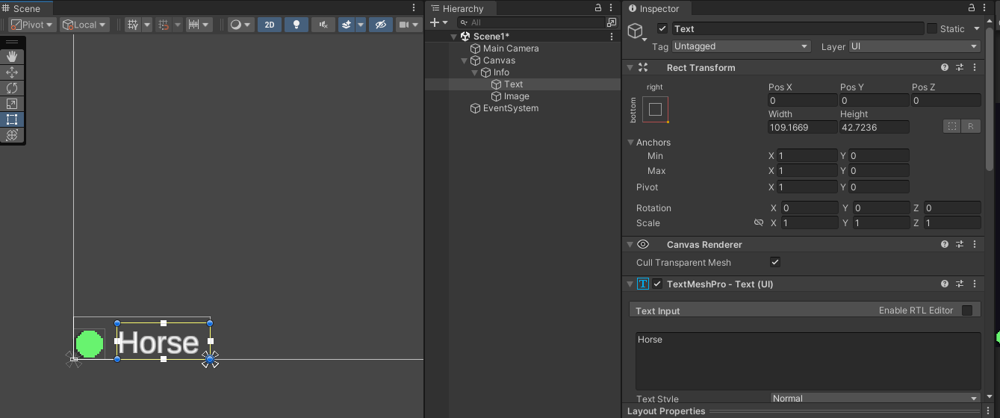

# Plan for today

1. [Project 2 Sketch Meetings](#project-sketch-meetings)
2. [Inventories and Keys](#inventories)

Also the [Microjam Bitseum](micro-jam-museum/index.html) is now up! If I have the wrong version of your group's game let me know!

**Template**: If you haven't yet downloaded the [flat game template unitypackage](https://drive.google.com/file/d/1wl8eYa-01PaycjSLsaZzSBzm7S1s59S3/view?usp=sharing), please do!
# Project Sketch Meetings

Add your name to the list on the board for meetings. 


# Inventories

Beyond running, jumping, and touching, items complicate how players interact with the world. 

<br/>*Items and a bag (here, a bucket) for carrying*

## Through prosthetic extension of the player character's form (whether human, animal, or ball), they change how a player engages with the surrounding territory. 

<br/>*Zork (1977)* - Simply a list of the items you've picked up.

  

<br/>*Resident Evil 4 (2005)* - Limited carrying space, optimizing your carrying case.

  

<br/>*Stardew Valley (2016)* - More information about items, detailed images, hints on what to use them for.

## Through design they carry meaning, further solidifying an invented world, elaborating on relationships, alluding to narrative futures.

<br/>*Bloodborne (2015)* - Worldbuilding lore, filling in details and connections.

## While a jump is immediate, items have potential and an inventory holds the branching possibilities from which your player-character can select.

<br/>*[Grotto](https://www.mudroom.rip/) (2023)* – Items, world, and more are generated from lineage. Sometimes items are just to help with getting around.

# Carrier Bag Theory of Fiction


## The inventory as metaphor or device for storytelling can be seen as an alternative and, as Le Guin argues, precursor to linear, heroic modes of fiction. 

> If it is a human thing to do to put something you want, because it's useful, edible, or beautiful, into a bag, or a basket, or a bit of rolled bark or leaf, or a net woven of your own hair, or what have you, and then take it home with you, home being another, larger kind of pouch or bag, a container for people, and then later on you take it out and eat it or share it or store it up for winter in a solider container or put it in the medicine bundle or the shrine or the museum, the holy place, the area that contains what is sacred, and then next day you probably do much the same again--if to do that is human, if that's what it takes, then I am a human being after all. Fully, freely, gladly, for the first time. 
>
> [*The Carrier Bag Theory of Fiction*]( https://otherfutures.nl/uploads/documents/le-guin-the-carrier-bag-theory-of-fiction.pdf ) - Ursula K. Le Guin

[](http://takeshimurata.com/)
*Expanded Cinema* (2011) Takeshi Murata

# Picking up an item and holding on

You've already built a pickup in roll-a-ball. But what about different types of pickups? How do you keep track of what's been picked up? How do you use an item later?
## Pickup Prep

Start with the same setup as the roll-a-ball pickup (i.e. an object with a trigger).

1. Add an object to your scene. Since we're in 2D, you'll add a sprite or something that can be identified.
2. To the object, add a collider (Collider2D) and make it into a trigger.

## Inventory Script

We'll create a separate script that keeps track of all the items we pick up.

1. Create a new script called `Inventory` and attach this script to the player's Game Object.
2. Remove the Start and Update methods.
3. Add some `public int` variables to represent the different things that can be picked up.

Here's an example of what it might look like:

```csharp
using UnityEngine;

public class Inventory : MonoBehaviour
{
    public int eggs = 0;
    public int scrapsOfCloth = 0;
    public int jewels = 0;
    public int keys = 0;
}
```

## Collectible script

Next add a script to the object being collected. This script will:

1. Use OnTriggerEnter2D to detect when something collides with it.
2. Check if the incoming collider has an Inventory script attached to it.
4. Add itself to the inventory when it gets picked up.
5. Destroy the collectible game object.

For getting started, you can make a script for each type of collectible object. Here's one called `CollectibleScrap` for the scrapsOfCloth variable that was defined in the inventory above: 

```csharp
using UnityEngine;

public class CollectibleScrap : MonoBehaviour
{
    private void OnTriggerEnter2D(Collider2D collision)
    {
        Inventory playerInventory = collision.gameObject.GetComponent<Inventory>();
        if (playerInventory != null )
        {
            playerInventory.scrapsOfCloth += 1;

            Destroy(gameObject);
        }
    }
}
```

Test it out. When moving the player over the pickup, the object should disappear and you should be able to see the count increase on the Inventory script in the Inspector.

## Using items

We can write a script to automatically check for an item in the player's inventory. Doing this is pretty similar to the collectible script above.

To start, you'll need to create another object in the scene for the player to interact with and also give it a trigger collider. Then add a script to this object, which will:

1. Use OnTriggerEnter2D to detect when something collides with it.
2. Check if that object has an Inventory.
4. Check the inventory for a specific item
5. (optional) Remove the item from the inventory.
6. Destroy the attached game object, display a dialogue, win the game, etc.

You'll notice that it isn't that much different. Here's how it might look if I wanted to use the scrap of cloth I picked up earlier to fix a quilt:

```csharp
using UnityEngine;

public class Quilt : MonoBehaviour
{
    public GameObject quiltMessage;
    private void OnTriggerEnter2D(Collider2D collision)
    {
        Inventory playerInventory = collision.gameObject.GetComponent<Inventory>();
        if (playerInventory != null)
        {
            // use the scrap of cloth on the quilt
            playerInventory.scrapsOfCloth -= 1;

            // show a message
            print("Thanks for fixing my quilt"); // console
            quiltMessage.SetActive(true);

            // pick up the new quilt, make sure you add a 
            // 'fixedQuilt' variable to the Inventory script
            playerInventory.fixedQuilt += 1;

            // get rid of this game object
            Destroy(gameObject);
        }
    }
}
```

Since I add the fixed quilt to the player's inventory, I could have the player bring the quilt back to another character that might be looking for a quilt.

## Inventory UI

For showing the inventory, a connection must be made between the values of the Inventory script and the text (TMP_Text) values of UI elements.

Make sure there's a UI element in the scene that you're working on. If you're in the flat game template. There is a UI element in the "Scene1" scene which is a child of the Canvas element.



You can duplicate each "info" game object in the canvas for each inventory item you might want to display info about.

Let's get into the script. It's going to need to:

1. Connect to the Inventory script.
2. Connect to any text components that will display an item count
3. Check the inventory for the item counts.
4. Update the text value of the UI to match the current count.

Create a script called `InventoryDisplay` and attach it to the Canvas game object. It could be attached to any game object you want, but it should be easy to find.

```csharp
using TMPro;
using UnityEngine;

public class InventoryDisplay : MonoBehaviour
{
    Inventory playerInventory;
    // UI Text for showing scraps of cloth count
    public TMP_Text scrapDisplay;

    // Start is called before the first frame update
    void Start()
    {
        // Search the scene for the Inventory
        // OK to do in Start, but avoid doing this every frame
        playerInventory = FindObjectOfType<Inventory>();
    }

    // Update is called once per frame
    void Update()
    {
        // ToString() converts the int to a string
        scrapDisplay.text = playerInventory.scrapsOfCloth.ToString();
    }
}
```

Make sure to drag the UI element into the `scrapDisplay` property in the Inspector or you might see some an error like `NullReferenceException: Object reference not set to an instance of an object`

This script also assumes that there is an Inventory script attached to an object somewhere in the scene. If there isn't, you'll also see a `NullReferenceException`

You can add as many `TMP_Text` variables to the script as you have items in your inventory. All of them will update inside of the Update method.

# Key Challenge


Let's see who can open a door the fastest!

Split up into small teams (at least 2) and build:

1. A key
2. A locked door
3. A way for the player to pick up the key.
4. A way for the key to open the door.

See if you can build the door and open it before we can open the door in the game [You Have 293 Keys](https://14hourlunchbreak.itch.io/you-have-293-keys)


