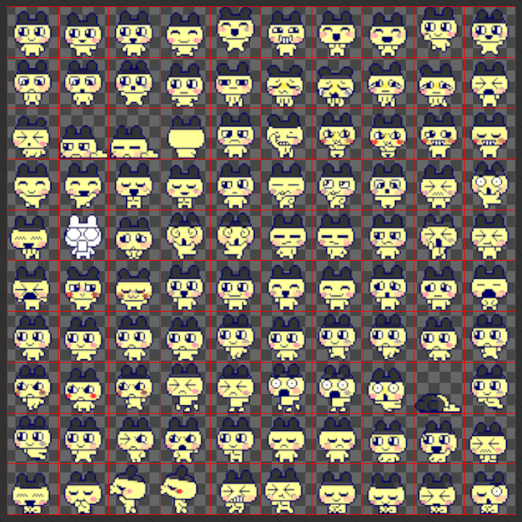

# Plan for today

1. Homeplay 2 Presentations
2. [Animation](#importing-sprites-animation-frame-animation)
3. [Miscellany](#mouse-interaction-dragging-snapping)
4. Visiting UCLADMAMFAFS2023 

# Importing sprites, Animation, Frame animation


*Mini Metro*, 2015

If you’re using software (or a plugin) that exports to a sprite sheet (i.e. packing multiple sprites into a single image file), then you don’t need to worry as much about exporting techniques. If not, there are some things you can consider when authoring your sprites to make things easier down the line.


*Sprite sheet for Sonic the Hedgehog character animations.*

# Animation in Unity


Not just limited to frame-animations in sprites, the Unity animation system allows you to create keyframe animations that control component properties and trigger functions. For objects that have multiple animations that need to be triggered based on the conditions of the scene, the system comes with a state machine to manage triggering animations.

## Keyframe animation with properties

Let’s get started by animating a circle to move back and forth on the screen.


Starting with an empty scene and a 2D circle sprite:

1. Add the “Animation” tab to the editor by clicking the three dots on the top right of an existing panel, then Add Tab > Animation (you can also go to Window > Animation > Animation)
   
   
   
2. In the Animation tab, with the Circle selected in the hierarchy, click Create and save the new animation in your assets.
   
   
   
   This will create an Animation Clip and an Animator Controller in your project assets. It will also automatically add an Animator component to the Circle game object and with the Animator Controller set in the controller property. You can leave the default settings for now.
  


3. The Animation tab should now show a button that lets you assign a property to animate. Click the Add Property button and select Transform > Position to add the position property to the timeline.
   
   
   
   If you click off the Circle game object, you’ll notice that the Animation tab goes back to the empty state from Step 2. Make sure that you have the object you want to animate selected.

4. Record some keyframes. Press the red Record Button on the top left of the Animation tab. Move the circle to a “starting position”. Since the playhead in the Animation tab is currently at frame zero of the animation this will set the object’s position at the start. 
   
   If you drag the playhead towards the end of the end of the timeline, you’ll see the position of the object animating back towards its original position.

5. Move the playhead to the halfway point and move the circle’s position to a different position. This will add new position keyframes to the timeline. De-activate the Record Button.
   
   

6. Now select the keyframes at the starting position, copy them (ctrl/cmd + c), move the playhead to the final frame of the animation, and paste (ctrl/cmd + v) the keyframes.
7. You should now have a looping animation. Preview it by clicking the play button on the Animation tab. The Animator Controller is also set to start the animation as soon as the object is active in the scene, so pressing the global play button also plays the animation. 
8. You can scale the length of the animation by selecting all the keyframes and dragging on one of the ends. Dragging to the right will also expand the overall animation length.
   
   

9. You can view the Animation Controller in the Animator window by double clicking the “Circle” animation controller in the Project tab. Or with the Circle selected in the hierarchy, you can open the Animator window with Window > Animation > Animator
   
   

There is only one clip for this controller, so there isn’t much to see. But you can select the clip and modify its settings in the inspector (for instance scaling the speed of the clip).


# Frame Animation with sprites

By animating which sprite is displayed in the SpriteRenderer component, you can create frame animations of sprites.

## Exporting individual sprites

The most common workflow for generating your sprites is to have each individual sprite on a separate layer in photoshop and then to export each layer as a separate PNG file. This is done using Export > Layers to Files…


You’ll end up with something like this:


And then you’ll need to organize groupings of sprites in your Unity project using folders or repacking sprites using an [atlas](https://docs.unity.cn/2021.1/Documentation/Manual/class-SpriteAtlas.html) .

## Sprite sheets

The sprite atlas mentioned above is a way to combine all of the individual sprites onto a single texture for more efficient loading and unloading of texture files. This is known as a sprite sheet.

It is not uncommon to create the sprite sheet within another program and exporting all your sprites as a single image file.


Usually sprites are packed into a grid. When importing into Unity, you'll set the sprite import settings to read the file as "multiple" in order to chop up the single file into individual sprites. 

Here's the sliced up grid for the previous sprite:



We'll get into the details of the sprite importing process after talking about another method for importing sprites.

[Spriters-resource](https://www.spriters-resource.com/) is a good place to see lots of examples of sprite sheets from lots of games.
## Directly importing sprites from photoshop

But, when using the 2D (URP) template, Unity includes a number of 2D specific packages that might be useful to reduce importing headaches.
  


The 2D PSD Importer package helps out with mapping Photoshop layers to sprites, for both generating sprite sheets and rigged characters.

[Here is a very good overview](https://youtu.be/b2bIh8WPsi4) of what the package is capable of. For this demo, we’ll only be bringing in sprites for use in frame animations. 

With the importer package, you don’t need to manually create a tiled sprite sheet, where each frame of the animation is placed on a grid (see above sheets). Instead, create each sprite on its own layer and Unity will handle how the sprite should be broken up in the import settings.

1. Create a simple character with a two-frame idle animation. Place each frame in a separate layer. You can group the layers and name them based on the animation type. Unity will bring over these names. **Important**: Make sure all layer names are unique (even hidden ones).
   

2. Save the entire scene as a PSB file. This is nearly identical to a PSD file, but can handle larger files. Unity will only import these types of files. You can save it directly to your project’s assets folder.
   
   Save as type > Large Document Format (*.PSB)
   
   

3. Back in Unity, click on the PSB file in the Project tab to bring up the import settings in the Inspector.
4. Make sure to have the following settings:
	1. Sprite Mode: Multiple
	2. Pixels Per Unit: 100 (this depends on what resolution you are working at)
	3. Import Mode: Individual Sprites (Mosaic)
	4. Use as Rig: False (unchecked)
	5. Filter Mode: Point (no filter) – this is if you want crisp pixel edges
	   
	   

5. Hit “Apply” and then click on the Open Sprite Editor to see how your sprite was imported.
6. You should see bounding boxes around each separate sprite. For a character like this, it’s important to have the pivot at the base of the sprite. Select each box and change the pivot to Bottom Center. For other sprites you’ll want to keep the pivot in the center or move it to another part of the sprite.
   
   
   
7. Import some more sprites that you might want to include in your scene. I found some clouds. Because we started the Project in the 2D template, all images will be imported as sprites by default. You can import new sprites separately or play with packing similar sprites into a single PSB file.

Here’s an example of a bunch of different clouds all imported together and how the resulting sprite sheet turned out:


  


# Creating Idle animation with Sprites

Adding the idle animation to the character.

1. Drag the first sprite of the character into the scene (or grab a 2D sprite sheet elsewhere).
2. Name this GameObject “Player”
3. With the GameObject selected in the Hierarchy, open the Animation tab Window > Animation > Animation.

 

4. In the Animation window, click “Create” and save the new animation as “player_idle” (It’s a good idea to create an Animation folder to store all of the animation clips and controllers). There should now be an Animator component on the Player GameObject.
5. With the Animation window still open, select all the frames of the idle animation in the Project tab and drag them into the timeline of the Animation window. You should see a keyframe for each of the sprites. 


6. Preview the animation by pressing the Play button in the Animation window. It will be really fast. You can slow down the animation by reducing the Samples value to 5 or less. If you don’t see the Samples area, click the three dots on the right side of the Animation window timeline and select “Show Sample Rate”


7. The character should now have an idle animation. Press play in the scene view and the animation will start with the scene.

# Mouse interaction, dragging, snapping

I've put together a script called `MouseDrag` that you can attach to objects you'd like to test out with mouse interactions. UI Buttons are already set up for receiving mouse inputs, so you don't need to add this script to those.

Create a new script called `MouseDrag` in your scene. 

> Note: Mouse events work in both 2D and 3D, but the snapping on this script is only set up for 2D (using Physics2D and Collider2D)

```csharp
using UnityEngine;

public class MouseDrag : MonoBehaviour
{
    // toggle whether to use snapping
    public bool snapToPosition = false;
    // radius to check for finding snap points
    public float snapRadius = 1f;
    // use a layer mask to filter unwanted colliders
    public LayerMask snapLayer; 

    // reference to our camera
    Camera cam;

    void Start()
    {
        // shorthand for grabbing the main camera
        cam = Camera.main;
    }

    // do something on mouse click
    void OnMouseDown()
    {
        print("mouse pressed");
    }

    // do something while mouse is clicked and held (every frame)
    void OnMouseDrag()
    {
        // move object to position of mouse
        Vector2 mousePos = Input.mousePosition; // using old input system

        // convert from screen space (mouse coords) to world space (game coords)
        Vector3 newPos = cam.ScreenToWorldPoint(new Vector3(mousePos.x, mousePos.y, 10f));

        // set the position
        transform.position = newPos; 
    }

    // do something when mouse released
    void OnMouseUp()
    {
        if (snapToPosition)
        {
            // use an overlap to check for nearby objects 
            Collider2D collider = Physics2D.OverlapCircle(transform.position, snapRadius, snapLayer);
            // if another collider was found, snap to that object
            if(collider != null)
            {
                transform.position = collider.transform.position;
            }
        }
    }
}

```

You can attach this script to a game object that you'd like to drag around. 

The only caveat is that **the object needs to have a collider** ([documentation](https://docs.unity3d.com/ScriptReference/MonoBehaviour.OnMouseDrag.html)).

The `OnMouseDown` method is empty, but this can be used if you only care about whether an object has been clicked. `OnMouseUp` is only used for snapping.

## How snapping works

When you release the mouse on the dragged game object, `OnMouseUp` will run. 

After checking for whether `snapToPosition` is true or false, the script will use an overlap, specifically [OverlapCircle](https://docs.unity3d.com/ScriptReference/Physics2D.OverlapCircle.html), which temporarily creates a circle at a position with a specified radius and will return the first collider that overlaps with the circle. 

Here, the script uses the position of the game object which is being dragged as the center of the circle and a radius specified by the `snapRadius` variable. Additionally, the `snapLayer` layermask will filter out any colliders that aren't on the layers we're interested in.

If the returned collider exists (i.e. is not null), the script will set the dragged object's position equal to the position of the collider object.


The snap point requires only a **Transform** and a **Collider2D** to work. In the above image, I've used a sprite renderer to make it easier to spot the point. 

Additionally, I've placed these snap points on a [Layer](https://docs.unity3d.com/Manual/Layers.html) called 'snap' so that the `snapLayer` property of the `MouseDrag` script can be used to ignore all colliders not on this layer.[ Adding a new layer](https://docs.unity3d.com/Manual/create-layers.html) to your project is done by clicking on the layer dropdown and selecting *Add Layer...*. After adding a new one by typing the name into one of the empty slots, you'll have to go back to the object and set it to the newly added layer.


The draggable object now has the `MouseDrag` script with snapping set to true and the `snapLayer` set to 'snap'. 
# Joytokey config

For those that might want to test the cocktail cabinet inputs by plugging them directly into your computer. You can download the [JoyToKey](https://joytokey.net/en/) config file (you'll also need to download JoyToKey): 

[https://drive.google.com/file/d/1eRSZgUk_XG248zJ_lDLOb1Vf2FHsWwJD/view?usp=share_link](https://drive.google.com/file/d/1eRSZgUk_XG248zJ_lDLOb1Vf2FHsWwJD/view?usp=share_link)

# 2D Platformer Package


So you don't need to try and roll-your-own 2D character controller. I’ve made a demo that shows how to connect this [2D Character Controller script](https://github.com/Brackeys/2D-Character-Controller)  with the newer input system, specifically the one used by the game lab arcade machines.

Download the [demo unitypackage](https://drive.google.com/file/d/17CZ3ogYZOAYwsJTV8AN-7D53HzC9NNmg/view?usp=drive_link) and test it out.

You can watch a video walkthrough of the original script [here](https://www.youtube.com/watch?v=dwcT-Dch0bA).

If you want to allow for the character to crouch properly, you will need to modify the “Interactions” section of the input actions:


  

This allows the OnButton2 to trigger on both press and release. You can check the state by testing the input value:

```csharp
void OnButton2(InputValue value)
{
	if (value.isPressed)
	{
		crouch = true;
	} 
	else
	{
		crouch = false;
	}       
}
```
