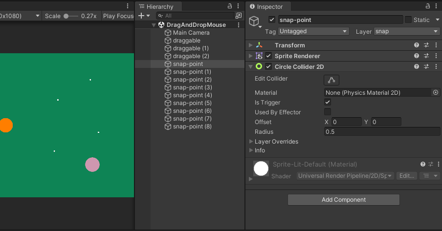
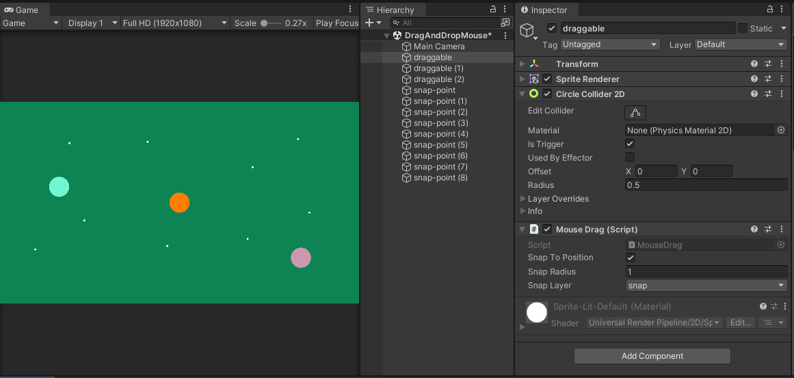

While I'm re-organizing tutorials, I'll put any stray sections here. Maybe I can find a place for them somewhere else.

# scripting is going to start in Project 2

we'll convert any existing "how-to's" into a unitypackage so people can incorporate into their own projects (and see how things are constructed)


[To link](https://docs.google.com/document/d/1BLaqdKs6isLeA-wHElG60bSq66RHTwGTfL3u92XHlbQ/edit#heading=h.5higyay74nze)

# Unity Recorder

[https://docs.unity3d.com/Packages/com.unity.recorder@4.0/manual/index.html](https://docs.unity3d.com/Packages/com.unity.recorder@4.0/manual/index.html) 

You’ll need to install the recorder through the Unity package manager

Window > Package Manager > Unity Registry > Recorder


After installation you can access the Recorder via:

Window > General > Recorder > Recorder Window

I’ve saved a recorder preset that you can use for both screenshots and screen recordings here:
[https://drive.google.com/file/d/1RDXTsL7Cn08FAeEMzkjZ-0gHMaU1pNne/view?usp=sharing](https://drive.google.com/file/d/1RDXTsL7Cn08FAeEMzkjZ-0gHMaU1pNne/view?usp=sharing) 

Drag the file into your project’s assets and then load it using the menu next to the “Add Recorder” button.


  
  
  


  
# Scripting Components

## Step 1: GetComponent / FindGameObjectsWithTag / FindObjectOfType / 

Currently, the way we’ve been accessing other objects and components in code was to make variables public, so that the variable would appear in the inspector and the component dragged to the empty slot.

```csharp
public GameObject go;  
public Rigidbody rb;  
public Camera cam; // note: for the main camera use Camera.main  
public Light lt;  
public AudioSource audioSource; // can't use 'as'  
public ParticleSystem ps;
```
### GetComponent

When a component that you need is on the same GameObject as your script (or the component is on another GameObject that the script has a reference to), you can use *GetComponent* to get and store the needed component.

```csharp
Type name = GetComponent<Type>();
```

For example if you wanted to get the Rigidbody on the same game object as your script:


```csharp
Rigidbody rb = GetComponent<Rigidbody>();
```

Or, if you have a reference to the game object you can access any of its components in the same way

```csharp
public GameObject go;
void Start()
{ 
	Renderer renderer = go.GetComponent<Renderer>(); 
}
```

There are other variants which return multiple components as an array

```csharp
AudioSource[] sources = GetComponentsInChildren<AudioSource>(); 
foreach (AudioSource source in sources)  
{  
	source.mute = true; 
}
```

And a version to be used in conjunction with a conditional statement

```csharp
if (TryGetComponent(out HingeJoint hinge)) 
{  
	hinge.useSpring = false;  
}
```


### FindGameObjectsWithTag


There is another useful method when looking for tagged objects called FindGameObjectsWithTag which is used like this

```csharp
GameObject[] name = FindGameObjectsWithTag(“myTagName”); 
```

These can be combined to quickly change a lot of things in your scene

```csharp
GameObject[] borts = GameObject.FindGameObjectsWithTag("bort");  
foreach (GameObject bort in borts)  
{  
bort.GetComponent<Transform>().LookAt(Vector3.zero);  
}
```

This tells any object tagged as “bort” to look at the origin (0,0,0) of the scene.
  
All the methods in the GameObject class here:

[https://docs.unity3d.com/ScriptReference/GameObject.html](https://docs.unity3d.com/ScriptReference/GameObject.html)

### FindObjectOfType

A third option is to search for all loaded objects of a specific type in the scene. This is not the fastest operation, so it’s not the best idea to call it every frame. 

```csharp
Rotator[] rotators = FindObjectsOfType<Rotator>();  
// set speed of all rotators  
foreach (Rotator rotator in rotators)  
{  
	rotator.speed = 10f;  
}
```

Try doing this in your own Roll-a-ball scene. You’ll need to modify the Rotator script in order for this to work.

## Step 2: modify things

I’ve already given away how this might work in a few of the examples above, but what if you wanted to modify a value over time from a separate script?

  

```csharp
GameObject[] iceCubes;  
GameObject[] fireCubes;  

void Start()  
{  
	iceCubes = GameObject.FindGameObjectsWithTag("ice");  
	fireCubes = GameObject.FindGameObjectsWithTag("fire");  
}  

void Update()  
{  
	foreach(var ice in iceCubes)  
	{  
		float valueAmount = Mathf.PingPong(Time.time, 1f);  
		Color iceColor = Color.HSVToRGB(0.7f, 1f, valueAmount);  
		ice.GetComponent<Renderer>().material.SetColor("_BaseColor", iceColor);  
	}  
	foreach(var fire in fireCubes)  
	{  
		float valueAmount = Mathf.Repeat(Time.time, 1f);  
		Color iceColor = Color.HSVToRGB(0f, 1f, valueAmount);  
		fire.GetComponent<Renderer>().material.SetColor("_BaseColor", iceColor);  
	}  
}
```

  

More likely, it’s better to have the color changing scripts on the objects themselves. But this script covers a lot of new ground on ways to modify things including:

- The [PingPong](https://docs.unity3d.com/ScriptReference/Mathf.PingPong.html) and [Repeat](https://docs.unity3d.com/ScriptReference/Mathf.Repeat.html) methods of the [Mathf](https://docs.unity3d.com/ScriptReference/Mathf.html) class
- Creating colors in scripts with the [Color](https://docs.unity3d.com/ScriptReference/Color.html) class and converting HSV to RGB
- How to access and set the color of a material with [SetColor](https://docs.unity3d.com/ScriptReference/Material.SetColor.html) (note: for URP use “_BaseColor” rather than “_Color” )

In both of the cases above, Time.time was used to modify the value over time. Time.time can also be passed into the offset of a Material to create a scrolling texture

```csharp
using UnityEngine;  
public class SlideTexture : MonoBehaviour  
{  
	Material material;  
	void Start()  
	{  
		material = GetComponent<Renderer>().material;  
	}  
	void Update()  
	{  
		Vector2 newOffset = new Vector2(Time.time, Time.time);  
		material.SetTextureOffset("_BaseMap", newOffset);  
	}  
}
```

  


# Resetting a Scene

After a player wins or loses, you’ll want to reset the scene so that they can try again (or allow the player to exit the game in frustration).

Resetting the scene == Loading the current scene

Scene loading is managed by …. the [Scene Manager](https://docs.unity3d.com/ScriptReference/SceneManagement.SceneManager.LoadScene.html), which you need to import with the “using” keyword at the top of your script.

Once added, loading a scene is as easy as passing in a scene name or build index to the Scene Manager’s LoadScene method. The scene name is the string that you’ve named your scene, and the build index is an integer that represents the order of scenes in your build settings:

  


  

Here is a short script that will reload the scene after 5 seconds:


```c#
using UnityEngine;
using UnityEngine.SceneManagement;

public class ReloadScene : MonoBehaviour
{
    void Update()
    {
        // Time.time returns the time (seconds) since the start of the game
        if(Time.time > 5)
        {
            // get the current scene's build index
            int buildIndex = SceneManager.GetActiveScene().buildIndex;
            // load the scene using this index
            SceneManager.LoadScene(buildIndex);
        }
    }
}
```

You can load a scene from any script as long as you’ve imported the Scene Manager. For instance, if you’ve detected that the player has fallen off the playfield or gone out of bounds, you can immediately reload the scene from within the Player Controller script to reset the game.


# Methods and UnityEvents

[Check the document from the previous class for the section on methods](https://docs.google.com/document/d/1pObyXIoZC0qpyYcBhvbr6CFH0ElAPucznw0NtvaezOk/edit#heading=h.3fd8aagxob6a)

In C#, events allow a class to notify other parts of the program when something has happened (see also [observer pattern](https://en.wikipedia.org/wiki/Observer_pattern)). The “publisher” of the event is the class that signals that something happened, and any “subscribers” to the event will be triggered.

C# has its own [event system](https://learn.microsoft.com/en-us/dotnet/csharp/programming-guide/events/), but Unity has an event system called [UnityEvents](https://docs.unity3d.com/Manual/UnityEvents.html) that integrates  with the Inspector and is a bit more friendly to use. In fact, most of the UI system already makes use of UnityEvents.  

To create a UnityEvent, add the UnityEngine.Events namespace and then declare the UnityEvent as public:

```csharp
using UnityEngine;
using UnityEngine.Events;
public class EventTesting : MonoBehaviour
{
	public UnityEvent myBigEvent;
	void Update()
	{
	
	}
}
```

When you save the script and attach it to a GameObject, you’ll see a place to add subscribers to your event.
  


  
Pressing the ‘+’ button will add a new subscriber to the list, but the slot will be empty. Drag in a GameObject to the list. The function dropdown will now display all the components that have functions which can be called when the event fires.


In this case, you could use the event to call the SetActive function on the GameObject in order to show or hide it when invoking the event. 


The checkbox underneath controls whether set active is sent true (checked) or false (unchecked)

The event still isn’t doing anything though. To trigger the event, call the UnityEvent’s Invoke method:

```csharp
using UnityEngine;  
using UnityEngine.Events;  
using UnityEngine.InputSystem;  

public class EventTesting : MonoBehaviour  
{  
	public UnityEvent myBigEvent;  
	void Update()  
	{  
		// use the input system to listen for the spacebar  
		if(Keyboard.current.spaceKey.wasPressedThisFrame)  
		{  
			myBigEvent.Invoke();  
		}  
	}  
}
```

When playing the scene, pressing the spacebar will cause the Cube to appear (if it was not active in the scene yet)

You might want something more sophisticated to happen when an event occurs. You can call any methods that are set to public as long as they match the signature of the event. The default UnityEvent does not send any values, so any methods that are called should have no parameters.

Attach this script, called SubscriberTesting.cs, to an empty GameObject named “subscriber”: 

```csharp
using UnityEngine;  
public class SubscriberTesting : MonoBehaviour  {      
	public void ShutdownComputer()  
	{  
		print("shutting down game");  
		// how to close the program  
		Application.Quit();  
	}  
}
```

Select the GameObject with the event publisher script and use the ‘+’ button to add another subscriber to the event. Then drag the GameObject to the empty slot.


Now, when pressing the spacebar, the cube will appear and the ShutdownComputer() method will be called. Fortunately Application.Quit() only works in the build of the game.

By default, UI Buttons have an OnClick event that you can subscribe to. For instance, if you wanted to reset the game using an on-screen button, you could write public methods with the reset game code. Then connect the script to the OnClick event by dragging the component onto the UI reset button.
# More UI System

[official Unity book](https://resources.unity.com/games/user-interface-design-and-implementation-in-unity) for a thorough review of the Unity UI system. For a shorter overview of the components check out the [manual page](https://docs.unity3d.com/Packages/com.unity.ugui@1.0/manual/UIBasicLayout.html).


1. Rendering order 
2. Turning off raycast target for non-interactable things
3. Interaction, triggering Events (See below)
# UnityEvents and UI

In programming, events allow one part of a program to notify other parts of the program when something has happened. You can define an event and add “subscribers” which will be notified when that event is invoked.


Let’s build a lightswitch:

1. Create a UI Button to toggle the lights on or off (you could also create a Toggle)
2. Create a Light
3. Connect the light to the button’s OnClick event
4. Press play and see if it works!

Have this button turn other things on or off. 

This technique only works for connecting to components that expose an event in the inspector. You can create events in your own scripts that can also create the same interface in the inspector.

This is a small script that triggers an event called OffEvent after two seconds:

```csharp
using UnityEngine;
using UnityEngine.Events;

public class EventTesting : MonoBehaviour
{
    public UnityEvent OffEvent;

    void Update()
    {
        if(Time.time > 2)
        {
            OffEvent.Invoke();
        }
    }
}
```

Try controlling the light with this script instead of the Button. You can also connect to public methods inside of your other scripts.  

Note: this script has to be attached to the same game object as a Light component.

```csharp
using UnityEngine;

public class ChangeLightColor : MonoBehaviour
{
    public void ChangeColor()
    {
        GetComponent<Light>().color = Color.green;
    }
}
```

# Arcade Things, Old Project 2

Play some [classic 2D arcade games](https://classes.dma.ucla.edu/Spring23/158/?page_id=151) and consider one that you would like to remake
# Let’s play some arcade games 

Search through the internet archive’s [internet arcade](https://archive.org/details/internetarcade?tab=about). I’ve also brought in an atari emulator for another set of games.

As you’re testing out different games, what are your initial impressions? What are similarities between the games? How long is the gameplay loop? 
# Reading Material

  


You can read more about the development of arcades in this book:  
  
[Coin-operated Americans: Rebooting Boyhood at the Video Game Arcade](https://drive.google.com/file/d/1flXi70BMFY6IZFfmwa4JCK5rn0HeY8g6/view?usp=share_link)

The first part of Chapter 1 (pp 19-26 of the PDF) provides a nice introduction to arcade culture in the 70s/80s. 

We’ll talk more about arcades next Tuesday.

EXTRA CREDIT: Read the whole chapter and answer [a few questions on this form](https://docs.google.com/forms/d/e/1FAIpQLSdJADTcUzpFJTNJvHeIjAPWUlRsWRuO18xbYcn74RSr3dFJ-Q/viewform?usp=sf_link)


# Prototyping / Gray boxing / White boxing (from old version of Day 6)

Check out the [level design book](https://book.leveldesignbook.com/) which contains much more thorough dives into these concepts. 


[Neon White](https://www.gameinformer.com/feature/2022/11/25/how-a-neon-white-level-is-made)

Now that you know a bit about 2D in Unity, and you’ve had a taste of a few arcade games. You’re ready to start prototyping and considering how you’ll put together your game. 

When developing a level or game mechanic, it’s useful to separate the “art” (modeling, lighting, texturing, etc.) from the movement, trajectory, and feel of the game. A common technique in game development is known as Gray boxing (White boxing) or blocking out involves this process. 


[https://book.leveldesignbook.com/process/env-art](https://book.leveldesignbook.com/process/env-art) 

You can compare this idea to adding placeholder text and images for getting a sense of page layout. The content doesn’t need to exist before you can consider things like navigation, composition, or interaction.

Here’s the process:

1. Sketch layout
2. Add ground plane, scale figures, walls
3. Playtest
4. Diverge, iterate, and playtest again
5. Repeat step 4 until done

(See here for [breakdowns](https://book.leveldesignbook.com/process/blockout#how-to-blockout) of each step )

The design doc portion of Project 1 asked you to do a very informal version of the first step. For Project 2 and Project 3. We will focus on building out the prototypes of the projects before integrating the art assets. 


Once you’ve decided on the arcade game you would like to remake, the next step is to try and create the game using just basic shapes with simple colors. This way you can focus on solving all the design issues related to interaction and feel.


# A bit more arcade cabinet artwork


  


# Persistent Data (high scores)

Creating a basic High Score system.

  

Unity’s [PlayerPrefs](https://docs.unity3d.com/ScriptReference/PlayerPrefs.html) allows you to save data (string, int, or float) to a named key. Retrieving a value can be done by passing in the correct key. This allows you to keep track of values from one session to the next even after the game has been shut down.

  

```csharp
string playerName = "Zip Zap";
// save the string
PlayerPrefs.SetString("name", playerName);
// get back the string
string name = PlayerPrefs.GetString("name", “anonymous”);
```

  

Saving a high score is just as easy, especially if you only need to keep track of a single score. This script has a reference to a UI Text element that displays the current high score. Another script could call the SetHighScore function to save the score and update the UI.

  

```csharp
using UnityEngine;
using TMPro;
public class SimpleHighScore : MonoBehaviour
{
	public TMP_Text highScore;
	
	void Start()
	{
		// get most recent high score
		int score = PlayerPrefs.GetInt("HighScore");
		// display the value
		highScore.text = score.ToString();
	}
	
	public void SetHighScore(int newScore)
	{
		// save the new score
		PlayerPrefs.SetInt("HighScore", newScore);
		// update the text
		highScore.text = newScore.ToString();
	}
}
```

  

At first, you may not have any saved preferences, so you can also have a default value by adding an additional argument to the Get method:

  

```csharp
PlayerPrefs.GetInt("HighScore", 0);
```

## High scores and initials

Keeping track of a list of scores and associated names becomes a bit trickier. One option is to create a separate PlayerPref key-value pair for each entry on the list, but this can be hard to keep track of. 

One method is to create a simple class that contains a name and a score. 

```csharp
[System.Serializable]
public class HighScore
{
	public string name;
	public int score;
}
```

  

Making the class serializable allows it to be converted to JSON. So rather than having ten different PlayerPref entries, it’s possible to create a list of HighScore objects and convert the entire list into a single [JSON](https://www.json.org/json-en.html) string. 

  

JSON is a text-based format for representing structured data. More info [here](https://developer.mozilla.org/en-US/docs/Learn/JavaScript/Objects/JSON). Data is stored as javascript-style objects and can also be written as an array of objects:

  

```json
[
{
	"name": "Molecule Man",
	"age": 29,
	"secretIdentity": "Dan Jukes",
	"powers": ["Radiation resistance", "Turning tiny", "Radiation blast"]
},
{
	"name": "Madame Uppercut",
	"age": 39,
	"secretIdentity": "Jane Wilson",
	"powers": ["Million tonne punch", "Damage resistance","Superhuman reflexes"]
}
]
```

  

Having a list of HighScore objects also involves another class:

  

```csharp
public class HighScores
{
	public List<HighScore> highScoreList;
}
```

  

The benefit of this is that all the scores can be managed, sorted, etc. as a list and saving/loading is easy by converting to and from a JSON string. Ultimately, the JSON string is still being saved and loaded using PlayerPrefs.

  

Saving list of high scores:

  

```csharp
void SaveHighScores(List<HighScore> scores)
{
	// create list object
	HighScores highScores = new HighScores { highScoreList = scores };
	// convert to JSON
	string json = JsonUtility.ToJson(highScores);
	// save prefs
	PlayerPrefs.SetString("HighScoreTable", json);
}
```

  

Loading list of high scores

  

```csharp
public static List<HighScore> LoadHighScores()
{
	// grab scores as json
	string json = PlayerPrefs.GetString("HighScoreTable");
	// if empty, make a new list
	if (json == "") return new List<HighScore>();
	// convert back to list
	HighScores loadedScores = JsonUtility.FromJson<HighScores>(json);
	// return the list of scores
	return loadedScores.highScoreList;
}
```

  
# Scenes, Loading, Changing

This demo heavily references [this demo game](https://drive.google.com/file/d/1hBL7aww-pa3cSKZHSHBiVD8_bAXoOkC_/view?usp=share_link). Please download the package and import it into your existing 2D unity project or a new project (2D URP template, add input system package)

  


  

Here is an overview of the different scenes and how they are connected.

## Title screen

This can be any sort of image. In the example, I’ve set it to get the current high score and blink some text. It has a script that triggers the next scene using any input from the keyboard.
  


```csharp
using UnityEngine;
using UnityEngine.InputSystem;
public class StartGame : MonoBehaviour
{
	void Update()
	{
		if (Keyboard.current.anyKey.wasPressedThisFrame)
		{
			GameManager.Instance.StartGame();
		}
	}
}
```


Changing scenes involves the [Unity Scene Manager](https://docs.unity3d.com/ScriptReference/SceneManagement.SceneManager.html) which requires

```csharp
Using UnityEngine.SceneManagement;
```


Scenes can be loaded by name or by their build index (as above). Scenes need to be added to the build before they can be loaded by the scene manager

Open the Build Settings (File > Build Settings) and drag the scenes you would like to include with the game into the Scenes In Build section
  


The build index for each scene is listed on the right side.

### DontDestroyOnLoad / Manager

The example title screen scene also includes a basic GameManager script that will be used across all the scenes in the game. This script uses [DontDestroyOnLoad](https://docs.unity3d.com/ScriptReference/Object.DontDestroyOnLoad.html) to prevent being erased when a new scene is loaded

The GameManager is also written as a [Singleton](https://levelup.gitconnected.com/tip-of-the-day-manager-classes-singleton-pattern-in-unity-1bf3aafe9430), storing a single static instance of the manager. This instance makes it easy for other scripts to access global game information or to call specific game related functions


The Singleton involves creating a public and static instance of the game manager, but making sure there is only ever one copy of the game manager. You’ll find lots of arguments about the pros and cons of this pattern. The problem is more about developers overusing the pattern when other patterns or techniques are more appropriate.

Here is the script:

```csharp
using UnityEngine;
using UnityEngine.SceneManagement;
using System.Collections;
public class GameManager : MonoBehaviour
{
	// keeping track of scores
	public int score { get; private set; }
	public int highScore { get; private set; }
	// singleton business
	public static GameManager Instance { get; private set; }
	void Awake()
	{
		if (Instance != null && Instance != this)
		{
			Destroy(gameObject);
		}
		else
		{
			Instance = this;
			// keep object around between scene changes
			DontDestroyOnLoad(gameObject);
		}
	
		// get the current high score
		highScore = PlayerPrefs.GetInt("hi-score", 0);
	}
	
	public void AddToScore(int amount)
	{
		score += amount;
	}
	
	public void StartGame()
	{
		StartCoroutine(DelaySceneLoad(1, 1));
	}
	
	public void EndGame()
	{
		// check if there's a high score
		if (score > highScore)
		{
			// store the new high score
			highScore = score;
			PlayerPrefs.SetInt("hi-score", score);
			// New high score screen
			StartCoroutine(DelaySceneLoad(2, 2));
		}
		else
		{
			ReturnToTitle();
		}
	}
	
	public void ReturnToTitle()
	{
		// clear score
		score = 0;
		// return to title
		StartCoroutine(DelaySceneLoad(0, 2));
	}
	
	IEnumerator DelaySceneLoad(int index, float delay)
	{
		yield return new WaitForSeconds(delay);
		SceneManager.LoadScene(index);
	}
}
```


Aside from the Singleton code in the Awake section, the manager doesn’t do very much. There is a score variable that can be updated with the AddToScore method and methods for changing to different scenes depending on whether the player achieved a high score.

The version in the demo has a few extra things related to background music.

## Main game scene

This is a very simply game that just requires the player to place sunglasses on another character’s face:

1. A score decreases over time
2. When the sunglasses are in the right position, the score is recorded.
3. If there’s a new high score, the manager loads a high score scene, otherwise it’s back to the title screen.

The collision detection is on the InputTestForce.cs script and very similar to the Roll-a-ball project (using 2D physics) :

```csharp
private void OnTriggerEnter2D(Collider2D collision)
{
	if (collision.CompareTag("face"))
	{
		freeze = true;
		rb.velocity = Vector2.zero;
		// let everyone know
		FoundFace.Invoke();
		// signal end of game
		GameManager.Instance.EndGame();
	}
}
```

  

There is an additional UnityEvent that lets the timer know that it should stop and record the score and to add a small visual effect.

## High score scene

The name entry scene is a bit more complicated. The important thing is that it uses [PlayerPrefs](https://docs.unity3d.com/ScriptReference/PlayerPrefs.html) to load and save high score information. Which we will talk about next. Otherwise it takes in the data and then tells the GameManager to reset back to the title screen with this line:

  

```csharp
GameManager.Instance.ReturnToTitle();
```


# Raycasting et al.

Alternative method for checking collisions, visibility, projectiles

  

Raycasting (and other physics casts) can check for collisions at a distance. Casts are extremely useful for checking on the environment around a player, npc, or other object. 

  

## Casts

  

Some common operations include (for [Physics2D](https://docs.unity3d.com/ScriptReference/Physics2D.html)): Raycast, BoxCast, CircleCast, OverlapCircle, OverlapBox (there are also corresponding 3D ones for [Physics](https://docs.unity3d.com/ScriptReference/Physics.html))

  


  

Casts can be thought of as sending out a collider to determine if there are any other objects (that also have colliders). The cast is given an origin and a direction of travel

  

```csharp
// Cast a ray straight down.
RaycastHit2D hit = Physics2D.Raycast(transform.position, -Vector2.up);
```

  

The cast operation returns a [RaycastHit](https://docs.unity3d.com/ScriptReference/RaycastHit.html) / [RaycastHit2D](https://docs.unity3d.com/ScriptReference/RaycastHit2D.html) that can give information about the object that was hit (point, normal, distance, etc.). 

  

If the hit is null, then the cast did not collide with anything.

  

```csharp
if (hit.collider != null)
{
	// print out the point of contact
	print(hit.point);
}
```

  

Different types of casts can be used to check if the player is grounded (i.e. can the player jump), if an enemy can see the player (line of sight), checking if an object is underneath the cursor (is selectable / clickable), and a lot more.

  

I mentioned before that raycasts are useful for determining how an object might bounce off a wall. 

  

Here’s an example script that displays the path of an object including bounces:

  


  

```csharp
using System.Collections.Generic;
using UnityEngine;
public class CastRayWithBounce : MonoBehaviour
{
	public int numberOfBounces = 2;
	public LineRenderer lr;
	
	void Start()
	{
		lr.positionCount = numberOfBounces + 1;
	}
	
	void FixedUpdate()
	{
		CalculateBounces();
	}
	
	private void CalculateBounces()
	{
		Vector2 castStart = transform.position;
		int bounces = 0;
		
		// create new list and add the first position
		List<Vector3> linePositions = new List<Vector3> { castStart };
		
		// cast a ray up
		RaycastHit2D hit = Physics2D.Raycast(transform.position, transform.up);
		
		// keep going as long as there's a hit and we still have bounces to go
		while (hit.collider != null && bounces < numberOfBounces)
		{
			// add next point to list
			linePositions.Add(hit.point);
			
			// calc bounce direction using reflect
			Vector2 inDir = (hit.point - castStart).normalized;
			Vector2 dir = Vector2.Reflect(inDir, hit.normal);
			
			// start a new cast from the hit point
			castStart = hit.point;
			// move slightly away from the collider to prevent self-hit
			castStart += hit.normal * 0.01f;
			
			// make the cast
			hit = Physics2D.Raycast(castStart, dir);
			
			bounces++;
		}
	
		// draw it
		lr.SetPositions(linePositions.ToArray());
	}
}
```

  

The script draws the ray with a [LineRenderer](https://docs.unity3d.com/Manual/class-LineRenderer.html) attached to the object and dragged into the script.

  


  

## Overlaps

Related to the casts are overlaps. These are designed to check if a collider or colliders overlap with a shape (box, sphere, capsule, area, circle, box). 

  


  

On overlap operation will return a collider or array of colliders that overlap with its shape. This can be useful for checking how many things are within the range of a player or collecting the number of objects in a room. As with raycasts, the objects all need colliders in order to be detected by the overlap operation.

  

Here is an example using OverlapSphere that causes damage to any objects within the radius of the explosion:

  

```csharp
void ExplosionDamage(Vector3 center, float radius)
{
	Collider[] hitColliders = Physics.OverlapSphere(center, radius);
	foreach (var hitCollider in hitColliders)
	{
		hitCollider.SendMessage("AddDamage");
	}
}
```

  

For 2D overlaps, you will need to specify if you want just one collider (checking if there are any overlapping colliders) or if you want to get all the overlapping colliders

  

```csharp
Collider2D justOne = Physics2D.OverlapCircle(center, radius);
Collider2D allOfThem = Physics2D.OverlapCircleAll(center, radius);
```

  

Check out the [Physics2D](https://docs.unity3d.com/ScriptReference/Physics2D.html) page to see all the operations.

# Pausing physics


[https://superhotgame.com/](https://superhotgame.com/) 


In Project Settings > Time, you can manually control the global Time Scale of your game. At a value of one, the time proceeds normally, at 0.5 the game runs at half speed, and at 2 the game moves at double the speed. You can set the time scale to zero to pause the game (this pauses FixedUpdate completely).

To set the time scale in a script, you can use the Time.timeScale property

```csharp
Time.timeScale = 1.0f;
```

For doing physics calculations, it’s also important to scale the FixedUpdate delta time with the time scale. This makes sure that the number of physics calculations per Update frame stays the same.

```csharp
Time.fixedDeltaTime = this.fixedDeltaTime * Time.timeScale;
```

For a bit more info and a good demo of the Unity physics system, check out the [Unity Physics Playground](https://resources.unity.com/unitenow/onlinesessions/prototype-series-physics-playground-slow-motion-and-gravity)

# Flow, Difficulty, Progression 

  


The four levels of Donkey Kong

A large part of keeping players engaged with a game (or an app, service, job) is to create an experience that balances skill and challenge. As a player’s skill increases, the challenge should increase as well. Conversely, a player without experience should be able to get started without hitting a wall of difficulty.


Csikszentmihalyi playing a game with his dog  
  
From his book "Flow: The Psychology of Optimal Experience"

In this game, the dog would bark and run away, encouraging Csikszentmihalyi to chase it. The game involved a sense of playful challenge, with the dog trying to stay just out of reach while still maintaining a connection with Csikszentmihalyi.

If he was tired and not keeping up, the dog would circle a bit closer. This allowed him to get closer, enticing him to maintain the chase. His dog, Hussar, would also speed up when Csikszentmihalyi was more active, always keeping the game interesting. 

According to Csikszentmihalyi, the escape and pursuit game can be a way to achieve flow, as it involves a balance between challenge and skill. The dog was able to adjust its movements and actions in response to Csikszentmihalyi's pursuit, creating a dynamic and engaging experience for both of them.


Typically, a flow-producing activity: 
- balances an individual’s skills with the activity’s challenges
- presents clear goals and feedback toward achieving these goals
- allows a feeling of control when awareness merges with action. 

Then, according to Csikszentmihalyi, self-consciousness disappears and one’s awareness of time and its passing melts away.


“flow theory has also been applied to just about everything else, from workplace satisfaction to education to spirituality”  – Ian Bogost, [Play Anything](https://bogost.com/books/play-anything/)

“However, flow is not an uncomplicated, straightforward solution to the problem of alienation. It is not simply a natural psychological state or experience; flow theory uses the concept as an ideology, one that privileges individuality over social collectivities, growth and accumulation over equilibrium and sustainability, self-determination over the idea that external forces shape human consciousness, and action over critical examination.”

[https://mitpress.mit.edu/9780262045506/against-flow/](https://mitpress.mit.edu/9780262045506/against-flow/)


[https://pippinbarr.com/itisasifyouweredoingwork/](https://pippinbarr.com/itisasifyouweredoingwork/) 

Flow-inducing techniques can give the impression of autonomy or skill while actually guiding your behavior towards the interests of another person/group/business (see also behavioral economics – [1](https://en.wikipedia.org/wiki/Thinking,_Fast_and_Slow) [2](https://en.wikipedia.org/wiki/Nudge_(book)))

## What are some of the techniques used in games?


*Banding* - Mario Kart and other arcade racing games
*Assist Mode* - Mario Odyssey, Control, Celeste – see also accessibility [modes](https://youtu.be/W7ExSsmJssQ) 
*Dynamic Difficulty Adjustment* - Resident Evil 4, Left 4 Dead
*Multiple pathways / Open world* - Breath of the Wild, Metal Gear Solid 5, Elden Ring 
*Ranked Matchmaking* - most competitive online video games 
  
Non-video-game examples?
- Apps?


[https://press.princeton.edu/books/paperback/9780691160887/addiction-by-design](https://press.princeton.edu/books/paperback/9780691160887/addiction-by-design) 

“What we didn’t get at the beginning is that people don’t really want to be entertained. Our best customers are not interested in entertainment—they want to be totally absorbed, they want to get into a rhythm.”

“The aesthetics of many video games are monopolized by their attempt to produce flow, and that flow has a monopoly on mainstream games.”


[https://thatgamecompany.com/flow/](https://thatgamecompany.com/flow/) 

## Alternatives… play and flow

“There are … plenty of video games that eschew the absorption of flow and its challenge-based immersion to explore the variety of human affect and experience (for example,... “anxiety” and “boredom”...). Moreover, video games may bring flow to the masses, but the masses are not docile subjects so easily forced into flow. The unruly, unpredictable, and often subversive agency of players can take a game that privileges flow and transgress it, mutate it, queer it, subvert it, unplay it, and trifle with it.”


[Dys41a](https://archive.org/details/dys41a) - Anna Anthropy


[Realistic kissing simulator](http://jimmylands.com/experiments/kissing/) - Jimmy Andrews and Loren Schmidt


[Octodad](https://octodad.com/) - Young Horses


Caillois: 

play is “an occasion of pure waste: waste of time, energy, ingenuity, skill, and often of money”. 

> Play resists demands for productivity. 

But flow is a psychological experience of enjoyable action that can accompany any activity whatsoever (even productive work).

# Old Project 3 Deliverables

- **Automatic.** The game should run/proceed/progress on it's own, meaning that things should happen even if nobody is around to press any buttons.
- **Non-deterministic**. The game should not run the same way twice. The output and combinations should be varied enough that repetition is rare. How much time should be spent with the work?
- **Consideration of inputs**. A player doesn’t need to interact directly with the work, but consider the player/spectator and how they should view the work. Is it meant to be meditative, overwhelming, funny? Should it run ambiently in the background, should it run on extended cycles (hours, days, seasons, lifetimes, every rainy day, etc.), should it use external sensors or react to network data?
- **2D, 3D, XD**. No restrictions on the format.


# Mouse interaction, dragging, snapping

I've put together a script called `MouseDrag` that you can attach to objects you'd like to test out with mouse interactions. UI Buttons are already set up for receiving mouse inputs, so you don't need to add this script to those.

Create a new script called `MouseDrag` in your scene. 

> Note: Mouse events work in both 2D and 3D, but the snapping on this script is only set up for 2D (using Physics2D and Collider2D)

```csharp
using UnityEngine;

public class MouseDrag : MonoBehaviour
{
    // toggle whether to use snapping
    public bool snapToPosition = false;
    // radius to check for finding snap points
    public float snapRadius = 1f;
    // use a layer mask to filter unwanted colliders
    public LayerMask snapLayer; 

    // reference to our camera
    Camera cam;

    void Start()
    {
        // shorthand for grabbing the main camera
        cam = Camera.main;
    }

    // do something on mouse click
    void OnMouseDown()
    {
        print("mouse pressed");
    }

    // do something while mouse is clicked and held (every frame)
    void OnMouseDrag()
    {
        // move object to position of mouse
        Vector2 mousePos = Input.mousePosition; // using old input system

        // convert from screen space (mouse coords) to world space (game coords)
        Vector3 newPos = cam.ScreenToWorldPoint(new Vector3(mousePos.x, mousePos.y, 10f));

        // set the position
        transform.position = newPos; 
    }

    // do something when mouse released
    void OnMouseUp()
    {
        if (snapToPosition)
        {
            // use an overlap to check for nearby objects 
            Collider2D collider = Physics2D.OverlapCircle(transform.position, snapRadius, snapLayer);
            // if another collider was found, snap to that object
            if(collider != null)
            {
                transform.position = collider.transform.position;
            }
        }
    }
}

```

You can attach this script to a game object that you'd like to drag around. 

The only caveat is that **the object needs to have a collider** ([documentation](https://docs.unity3d.com/ScriptReference/MonoBehaviour.OnMouseDrag.html)).

The `OnMouseDown` method is empty, but this can be used if you only care about whether an object has been clicked. `OnMouseUp` is only used for snapping.

## How snapping works

When you release the mouse on the dragged game object, `OnMouseUp` will run. 

After checking for whether `snapToPosition` is true or false, the script will use an overlap, specifically [OverlapCircle](https://docs.unity3d.com/ScriptReference/Physics2D.OverlapCircle.html), which temporarily creates a circle at a position with a specified radius and will return the first collider that overlaps with the circle. 

Here, the script uses the position of the game object which is being dragged as the center of the circle and a radius specified by the `snapRadius` variable. Additionally, the `snapLayer` layermask will filter out any colliders that aren't on the layers we're interested in.

If the returned collider exists (i.e. is not null), the script will set the dragged object's position equal to the position of the collider object.


The snap point requires only a **Transform** and a **Collider2D** to work. In the above image, I've used a sprite renderer to make it easier to spot the point. 

Additionally, I've placed these snap points on a [Layer](https://docs.unity3d.com/Manual/Layers.html) called 'snap' so that the `snapLayer` property of the `MouseDrag` script can be used to ignore all colliders not on this layer.[ Adding a new layer](https://docs.unity3d.com/Manual/create-layers.html) to your project is done by clicking on the layer dropdown and selecting *Add Layer...*. After adding a new one by typing the name into one of the empty slots, you'll have to go back to the object and set it to the newly added layer.



The draggable object now has the `MouseDrag` script with snapping set to true and the `snapLayer` set to 'snap'. 
# Joytokey config

For those that might want to test the cocktail cabinet inputs by plugging them directly into your computer. You can download the [JoyToKey](https://joytokey.net/en/) config file (you'll also need to download JoyToKey): 

[https://drive.google.com/file/d/1eRSZgUk_XG248zJ_lDLOb1Vf2FHsWwJD/view?usp=share_link](https://drive.google.com/file/d/1eRSZgUk_XG248zJ_lDLOb1Vf2FHsWwJD/view?usp=share_link)

# 2D Platformer Package


So you don't need to try and roll-your-own 2D character controller. I’ve made a demo that shows how to connect this [2D Character Controller script](https://github.com/Brackeys/2D-Character-Controller)  with the newer input system, specifically the one used by the game lab arcade machines.

Download the [demo unitypackage](https://drive.google.com/file/d/17CZ3ogYZOAYwsJTV8AN-7D53HzC9NNmg/view?usp=drive_link) and test it out.

You can watch a video walkthrough of the original script [here](https://www.youtube.com/watch?v=dwcT-Dch0bA).

If you want to allow for the character to crouch properly, you will need to modify the “Interactions” section of the input actions:


  

This allows the OnButton2 to trigger on both press and release. You can check the state by testing the input value:

```csharp
void OnButton2(InputValue value)
{
	if (value.isPressed)
	{
		crouch = true;
	} 
	else
	{
		crouch = false;
	}       
}
```


## Delaying Animation

An animator component will immediately start playing as soon as the object is awake (and the component is enabled). Generally, activating the game object with the animator component is the easiest way to control when an animation will start. 

The following script uses a [coroutine](https://docs.unity3d.com/Manual/Coroutines.html) to toggle the animator component in order to control when the animation starts. You can replace (or combine) the previous script with the following:


```csharp
using System.Collections;  
using UnityEngine;  

public class AnimationController : MonoBehaviour  
{  
	public float delayTime = 2f;  
	private Animator animator;  
	
	void Start()  
	{  
		// get the animator  
		animator = GetComponent<Animator>();  
		
		// turn off the component  
		animator.enabled = false;  
		
		// use a coroutine to delay  
		StartCoroutine(RunAfterDelay(delayTime));  
	}  
	
	IEnumerator RunAfterDelay(float delay)  
	{  
		// wait a moment  
		yield return new WaitForSeconds(delay);  
		// turn on component  
		animator.enabled = true;  
	}  
}
```


This script also demonstrates how to pass a value to a coroutine if you wanted to reuse the `RunAfterDelay` method with a different value.

Coroutines can be useful any time that you need to do a task over the course of multiple frames or if you need to pause the execution of some code without pausing the entire game.

## Playing Animation On Mouse Click

You can use a Trigger parameter to transition. The set up will be like a combined version of the initial state machine example and the idle-to-walk example

1. First, create an object which can react to a click event (has a trigger collider) and which also has an Animator component.   
   
2. Next, open the Animator window and create a Trigger parameter called "play". Then set an empty clip to be the Default State and a transition to the animation clip. Add a condition to this transition and by default the condition will be set to "play". Create another transition back to the empty clip without any conditions. This will automatically return to the empty state when the animation is finished.
   
3. Now add a script to the game object which will trigger the "play" parameter as soon as the object is clicked.

```csharp
using UnityEngine;

public class AnimateOnClick : MonoBehaviour
{
    // reference to the game object's animator
    Animator animator;
    void Start()
    {
        animator = GetComponent<Animator>();
    }

    void OnMouseDown()
    {
        // trigger animation
        animator.SetTrigger("play");
    }
}
```


# Yarn Spinner resources


For those wanting to write dialogue in the style of [Twine](https://twinery.org/) or [Ren'Py](https://www.renpy.org/), Yarn Spinner is likely the best *free* plugin for Unity. There are very capable[ paid assets ](https://www.pixelcrushers.com/dialogue-system/) as well if you find yourself in need of something with many more features.

> Note: Yarn Spinner can be quick to set up using its default components, but making the UI look good or adding other custom functions will require customization

The [Yarn Spinner documentation website](https://docs.yarnspinner.dev/) is the place to get started. You can also find a specific tutorial for [installing and setting up Yarn Spinner with Unity](https://docs.yarnspinner.dev/beginners-guide/using-a-game-engine/yarn-spinner-for-unity). 

Dialogues are written in the Yarn language, so you'll need to get a sense of what the syntax is like. You can [read about all the basics in the documentation](https://docs.yarnspinner.dev/beginners-guide/syntax-basics) and [try it out directly in the browser](https://try.yarnspinner.dev/). Yarn Spinner has an official add-on for VS Code if you want code completion and syntax highlighting in your yarn files.

The [FAQ on the website](https://docs.yarnspinner.dev/using-yarnspinner-with-unity/faq) is also a good way to see how the developers suggest using Yarn Spinner

Finally, the Yarn Spinner unity package comes with a bunch of samples that you can use as a template for the type of dialogue that you're trying to make. There is a samples tab in the package manager where you can download and try them out.